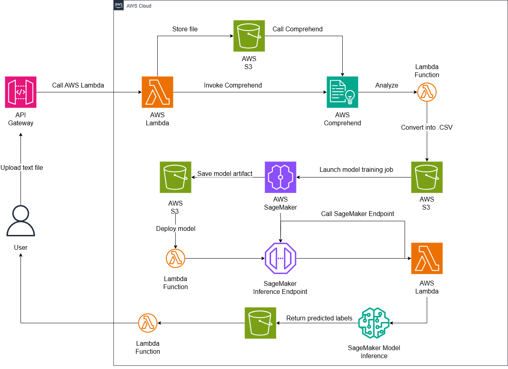

# Nâng cao NLP với AWS Comprehend và Transformers
## Giải pháp NLP nâng cao áp dụng trong thương mại điện tử

---

# Executive Summary
Trong thời đại dữ liệu người dùng ngày càng phong phú và phức tạp, việc khai thác ngôn ngữ tự nhiên không chỉ còn là công cụ phân tích đơn thuần, mà đã trở thành yếu tố cốt lõi trong chiến lược công nghệ của nhiều doanh nghiệp. Natural Language Processing (NLP) – công nghệ xử lý ngôn ngữ tự nhiên – đang dần chuyển mình từ các mô hình phân tích thủ công hoặc rule-based sang thế hệ mới: NLP nâng cao sử dụng học sâu (deep learning), transformer, và hệ sinh thái dịch vụ AI mạnh mẽ như AWS.
Đề tài này tập trung vào việc phát triển một giải pháp NLP nâng cao, kết hợp giữa Amazon Comprehend và các mô hình Transformer tùy chỉnh, nhằm giải quyết các tác vụ xử lý ngôn ngữ tự nhiên chuyên biệt theo từng miền ứng dụng (domain-specific NLP). Giải pháp được xây dựng dựa trên kiến trúc serverless, tận dụng khả năng scale, độ tin cậy và tính linh hoạt của AWS để triển khai trên các quy mô khác nhau.
Để minh họa tính ứng dụng, đề tài chọn một kịch bản thử nghiệm thực tế trong lĩnh vực thương mại điện tử: phát hiện các đánh giá khách hàng sai lệch giữa nội dung phản hồi và số sao, từ đó cung cấp phân tích chính xác và sinh phản hồi tự động phù hợp. Kịch bản này cho thấy rõ những hạn chế của các giải pháp NLG/NLP thông thường, và làm nổi bật hiệu quả cải tiến khi áp dụng mô hình transformer fine-tuned theo miền (ví dụ như ngành hàng tiêu dùng).
Tuy nhiên, giải pháp không giới hạn trong thương mại điện tử. Kiến trúc, quy trình và khả năng mở rộng của hệ thống cho phép nhanh chóng điều chỉnh để phục vụ các lĩnh vực khác như:
-	Y tế: phân tích phản hồi bệnh nhân, trích xuất thông tin y khoa.
-	Tài chính: phát hiện gian lận qua mô tả giao dịch hoặc phân tích yêu cầu khách hàng.
-	Giáo dục: tự động phân loại câu hỏi, đánh giá cảm xúc học viên.
-	Media/HR: trích xuất chủ đề nổi bật từ phản hồi nội bộ, cải tiến quản trị nhân sự.

# 1. Problem Statement
## Current Situation
Hiện nay, trong các nền tảng thương mại điện tử như Shopee, việc đánh giá sản phẩm chủ yếu dựa trên hệ thống chấm điểm bằng sao (1–5 sao). Tuy nhiên, nhiều trường hợp cho thấy người dùng để lại đánh giá 5 sao nhưng nội dung phản hồi lại mang tính tiêu cực, hoặc ngược lại. Điều này gây ra sự sai lệch nghiêm trọng trong việc đánh giá thực chất sản phẩm và dịch vụ.
## Key Challenges
Mặc dù nhiều doanh nghiệp đã triển khai các hệ thống NLP truyền thống (rule-based hoặc keyword-based) để phân tích phản hồi khách hàng, nhưng những hệ thống này thường:
-	Chỉ nhận diện theo từ khóa đơn giản, bỏ qua ngữ cảnh và sắc thái ngôn ngữ.
-	Không có khả năng xử lý nội dung đa ngôn ngữ.
-	Không phát hiện được các mẫu đánh giá sai lệch giữa nội dung và số sao.
-	Không thể học hỏi, thích nghi với dữ liệu mới.
## Stakeholder Impact
-	Khách hàng: không nhận được phản hồi phù hợp, giảm lòng tin vào nền tảng.
-	Doanh nghiệp: phân tích sai dữ liệu phản hồi, dẫn đến quyết định sai lầm về sản phẩm hoặc vận hành.
-	Bộ phận CSKH: tốn thời gian xử lý thủ công.
## Business Consequences
-	Quyết định kinh doanh dựa trên dữ liệu sai lệch.
-	Không phát hiện được các sản phẩm/dịch vụ kém chất lượng bị phản ánh gián tiếp.
-	Mất cơ hội cải thiện trải nghiệm khách hàng.

# 2. Solution Architecture
## Architecture Overview

## AWS Services Used
-	Amazon Comprehend – phân tích ngữ nghĩa cơ bản (sentiment, entity)
-	Amazon S3 – lưu trữ input, output, model
-	AWS Lambda – xử lý không đồng bộ các giai đoạn
-	Amazon API Gateway – làm interface cho frontend
-	Amazon SageMaker – training và triển khai mô hình Transformer
## Component Design
-	Hệ thống chia thành các bước độc lập, giúp dễ maintain và mở rộng.
-	Kết hợp mô hình có sẵn của AWS và custom model để đạt độ chính xác cao hơn.
## Security Architecture
-	IAM Role tách biệt giữa Lambda, SageMaker và S3.
-	Mã hóa dữ liệu tại S3.
-	Kiểm soát quyền truy cập API Gateway bằng IAM hoặc Cognito.
## Scalability Design
-	Lambda và API Gateway tự động scale theo tải.
-	SageMaker endpoint hỗ trợ multi-instance.
-	Thiết kế module hóa dễ mở rộng cho nhiều miền ứng dụng khác.

# 3. Technical Implementation
## Implementation Phases
1.	Thu thập dữ liệu & Định nghĩa output
2.	Fine-tuning mô hình Transformer
3.	Tích hợp AWS Comprehend và SageMaker
4.	Triển khai API & tích hợp frontend
5.	Test A/B & hiệu chỉnh
## Technical Requirements
-	Mẫu dữ liệu dạng text (~3–5 dòng/mẫu)
-	Khả năng phân tích ngôn ngữ tiếng Việt, Anh
-	Training với tập dữ liệu từ 100–500 mẫu (tùy giai đoạn)
## Development Approach
-	Dữ liệu lưu ở S3 → gọi Comprehend → huấn luyện bằng SageMaker → trả kết quả về frontend.
-	Tận dụng pipeline Lambda + API Gateway.
## Testing Strategy
-	Unit test cho Lambda function
-	Integration test cho luồng S3–SageMaker–API
-	Evaluation metrics: Precision, Recall, BLEU
## Deployment Plan
-	Deploy từng Lambda theo module
-	Đóng gói mô hình với model.tar.gz
-	Endpoint test staging trước khi go live

# 4. Timeline & Milestones
## Project Timeline - 8 week
-	Tuần 1: Thu thập & phân tích yêu cầu
-	Tuần 2: Dataset & Annotation
-	Tuần 3–4: Huấn luyện mô hình & tích hợp AWS Comprehend
-	Tuần 5: Tích hợp frontend & backend
-	Tuần 6: Kiểm thử
-	Tuần 7: Triển khai thử nghiệm
-	Tuần 8: Tối ưu hóa và wrap-up
## Project Timeline - 4 week
-   Tuần 1: Thu thập yêu cầu, tạo tập dữ liệu mẫu và tiền xử lý
-   Tuần 2: Annotation và training mô hình đồng thời trên tập dữ liệu thu gọn
-   Tuần 3: Tích hợp backend (Lambda, Comprehend, SageMaker nếu cần)
-   Tuần 4: Tích hợp frontend, kiểm thử, triển khai thử nghiệm với 3–5 mẫu và wrap-up
## Key Milestones
-   Model accuracy > 80%
-   Tích hợp thành công API
-   Phân tích phản hồi chính xác
## Dependencies
-   AWS Account + Dataset đầu vào
## Resource Allocation
-   1 DevOps + 1 AI Engineer (nếu quy mô lớn)

# 5. Budget Estimation
## Infrastructure Costs (Production)
-	SageMaker endpoint: $2–$4/ngày (~$60–120/tháng)
-	Lambda/API Gateway: ~$5–10/tháng
-	Amazon Comprehend: ~$15/tháng (phân tích 30.000 đoạn)
-	S3 storage: <$1
-	Total costs: ~$90–150/tháng
## Infrastructure Costs (Low-cost Version)
-	Dùng mô hình Transformer open-source (không SageMaker)
-	Lambda/API Gateway: ~$5–10/tháng
-	Amazon Comprehend: ~$15/tháng
-	AWS chi phí serverless + S3: ~$10–20/tháng
-	Total costs: ~$10–20/tháng
## Infrastructure Costs (Pilot Testing)
-   SageMaker Training Job	1 lần (10–15 phút)	$0.20
-   SageMaker Endpoint	1 giờ hoạt động	$0.07
-   Comprehend	10 request nhỏ	$0.001
-   Lambda + API Gateway	10 lần gọi	$0.01
-   Amazon S3 (lưu file nhỏ)	< 1GB dữ liệu	$0.01
-	Total costs:  $0.30 – $0.40/test
## Development Costs (Low-cost Version)
-   Fine-tuning Transformer model trên SageMaker: $100–200 (1 lần training job).
-   Phát triển backend/frontend và tích hợp AWS: $200–300 (1 tuần công).
-   Thiết lập CI/CD, IAM, logging, bảo mật: $100–150.
-   Total costs: $400–650
## Operational Costs (Production)
-   EC2 uptime 24/7 (t2.medium): $10/tháng
-   CloudWatch Logs & basic alerts: $2–3/tháng
-   Bảo trì thủ công (manual monitoring, restart, update model nhẹ): $5/tháng
## ROI Analysis
Triển khai chính thức
-   Accuracy tăng > 25%
-   Giảm effort xử lý feedback > 30%
-   Tiết kiệm chi phí nhân sự hàng tháng (ước tính >$1.000/tháng)
Triển khai quy mô nhỏ
-   Phân tích nhanh, không cần đội ngũ lớn
-   Duy trì chi phí hạ tầng dưới $40/tháng
-   ROI tốt cho SME hoặc sản phẩm ngách
Triển khai thử nghiệm
-   Chi phí cực thấp để thử nghiệm mô hình thực tế
-   Thích hợp làm POC nội bộ hoặc thuyết phục stakeholders
-   Giảm rủi ro đầu tư sai công nghệ
# 6. Risk Assessment
## Risk Matrix
| Rủi ro                                 | Mức độ ảnh hưởng | Xác suất xảy ra | Phân loại     |
|----------------------------------------|------------------|-----------------|---------------|
| Dữ liệu phản hồi sai lệch              | Cao              | Trung bình      | Khách quan    |
| Comprehend giới hạn trong ngữ cảnh     | Trung bình       | Trung bình      | Kỹ thuật      |
| Mô hình Transformer bị overfitting     | Cao              | Thấp            | Kỹ thuật      |
| Chi phí vận hành SageMaker cao         | Trung bình       | Trung bình      | Kỹ thuật      |
| Tích hợp frontend phức tạp             | Trung bình       | Thấp            | Kỹ thuật      |
## Mitigation Strategies
-	Sử dụng dữ liệu kiểm thử A/B
-	Đặt giới hạn chi phí SageMaker Endpoint
-	Tách model inference ra Lambda nhỏ hơn
## Contingency Plans
-	Chuyển qua mô hình open-source nhẹ nếu cần
-	Đảm bảo rollback khi deploy API Gateway

# 7. Expected Outcomes
## Success Metrics
-	Accuracy mô hình ≥ 80%
-	Tăng độ chính xác phát hiện đánh giá sai lệch ≥ 60%
-	Giảm effort xử lý thủ công ≥ 30%
## Business Benefits
-	Tăng chất lượng dữ liệu phân tích khách hàng
-	Giảm thời gian xử lý feedback
-	Cải thiện uy tín sản phẩm trên nền tảng thương mại điện tử
## Technical Improvements
-	Đưa vào vận hành pipeline NLP chuyên sâu
-	Có khả năng customize mô hình theo domain riêng
## Long-term Value
Mô hình có thể áp dụng cho các lĩnh vực:
-	Y tế: phân tích phản hồi bệnh nhân
-   Giáo dục: phân loại nội dung khóa học
-   Tài chính: phân tích tin nhắn giao dịch

---