# Sử dụng Amazon SageMaker Unified Studio để xây dựng quy trình AI phức tạp bằng Amazon Bedrock Flows

> **📖 Original article**: [Use Amazon SageMaker Unified Studio to build complex AI workflows using Amazon Bedrock Flows](https://aws.amazon.com/vi/blogs/machine-learning/use-amazon-sagemaker-unified-studio-to-build-complex-ai-workflows-using-amazon-bedrock-flows/)  
> **👤 Authors**: Sumeet Tripathi and Vishal Naik   
> **📅 Publication date**: 01/07/2025   
> **🌐 Source**: AWS Machine Learning Blog    
> **👨‍💻 Translator**: Lê Minh Giàu - FCJ Intern      
> **📅 Translation date**: 09/07/2025      
> **⏱️ Read time**: 15 phút  

---

## 📋 Tóm tắt

Bài viết này hướng dẫn cách sử dụng Amazon SageMaker Unified Studio để xây dựng một ứng dụng hỗ trợ đại lý được hỗ trợ bởi AI tạo sinh cho một tổ chức tài chính hư cấu, FinAssist Corp. Giải pháp này sử dụng [Amazon Bedrock Flows](https://docs.aws.amazon.com/bedrock/latest/userguide/flows.html) để điều phối một quy trình làm việc phức tạp bao gồm các truy vấn cơ sở tri thức, phân loại dựa trên lời nhắc, định tuyến có điều kiện và tạo phản hồi dựa trên tác nhân. Bài viết trình bày cách tích hợp liền mạch các tính năng của Amazon Bedrock như Knowledge Bases, Agents và Flows trong một môi trường phát triển thống nhất để nhanh chóng phát triển và triển khai các ứng dụng AI tinh vi mà không cần viết mã rộng rãi.

**🎯 Intended audience**: Nhà phát triển AI/ML, kỹ sư dữ liệu và kiến trúc sư giải pháp.       
**📊 Difficulty**: Intermediate (200)   
**🏷️ Tags**: Amazon Bedrock, Amazon SageMaker Unified Studio, Technical How-to  

---

## 📚 Mục lục

- [Tổng quan về giải pháp](#tổng-quan-về-giải-pháp)
- [Điều kiện tiên quyết](#điều-kiện-tiên-quyết)
- [Chuẩn bị dữ liệu của bạn](#chuẩn-bị-dữ-liệu-của-bạn)
- [Tạo một dự án](#tạo-một-dự-án)
- [Tạo một prompt](#tạo-một-prompt)
- [Tạo một chat agent](#tạo-một-chat-agent)
- [Tạo một flow](#tạo-một-flow)
- [Thêm knowledge base vào flow app của bạn](#thêm-knowledge-base-vào-flow-app-của-bạn)
- [Thêm prompt vào flow app của bạn](#thêm-prompt-vào-flow-app-của-bạn)
- [Thêm điều kiện vào flow app của bạn](#thêm-điều-kiện-vào-flow-app-của-bạn)
- [Thêm chat agent vào flow app của bạn](#thêm-chat-agent-vào-flow-app-của-bạn)
- [Kiểm tra flow app](#kiểm-tra-flow-app)
- [Dọn dẹp](#dọn-dẹp)
- [Kết luận](#kết-luận)

---

Các tổ chức phải đối mặt với thách thức trong việc quản lý dữ liệu, nhiều công cụ trí tuệ nhân tạo và học máy (AI/ML) và các quy trình làm việc trên các môi trường khác nhau, ảnh hưởng đến năng suất và quản trị. Một môi trường phát triển thống nhất hợp nhất xử lý dữ liệu, phát triển mô hình và triển khai ứng dụng AI vào một hệ thống duy nhất. Sự tích hợp này hợp lý hóa các quy trình làm việc, tăng cường sự hợp tác và đẩy nhanh quá trình phát triển giải pháp AI từ ý tưởng đến sản xuất.

Thế hệ tiếp theo của Amazon SageMaker là trung tâm cho dữ liệu, phân tích và AI của bạn. SageMaker tập hợp các khả năng AI/ML và phân tích của AWS và mang lại trải nghiệm tích hợp cho phân tích và AI với quyền truy cập hợp nhất vào dữ liệu. Amazon SageMaker Unified Studio là một môi trường phát triển dữ liệu và AI duy nhất, nơi bạn có thể tìm và truy cập dữ liệu của mình và hành động dựa trên nó bằng các dịch vụ phân tích và AI/ML của AWS, để phân tích SQL, xử lý dữ liệu, phát triển mô hình và phát triển ứng dụng AI tạo sinh.

Với SageMaker Unified Studio, bạn có thể xây dựng hiệu quả các ứng dụng AI tạo sinh trong một môi trường đáng tin cậy và an toàn bằng cách sử dụng Amazon Bedrock. Bạn có thể chọn từ một lựa chọn các mô hình nền tảng (FM) hiệu suất cao và các công cụ và tùy chỉnh nâng cao như [Amazon Bedrock Knowledge Bases](https://docs.aws.amazon.com/bedrock/latest/userguide/knowledge-base.html), [Amazon Bedrock Guardrails](https://docs.aws.amazon.com/bedrock/latest/userguide/guardrails.html), [Amazon Bedrock Agents](https://docs.aws.amazon.com/bedrock/latest/userguide/agents.html) và [Amazon Bedrock Flows](https://docs.aws.amazon.com/bedrock/latest/userguide/flows.html). Bạn có thể nhanh chóng điều chỉnh và triển khai các ứng dụng AI tạo sinh và chia sẻ với danh mục tích hợp để khám phá.

Trong bài đăng này, chúng tôi trình bày cách bạn có thể sử dụng SageMaker Unified Studio để tạo các quy trình làm việc AI phức tạp bằng cách sử dụng [Amazon Bedrock Flows](https://docs.aws.amazon.com/bedrock/latest/userguide/flows.html).

### TỔNG QUAN VỀ GIẢI PHÁP

Hãy xem xét FinAssist Corp, một tổ chức tài chính hàng đầu đang phát triển một ứng dụng hỗ trợ đại lý được hỗ trợ bởi AI tạo sinh. Giải pháp này cung cấp các tính năng chính sau:

*   **Complaint reference system** – Một hệ thống được hỗ trợ bởi AI cung cấp quyền truy cập nhanh vào dữ liệu khiếu nại lịch sử, cho phép các đại diện dịch vụ khách hàng xử lý hiệu quả các lần theo dõi của khách hàng, hỗ trợ kiểm toán nội bộ và hỗ trợ đào tạo nhân viên mới.
*   **Intelligent knowledge base** – Một nguồn dữ liệu toàn diện về các khiếu nại đã được giải quyết giúp truy xuất nhanh chóng các chi tiết khiếu nại, hành động giải quyết và tóm tắt kết quả có liên quan.
*   **Streamlined workflow management** – Tăng cường tính nhất quán trong giao tiếp với khách hàng thông qua quyền truy cập được tiêu chuẩn hóa vào thông tin trường hợp trong quá khứ, hỗ trợ kiểm tra tuân thủ và các sáng kiến cải tiến quy trình.
*   **Flexible query capability** – Một giao diện đơn giản hỗ trợ các tình huống truy vấn khác nhau, từ các câu hỏi của khách hàng về các giải pháp trong quá khứ đến các đánh giá nội bộ về các thủ tục xử lý khiếu nại.

Hãy cùng khám phá cách SageMaker Unified Studio và [Amazon Bedrock Flows](https://docs.aws.amazon.com/bedrock/latest/userguide/flows.html), được tích hợp với [Amazon Bedrock Knowledge Bases](https://docs.aws.amazon.com/bedrock/latest/userguide/knowledge-base.html) và [Amazon Bedrock Agents](https://docs.aws.amazon.com/bedrock/latest/userguide/agents.html), giải quyết những thách thức này bằng cách tạo ra một hệ thống tham chiếu khiếu nại được hỗ trợ bởi AI. Sơ đồ sau đây minh họa kiến trúc giải pháp.

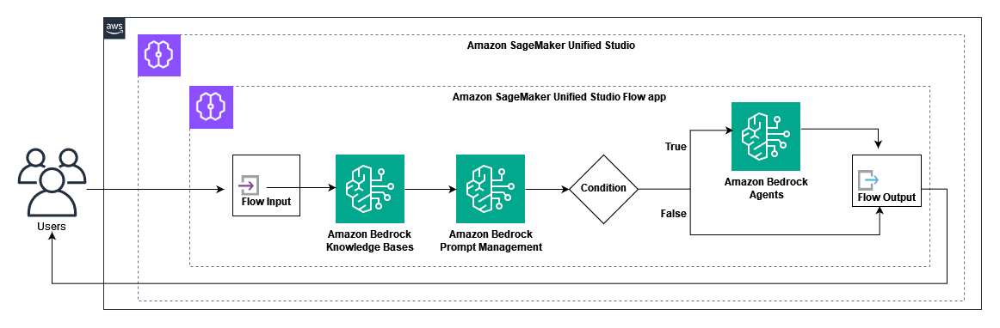

Giải pháp sử dụng các thành phần chính sau:

*   **SageMaker Unified Studio** – Cung cấp môi trường phát triển
*   **Flow app** – Điều phối quy trình làm việc, bao gồm:
    *   Truy vấn cơ sở tri thức
    *   Phân loại dựa trên prompt
    *   Định tuyến có điều kiện
    *   Tạo phản hồi dựa trên Agent

Quy trình làm việc xử lý các truy vấn của người dùng thông qua các bước sau:

1.  Người dùng gửi một câu hỏi liên quan đến khiếu nại.
2.  Knowledge Base cung cấp thông tin khiếu nại có liên quan.
3.  Prompt phân loại xem truy vấn có phải về thời gian giải quyết hay không.
4.  Dựa trên phân loại bằng cách sử dụng điều kiện, ứng dụng sẽ thực hiện hành động sau:
    a. Định tuyến truy vấn đến một AI Agent để có các phản hồi giải quyết cụ thể.
    b. Trả về thông tin khiếu nại chung.
5.  Ứng dụng tạo ra một phản hồi phù hợp cho người dùng.

### ĐIỀU KIỆN TIÊN QUYẾT

Đối với ví dụ này, bạn cần những điều sau:

*   [Quyền truy cập vào SageMaker Unified Studio](https://docs.aws.amazon.com/sagemaker-unified-studio/latest/userguide/getting-started-access-the-portal.html). (Bạn sẽ cần URL cổng thông tin SageMaker Unified Studio từ quản trị viên của mình). Bạn có thể xác thực bằng cách sử dụng:
    *   Thông tin đăng nhập của người dùng [[AWS Identity and Access Management](https://aws.amazon.com/iam/) \(IAM\)](https://aws.amazon.com/iam/).
    *   Thông tin đăng nhập một lần (SSO) với [AWS IAM Identity Center](https://aws.amazon.com/iam/identity-center/).
*   Người dùng IAM hoặc người dùng IAM Identity Center phải có các quyền thích hợp cho:
    *   SageMaker Unified Studio.
    *   Amazon Bedrock (bao gồm [Amazon Bedrock Flows](https://docs.aws.amazon.com/bedrock/latest/userguide/flows.html), [Amazon Bedrock Agents](https://docs.aws.amazon.com/bedrock/latest/userguide/agents.html), Amazon Bedrock Prompt Management, và [Amazon Bedrock Knowledge Bases](https://docs.aws.amazon.com/bedrock/latest/userguide/knowledge-base.html)).
    *   Để biết thêm thông tin, hãy tham khảo [các ví dụ về chính sách dựa trên danh tính](https://docs.aws.amazon.com/sagemaker-unified-studio/latest/adminguide/security_iam_id-based-policy-examples.html).
*   [Quyền truy cập vào các FMs của Amazon Bedrock](https://docs.aws.amazon.com/bedrock/latest/userguide/model-access.html) (đảm bảo rằng chúng được bật cho tài khoản của bạn), ví dụ: Claude 3 Haiku của Anthropic (cho Agent).
*   [Định cấu hình quyền truy cập](https://docs.aws.amazon.com/sagemaker-unified-studio/latest/adminguide/amazon-bedrock.html) vào các mô hình không có máy chủ Amazon Bedrock của bạn cho Amazon Bedrock trong các dự án SageMaker Unified Studio.
*   [Amazon Titan Embedding](https://aws.amazon.com/bedrock/titan/) (cho Knowledge Base).
*   Dữ liệu khiếu nại mẫu được chuẩn bị ở định dạng CSV để tạo Knowledge Base.

### CHUẨN BỊ DỮ LIỆU CỦA BẠN

Chúng tôi đã tạo một bộ dữ liệu mẫu để sử dụng cho [Amazon Bedrock Knowledge Bases](https://docs.aws.amazon.com/bedrock/latest/userguide/knowledge-base.html). Bộ dữ liệu này có thông tin về các khiếu nại mà các đại diện dịch vụ khách hàng nhận được và thông tin giải quyết. Sau đây là một ví dụ từ bộ dữ liệu mẫu:

```csv
complaint_id,product,sub_product,issue,sub_issue,complaint_summary,action_taken,next_steps,financial_institution,state,submitted_via,resolution_type,timely_response
FIN-2024-001,04/26/24,"Mortgage","Conventional mortgage","Payment issue","Escrow dispute","Customer disputes mortgage payment increase after recent escrow analysis","Reviewed escrow analysis, explained property tax increase impact, provided detailed payment breakdown","1. Send written explanation of escrow analysis 2. Schedule annual escrow review 3. Provide payment assistance options","Financial Institution-1","TX","Web","Closed with explanation","Yes"
FIN-2024-002,04/26/24,"Money transfer","Wire transfer","Processing delay","International transfer","Wire transfer of $10,000 delayed, customer concerned about international payment deadline","Located wire transfer in system, expedited processing, waived wire fee","1. Confirm receipt with receiving bank 2. Update customer on delivery 3. Document process improvement needs","Financial Institution-2","FL","Phone","Closed with monetary relief","No"
```

### TẠO MỘT DỰ ÁN

Trong SageMaker Unified Studio, người dùng có thể sử dụng các dự án để cộng tác trong các trường hợp sử dụng kinh doanh khác nhau. Trong các dự án, bạn có thể quản lý tài sản dữ liệu trong danh mục SageMaker Unified Studio, thực hiện phân tích dữ liệu, tổ chức quy trình làm việc, phát triển mô hình ML, xây dựng ứng dụng Generative AI, v.v.

Để tạo một dự án, hãy hoàn thành các bước sau:

1.  Mở trang đích SageMaker Unified Studio bằng URL từ quản trị viên của bạn.
2.  Chọn **Create project**.
3.  Nhập tên dự án và mô tả tùy chọn.
4.  Đối với **Project profile**, hãy chọn **Generative AI application development**.
5.  Chọn **Continue**.
6.  Hoàn tất cấu hình dự án của bạn, sau đó chọn **Create project**.

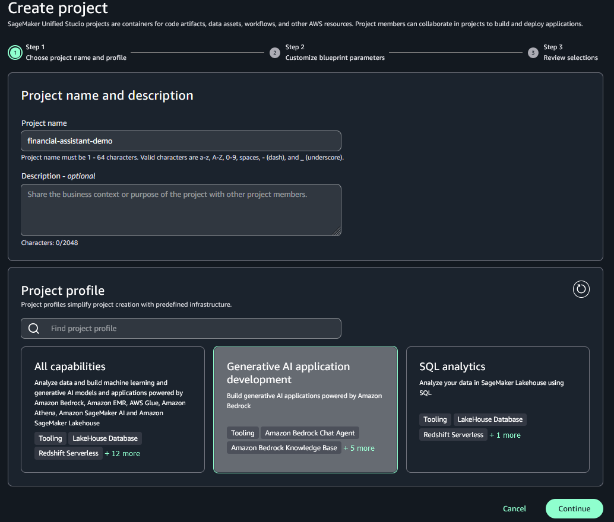

### TẠO MỘT PROMPT

Hãy tạo một prompt có thể tái sử dụng để nắm bắt các hướng dẫn cho các FMs, chúng tôi sẽ sử dụng sau này khi tạo flow app. Để biết thêm thông tin, hãy xem Tái sử dụng và chia sẻ Amazon Bedrock prompts.

1.  Trong SageMaker Unified Studio, trên menu **Build**, chọn **Prompt** trong **Machine Learning & Generative AI**.
2.  Cung cấp tên cho prompt.
3.  Chọn FM thích hợp (đối với ví dụ này, chúng tôi chọn Claude 3 Haiku).
4.  Đối với **Prompt message**, chúng tôi nhập như sau (Prompt đã được dịch sang tiếng Việt):
    ```
    Bạn là một bộ phân loại phân tích khiếu nại. Bạn sẽ nhận được dữ liệu khiếu nại từ một cơ sở tri thức. Phân tích {{input}} và trả lời bằng một chữ cái duy nhất:
    T: Nếu đầu vào chứa thông tin về thời gian giải quyết khiếu nại, thời gian phản hồi hoặc tiến trình xử lý (cho dù kịp thời hay bị trì hoãn)
    F: Đối với tất cả các loại thông tin khiếu nại khác
    Chỉ trả về 'T' hoặc 'F' dựa trên việc phản hồi của cơ sở tri thức có phải về thời gian giải quyết hay không. Không thêm bất kỳ văn bản hoặc giải thích bổ sung nào - chỉ trả lời bằng một chữ cái duy nhất 'T' hoặc 'F'.
    ```
5.  Chọn **Save**.
6.  Chọn **Create version**.

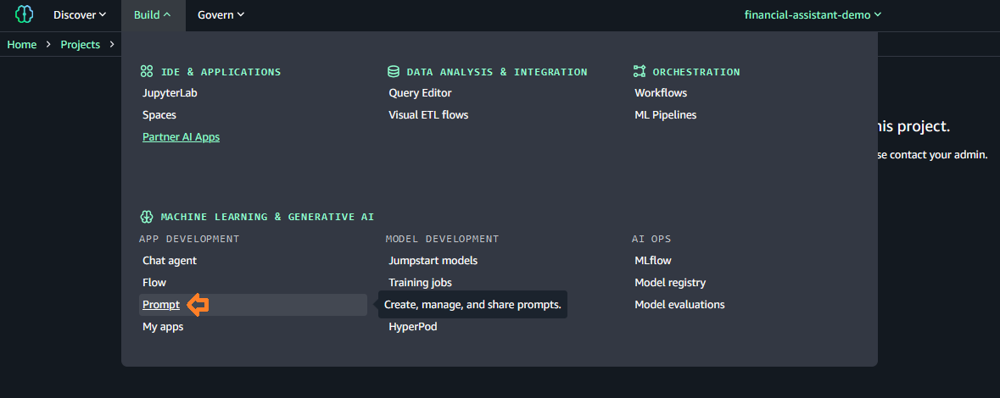
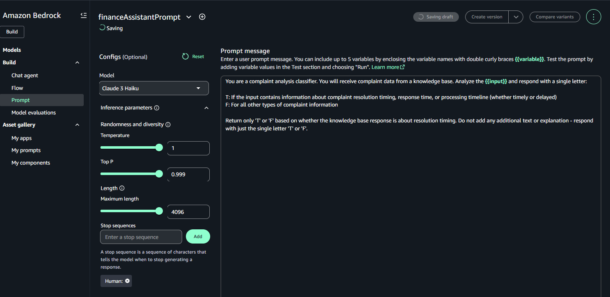

### TẠO MỘT CHAT AGENT

Hãy tạo một Chat Agent để xử lý các phản hồi giải quyết cụ thể. Hoàn thành các bước sau:

1.  Trong SageMaker Unified Studio, trên menu **Build**, chọn **Chat agent** trong **Machine Learning & Generative AI**.
2.  Cung cấp tên cho prompt.
3.  Chọn FM thích hợp (đối với ví dụ này, chúng tôi chọn Claude 3 Haiku).
4.  Đối với **Enter a system prompt**, chúng tôi nhập như sau (Prompt đã được dịch sang tiếng Việt):
    ```
    Bạn là một Trợ lý AI Khiếu nại Tài chính. Bạn sẽ nhận được thông tin khiếu nại từ một cơ sở tri thức và các câu hỏi về thời gian giải quyết.
    Khi trả lời các truy vấn về thời gian giải quyết:
    1. Sử dụng thông tin khiếu nại được cung cấp để xác nhận xem nó đã được giải quyết trong thời hạn hay chưa
    2. Đối với các giải pháp kịp thời, hãy cung cấp:
       - Xác nhận hoàn thành kịp thời
       - Các hành động cụ thể đã được thực hiện (từ dữ liệu khiếu nại được cung cấp)
       - Các bước tiếp theo đã được hoàn thành
    2. Đối với các giải pháp bị trì hoãn, hãy cung cấp:
       - Thừa nhận sự chậm trễ
       - Gói bồi thường tiêu chuẩn:
         • Tín dụng dịch vụ 75 đô la
         • Nâng cấp Trạng thái Ưu tiên trong 6 tháng
         • Miễn phí dịch vụ cho chu kỳ thanh toán hiện tại
       - Các hành động đã được thực hiện (từ dữ liệu khiếu nại được cung cấp)
       - Thông tin liên hệ để theo dõi: Đường dây ưu tiên: ************** 
    Luôn tham chiếu các chi tiết khiếu nại cụ thể được cung cấp trong đầu vào của bạn khi thảo luận về các hành động đã thực hiện và quy trình giải quyết.
    ```
5.  Chọn **Save**.
6.  Sau khi Agent được lưu, hãy chọn **Deploy**.
7.  Đối với **Alias name**, hãy nhập `demoAlias`.
8.  Chọn **Deploy**.

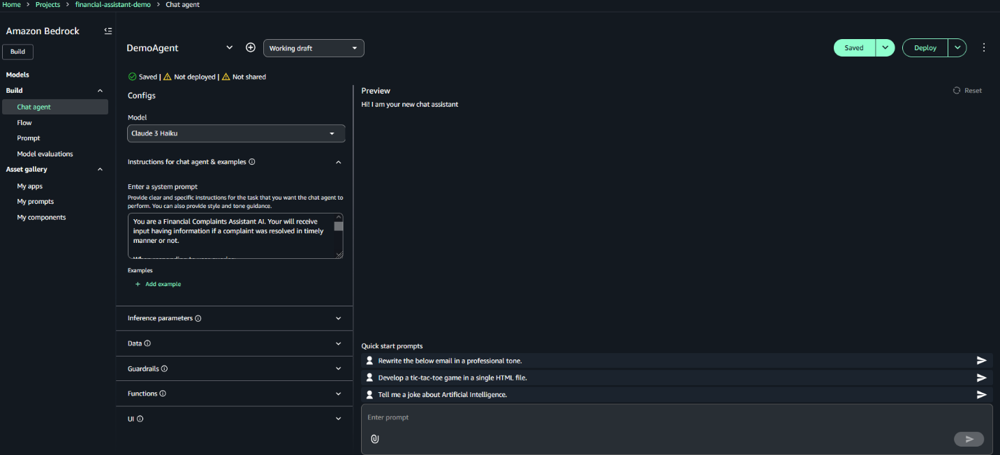

### TẠO MỘT FLOW

Bây giờ chúng ta đã sẵn sàng prompt và Agent, hãy tạo một Flow sẽ điều phối quy trình xử lý khiếu nại:

1.  Trong SageMaker Unified Studio, trên menu **Build**, chọn **Flow** trong **Machine Learning & Generative AI**.
2.  Tạo một Flow mới có tên `demo-flow`.

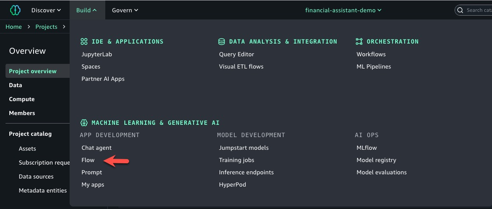
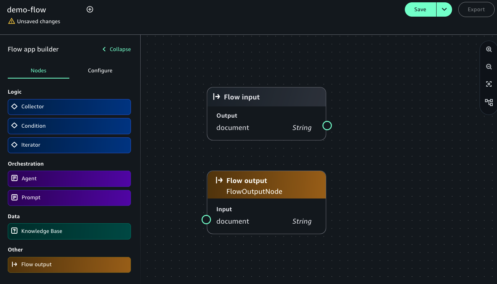

### THÊM KNOWLEDGE BASE VÀO FLOW APP CỦA BẠN

Hoàn thành các bước sau để thêm một nút Knowledge Base (Knowledge Base node) vào Flow:

1.  Trong ngăn điều hướng, trên tab **Nodes**, chọn **Knowledge Base**.
2.  Trên tab **Configure**, cung cấp thông tin sau:
    a. Đối với **Node name**, hãy nhập một tên (ví dụ: `complaints_kb`).
    b. Chọn **Create new Knowledge Base**.
3.  Trong ngăn **Create Knowledge Base**, hãy nhập thông tin sau:
    a. Đối với **Name**, hãy nhập một tên (ví dụ: `complaints`).
    b. Đối với **Description**, hãy nhập một mô tả (ví dụ: `user complaints information`).
    c. Đối với **Add data sources**, hãy chọn **Local file** và tải lên tệp `complaints.txt`.
    d. Đối với **Embeddings model**, hãy chọn **Titan Text Embeddings V2**.
    e. Đối với **Vector store**, hãy chọn **OpenSearch Serverless**.
    f. Chọn **Create**.
4.  Sau khi bạn tạo Knowledge Base, hãy chọn nó trong Flow.
5.  Trong tên chi tiết, cung cấp thông tin sau:
6.  Đối với **Response generation model**, hãy chọn **Claude 3 Haiku**.
7.  Kết nối đầu ra của nút đầu vào Flow (Flow input node) với đầu vào của nút Knowledge Base (Knowledge Base node).
8.  Kết nối đầu ra của nút Knowledge Base (Knowledge Base node) với đầu vào của nút đầu ra Flow (Flow output node).
9.  Chọn **Save**.

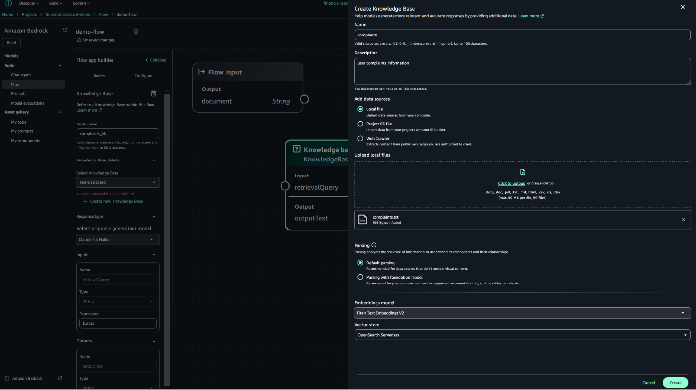
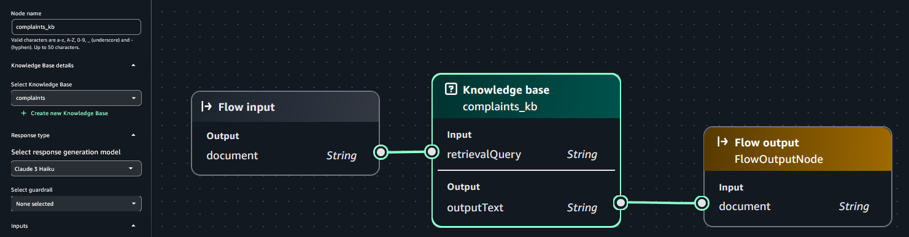

### THÊM PROMPT VÀO FLOW APP CỦA BẠN

Bây giờ, hãy thêm prompt bạn đã tạo trước đó vào Flow:

1.  Trên tab **Nodes** trong ngăn trình tạo flow app, hãy thêm một nút prompt (Prompt node).
2.  Trên tab **Configure** cho nút prompt (Prompt node), cung cấp thông tin sau:
3.  Đối với **Node name**, hãy nhập một tên (ví dụ: `demo_prompt`).
4.  Đối với **Prompt**, hãy chọn `financeAssistantPrompt`.
5.  Đối với **Version**, hãy chọn `1`.
6.  Kết nối đầu ra của nút Knowledge Base (Knowledge Base node) với đầu vào của nút prompt (Prompt node).
7.  Chọn **Save**.

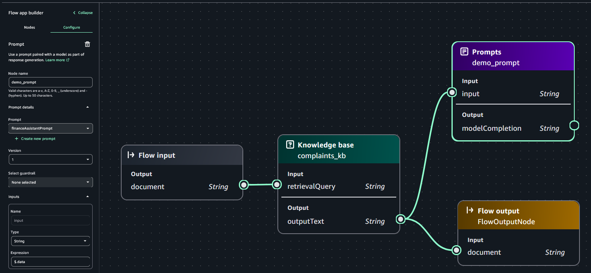

### THÊM ĐIỀU KIỆN VÀO FLOW APP CỦA BẠN

Nút điều kiện (Condition node) xác định cách Flow xử lý các loại truy vấn khác nhau. Nó đánh giá xem một truy vấn có phải về thời gian giải quyết hay thông tin khiếu nại chung hay không, cho phép Flow định tuyến truy vấn một cách thích hợp. Khi một truy vấn về thời gian giải quyết, nó sẽ được chuyển đến Chat Agent để xử lý chuyên biệt; nếu không, nó sẽ nhận được phản hồi trực tiếp từ Knowledge Base. Hoàn thành các bước sau để thêm một điều kiện:

1.  Trên tab **Nodes** trong ngăn trình tạo flow app, hãy thêm một nút điều kiện (Condition node).
2.  Trên tab **Configure** cho nút điều kiện (Condition node), cung cấp thông tin sau:
    a. Đối với **Node name**, hãy nhập một tên (ví dụ: `demo_condition`).
    b. Trong **Conditions**, đối với **Condition**, hãy nhập `conditionInput == "T"`.
    c. Kết nối đầu ra của nút prompt (Prompt node) với đầu vào của nút điều kiện (Condition node).
3.  Chọn **Save**.

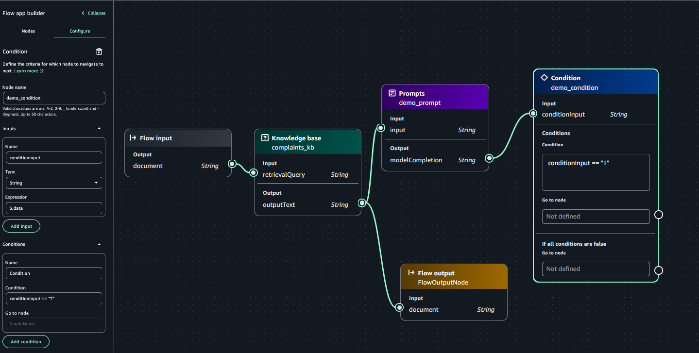

### THÊM CHAT AGENT VÀO FLOW APP CỦA BẠN

Bây giờ, hãy thêm Chat Agent bạn đã tạo trước đó vào Flow:

1.  Trên tab **Nodes** trong ngăn trình tạo flow app, hãy thêm nút Agent (Agent node).
2.  Trên tab **Configure** cho nút Agent (Agent node), cung cấp thông tin sau:
    a. Đối với **Node name**, hãy nhập một tên (ví dụ: `demo_agent`).
    b. Đối với **Chat agent**, hãy chọn `DemoAgent`.
    c. Đối với **Alias**, hãy chọn `demoAlias`.
3.  Tạo các kết nối nút sau:
    a. Kết nối đầu vào của nút điều kiện (Condition node) (`demo_condition`) với đầu ra của nút prompt (Prompt node) (`demo_prompt`).
    b. Kết nối đầu ra của nút điều kiện (Condition node):
       i.  Đặt **If condition is true** thành nút Agent (Agent node) (`demo_agent`).
       ii. Đặt **If condition is false** thành nút đầu ra Flow (Flow output node) hiện có (`FlowOutputNode`).
    c. Kết nối đầu ra của nút Knowledge Base (Knowledge Base node) (`complaints_kb`) với đầu vào của những thứ sau:
       i.  Nút Agent (Agent node) (`demo_agent`).
       ii. Nút đầu ra Flow (Flow output node) (`FlowOutputNode`).
    d. Kết nối đầu ra của nút Agent (Agent node) (`demo_agent`) với một nút đầu ra Flow (Flow output node) mới có tên `FlowOutputNode_2`.
4.  Chọn **Save**.

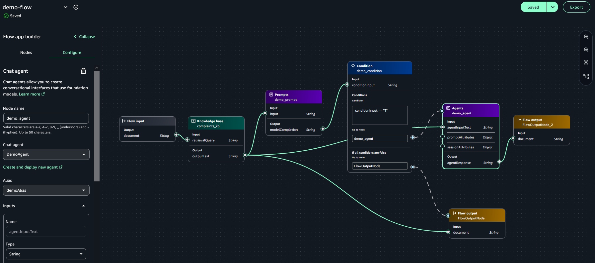
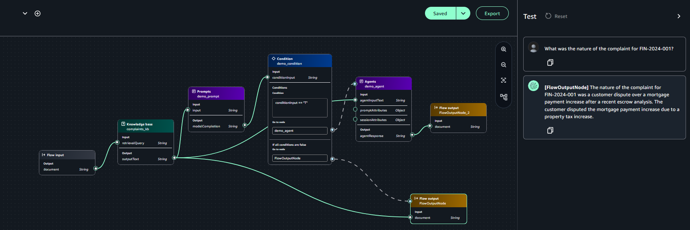

### KIỂM TRA FLOW APP

Bây giờ flow app đã sẵn sàng, hãy kiểm tra nó. Ở phía bên phải của trang, hãy chọn biểu tượng mở rộng để mở ngăn **Test**.

Trong hộp văn bản **Enter prompt**, chúng ta có thể hỏi một vài câu hỏi liên quan đến bộ dữ liệu được tạo trước đó.


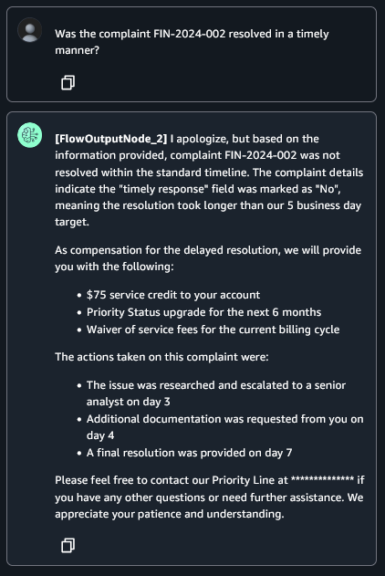

### DỌN DẸP

Để dọn dẹp tài nguyên của bạn, hãy xóa Flow, Agent, prompt, Knowledge Base và các tài nguyên OpenSearch Serverless được liên kết.

### KẾT LUẬN

Trong bài đăng này, chúng tôi đã trình bày cách xây dựng một hệ thống tham chiếu khiếu nại được hỗ trợ bởi AI bằng cách sử dụng một flow app trong SageMaker Unified Studio. Bằng cách sử dụng các khả năng tích hợp của SageMaker Unified Studio với các tính năng của Amazon Bedrock như [Amazon Bedrock Knowledge Bases](https://docs.aws.amazon.com/bedrock/latest/userguide/knowledge-base.html), [Amazon Bedrock Agents](https://docs.aws.amazon.com/bedrock/latest/userguide/agents.html) và [Amazon Bedrock Flows](https://docs.aws.amazon.com/bedrock/latest/userguide/flows.html), bạn có thể nhanh chóng phát triển và triển khai các ứng dụng AI phức tạp mà không cần viết mã rộng rãi.

Khi bạn xây dựng các quy trình làm việc AI bằng SageMaker Unified Studio, hãy nhớ tuân thủ [Mô hình chia sẻ trách nhiệm](https://aws.amazon.com/compliance/shared-responsibility-model/) của AWS về bảo mật. Triển khai các best practices về [bảo mật](https://docs.aws.amazon.com/sagemaker-unified-studio/latest/adminguide/security.html) của SageMaker Unified Studio, bao gồm các cấu hình IAM phù hợp và mã hóa dữ liệu. Bạn cũng có thể tham khảo [Bảo mật một trợ lý AI tạo sinh với OWASP Top 10 mitigation](https://aws.amazon.com/blogs/machine-learning/secure-a-generative-ai-assistant-with-owasp-top-10-mitigation/) để biết chi tiết về cách đánh giá tình hình bảo mật của một trợ lý AI tạo sinh bằng cách sử dụng các biện pháp giảm thiểu OWASP TOP 10 cho các mối đe dọa phổ biến. Việc tuân theo các nguyên tắc này giúp thiết lập các ứng dụng AI mạnh mẽ duy trì tính toàn vẹn của dữ liệu và bảo vệ hệ thống.

Để tìm hiểu thêm, hãy tham khảo Amazon Bedrock trong SageMaker Unified Studio và tham gia các cuộc thảo luận và chia sẻ kinh nghiệm của bạn trong Cộng đồng AI tạo sinh của AWS.

Chúng tôi mong muốn được thấy các giải pháp sáng tạo mà bạn sẽ tạo ra với các tính năng mới mạnh mẽ này.

---

## 📖 Glossary - Thuật ngữ

| English | Tiếng Việt | Định nghĩa |
| --- | --- | --- |
| Foundation Models (FMs) | Mô hình nền tảng | Các mô hình học máy lớn, được đào tạo trước có thể được điều chỉnh cho các tác vụ khác nhau. |
| Generative AI | AI tạo sinh | Trí tuệ nhân tạo có khả năng tạo ra nội dung mới, chẳng hạn như văn bản, hình ảnh hoặc mã. |
| Knowledge Base | Cơ sở tri thức | Một kho lưu trữ thông tin có cấu trúc và phi cấu trúc được sử dụng bởi các hệ thống AI. |
| Prompt | Lời nhắc | Hướng dẫn được cung cấp cho một mô hình ngôn ngữ lớn để tạo ra một phản hồi cụ thể. |
| Unified Development Environment | Môi trường phát triển hợp nhất | Một nền tảng tích hợp cung cấp một bộ công cụ và dịch vụ toàn diện để phát triển phần mềm. |

---

## 🔗 Tài liệu tham khảo

### Tài liệu gốc
- [Bài viết gốc](https://aws.amazon.com/vi/blogs/machine-learning/use-amazon-sagemaker-unified-studio-to-build-complex-ai-workflows-using-amazon-bedrock-flows/)
- [Sumeet Tripathi - Tác giả 1](https://aws.amazon.com/vi/blogs/machine-learning/author/sumeett/)
- [Vishal Naik - Tác giả 2](https://aws.amazon.com/vi/blogs/machine-learning/author/vishaln/)

### Tools và Services
- [Amazon SageMaker](https://aws.amazon.com/vi/sagemaker/): Dịch vụ cloud để xây dựng, đào tạo và triển khai các mô hình học máy.
- [Amazon Bedrock](https://aws.amazon.com/vi/bedrock/): Dịch vụ cloud cung cấp quyền truy cập vào các mô hình nền tảng hiệu suất cao.

---

## 💬 Ghi chú của người dịch

Bản dịch này được thực hiện trong khuôn khổ **Chương trình thực tập FCJ**.

### Thách thức trong quá trình dịch
- **Technical Terms**: Một số thuật ngữ kỹ thuật, chẳng hạn như "Flows", "Agents" và "Knowledge Bases", được giữ nguyên bằng tiếng Anh để duy trì tính nhất quán với tài liệu của AWS.
- **Cultural Context**: Bài viết sử dụng một công ty tài chính hư cấu làm ví dụ. Ngữ cảnh này đã được điều chỉnh để phù hợp với đọc giả.

### Hiểu biết thu được
- **Technical Learning**: Quá trình dịch đã cung cấp sự hiểu biết sâu sắc hơn về cách các dịch vụ AI/ML của AWS có thể được tích hợp để xây dựng các ứng dụng phức tạp.
- **Language Skills**: Việc dịch bài viết này đã giúp cải thiện kỹ năng dịch thuật kỹ thuật từ tiếng Anh sang tiếng Việt.

---

## 🤝 Đóng góp và Phản hồi

**📧 Liên hệ**: giaule.work@gmail.com  
**💬 Phản hồi**: Mọi góp ý để cải thiện chất lượng dịch thuật xin gửi về email trên  
**🔄 Cập nhật**: Bài dịch sẽ được cập nhật dựa trên phản hồi từ cộng đồng

---

*© 2025 - Bản dịch thuộc về Lê Minh Giàu. Vui lòng ghi rõ nguồn khi sử dụng.*
