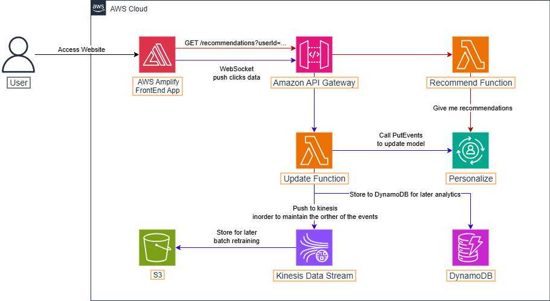
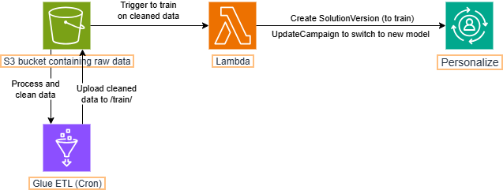
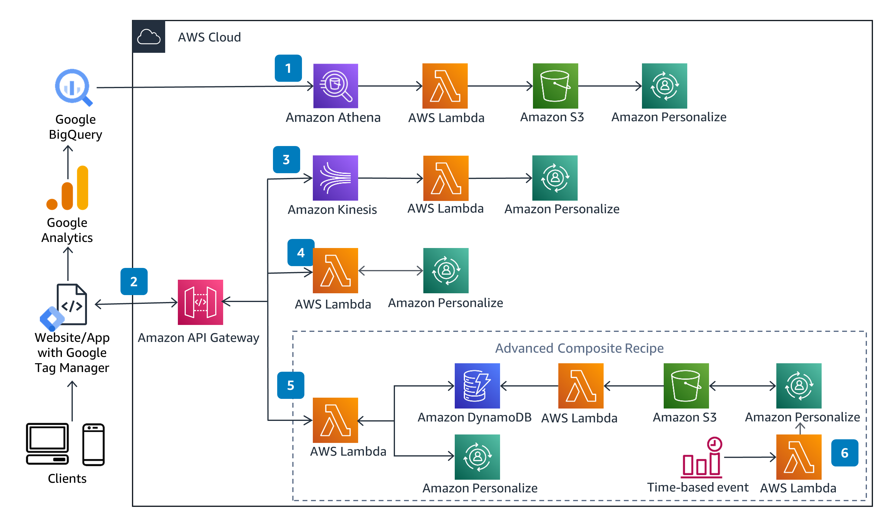
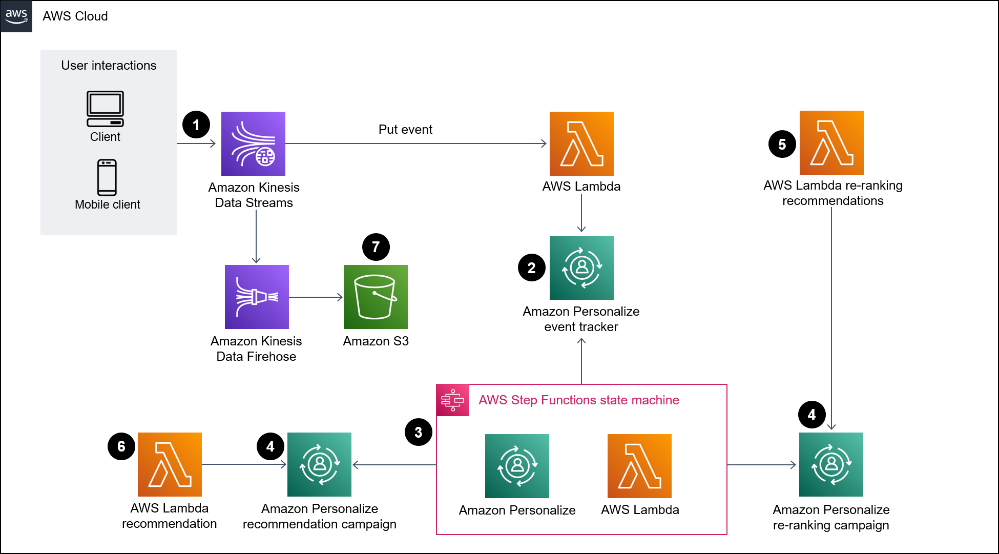

# Phát triển nền tảng Thương mại điện tử cá nhân hóa tích hợp gợi ý sản phẩm thời gian thực trên AWS

## Phát triển nền tảng thương mại điện tử hiện đại với khả năng phân tích hành vi người dùng và đề xuất sản phẩm theo thời gian thực sử dụng AWS Personalize

---

# Executive Summary

Trong bối cảnh thị trường thương mại điện tử (TMĐT) ngày càng cạnh tranh khốc liệt, trải nghiệm cá nhân hóa được xem là chìa khóa giữ chân khách hàng và thúc đẩy doanh thu. Báo cáo năm 2024 của McKinsey cho thấy 63 % người mua sắm trực tuyến kỳ vọng nhận được đề xuất sản phẩm “đo ni đóng giày” cho nhu cầu của mình, và các doanh nghiệp đã triển khai thành công mô hình gợi ý thời gian thực ghi nhận mức tăng trưởng doanh thu bình quân 20 – 30 %. Tuy nhiên, hầu hết nền tảng TMĐT tại Việt Nam mới chỉ dừng ở mức hiển thị “sản phẩm phổ biến” hoặc “khách cũng mua” dựa trên thống kê tĩnh, dẫn đến tỷ lệ chuyển đổi (conversion rate) thấp và chi phí quảng cáo ngày càng phình to.

Dự án **“Nền tảng Thương mại Điện tử Cá nhân hóa với Hệ thống Gợi ý Thời gian Thực”** đặt mục tiêu xây dựng một giải pháp toàn diện trên hạ tầng đám mây AWS, tận dụng **Amazon Personalize** để huấn luyện và phục vụ (serve) mô hình machine learning thời gian thực, kết hợp **AWS Lambda**, **API Gateway** và **DynamoDB** trong kiến trúc serverless linh hoạt. Khác với phương pháp “batch recommendation” truyền thống, hệ thống mới thu thập dữ liệu hành vi người dùng (clickstream, lịch sử mua, lượt xem) liên tục, cập nhật mô hình nhanh, trả về gợi ý trong dưới 100 ms – đủ để hiển thị ngay khi trang sản phẩm hoặc trang chủ được tải.

Về mặt kinh doanh, chúng tôi dự báo **tăng tỷ lệ chuyển đổi thêm 25 %**, **giảm bounce rate 30 %** và **nâng giá trị đơn hàng trung bình (AOV) 18 %** trong 6 tháng đầu sau triển khai. Với doanh thu hiện tại 16 tỷ đồng/năm, chỉ cần đạt các chỉ số trên ở nhóm người dùng được bật tính năng gợi ý (ước tính 60 % traffic) đã mang lại thêm \~4,2 tỷ đồng/năm; mức **ROI dương sau 3 tháng** so với tổng chi phí hạ tầng và nhân sự ước khoảng 950 USD/tháng (≈ 23 triệu VND). Ngoài lợi nhuận ngắn hạn, hệ thống còn mở ra cơ hội khai thác chéo (cross-sell), remarketing chính xác, và xây dựng lộ trình chuyển đổi dữ liệu lớn (big data) sang các dịch vụ AI khác của AWS như Forecast, SageMaker hoặc Connect.

Giải pháp được chia thành năm giai đoạn trong 7 tuần:
- **Thu thập & làm sạch dữ liệu**:
    - Tập hợp dữ liệu giao dịch 24 tháng cùng sự kiện web/app hiện hành
    - Chuẩn hóa và lưu trữ vào S3
- **Huấn luyện mô hình**:
    - Tạo Dataset Group & Solution trên Amazon Personalize
    - Thử nghiệm nhiều recipe (User-Personalization, SIMS) để chọn mô hình tốt nhất
- **Triển khai API**:
    - Xây dựng lớp Lambda bảo vệ bởi API Gateway
    - Truy vấn Personalize Serve-realtime và cache kết quả ngắn hạn trong DynamoDB
- **Tích hợp giao diện**:
    - Cập nhật frontend React/Next.js hiển thị gợi ý ở trang chủ, trang chi tiết, giỏ hàng
- **Kiểm thử & ra mắt**:
    - Thực hiện A/B test (2 tuần) để đo lường CTR, CR, AOV
    - Mở rộng dần đến 100% traffic

Chiến lược bảo mật bám sát khung **AWS Well-Architected** trụ cột Security: IAM tách biệt quyền, kết nối TLS 1.2, mã hóa dữ liệu tĩnh (S3, DynamoDB) bằng KMS, áp dụng WAF chặn OWASP Top 10, giám sát CloudWatch & GuardDuty. High Availability bảo đảm nhờ Lambda vùng kép (multi-AZ) và DynamoDB Multi-AZ với tự động mở rộng thông lượng. Đối với tuân thủ GDPR/PDPL, dữ liệu cá nhân được ẩn danh (pseudonymization) và cung cấp cơ chế xóa theo yêu cầu.

Rủi ro chính gồm **chất lượng dữ liệu không đồng nhất** (giải quyết bằng pipeline làm sạch & validation), **độ trễ inference tăng đột biến** (giảm thiểu bằng pre-warm Lambda, caching, auto-scale TPS Personalize) và **người dùng hoài nghi đề xuất** (giải pháp: hiển thị badge “Đề xuất cho riêng bạn”, kết hợp email/push khuyến mãi cá nhân).

Các **chỉ số thành công** (success metrics) bao gồm:

* **CTR gợi ý** (Click-Through Rate – tỷ lệ người dùng nhấp vào gợi ý) ≥ 6 % (tăng từ mức cơ sở 2,8 %)
* **Conversion Rate tổng** ≥ 1,5 % (so với 1,2 %)
* **Doanh thu thuần trên mỗi khách** (NTV – Net Revenue per Visitor) tăng ≥ 15 % sau 90 ngày

Với đội ngũ 2 kỹ sư backend, 1 ML engineer và 1 frontend dev bán thời gian, dự án có thể triển khai trọn vẹn trong vòng 2 tháng, tận dụng chương trình **AWS Activate** để nhận tín dụng (credits) giảm chi phí hạ tầng giai đoạn đầu. Thành công của dự án không chỉ giải quyết “nỗi đau” hiện tại về tỷ lệ chuyển đổi mà còn xây dựng lợi thế cạnh tranh bền vững: dữ liệu hành vi độc nhất được học liên tục, khó sao chép, tạo rào cản gia nhập đối thủ.

Tóm lại, **“Nền tảng Thương mại Điện tử Cá nhân hóa với Hệ thống Gợi ý Thời gian Thực”** là một khoản đầu tư chiến lược, chi phí hợp lý, rủi ro thấp nhờ sử dụng dịch vụ managed của AWS, nhưng đem lại giá trị dài hạn to lớn: tăng doanh thu, cải thiện trải nghiệm khách hàng, và là bước đệm vững chắc cho lộ trình chuyển đổi số sâu rộng dựa trên dữ liệu và trí tuệ nhân tạo.

# 1. **Problem Statement**

## Current Situation

Trong vòng 5 năm trở lại đây, TMĐT Việt Nam tăng trưởng kép (CAGR) hơn 20 %/năm, song hiệu quả chuyển đổi lại không bắt kịp đà mở rộng lưu lượng truy cập. Báo cáo **Digital Commerce 360** cho thấy **tỷ lệ chuyển đổi (CR) trung vị của 1.000 nhà bán lẻ trực tuyến lớn nhất Bắc Mỹ chỉ còn 2,7 %** vào cuối 2023, giảm nhẹ so với 2021–2022 ([Digital Commerce 360][1]); dữ liệu toàn cầu của **ECDB** cũng xác nhận mức CR quanh **2,7 % trong 2024** ([ECDB][2]). Trong khi đó, trang TMĐT của doanh nghiệp hiện chỉ đạt **\~1,2 %**, chưa tới một nửa chuẩn ngành, buộc bộ phận Marketing phải “bơm” ngân sách quảng cáo để duy trì doanh thu.

Kịch bản tương tự diễn ra với **bounce rate**. Trung bình, **47 % người ghé thăm website TMĐT rời đi ngay sau một trang** ([SaleHoo][3]); hệ thống hiện tại thậm chí cao tới **≈ 48 %**, ám chỉ trải nghiệm chưa đủ hấp dẫn để giữ chân khách. Ngoài ra, số liệu Google Analytics nội bộ cho thấy **75 % lưu lượng xuất phát từ di động**, nơi hành vi “lướt – thoát” xảy ra nhanh hơn desktop nhưng giao diện đề xuất lại hầu như tĩnh, chỉ hiển thị “sản phẩm bán chạy” hoặc “mới về”.

Song song, kỳ vọng của người tiêu dùng đã thay đổi. Nghiên cứu của McKinsey nhấn mạnh **các doanh nghiệp dẫn đầu cá nhân hoá có thể tăng doanh thu 5–15 % và cải thiện hiệu quả chi tiêu marketing 10–30 %** ([McKinsey & Company][4]). Một phân tích học thuật trên **ScienceDirect** thậm chí ghi nhận **tăng trưởng doanh thu tới 29 %** khi áp dụng gợi ý sản phẩm phù hợp bối cảnh người dùng ([ScienceDirect][5]). Như vậy, “khoảng trống” giữa mong đợi thị trường và trải nghiệm hiện tại của doanh nghiệp là rõ ràng, dẫn đến thất thoát doanh thu, chi phí quảng cáo tăng và nguy cơ tụt hậu cạnh tranh.

## Key Challenges

1. **Chưa có gợi ý thời gian thực**

   * Thuật toán batch chạy mỗi đêm → không phản ánh hành vi người dùng thay đổi từng phút (giỏ hàng, trang đã xem).
   * Latency truy xuất khuyến nghị > 800 ms trong giờ cao điểm, vượt ngưỡng UX khuyến nghị (< 100 ms).

2. **Dữ liệu hành vi phân mảnh**

   * Clickstream, tìm kiếm, giao dịch, phản hồi CSKH lưu trữ rải rác (S3, Aurora, Google Analytics) → khó tập trung huấn luyện ML.
   * Thiếu lược đồ sự kiện chuẩn (event schema) và pipeline CDC để đồng bộ theo thời gian thực.

3. **Hạ tầng thiếu khả năng mở rộng linh hoạt**

   * Mô-đun khuyến nghị hiện chạy trên EC2 cố định; khi traffic flash-sale tăng 5×, CPU/GPU nghẽn, buộc phải scale thủ công.
   * Không tận dụng được dịch vụ serverless (Lambda, DynamoDB auto-scale) lẫn managed ML (Amazon Personalize).

4. **Giới hạn nhân sự & kỹ năng ML/DevOps**

   * Đội kỹ sư hiện ưu tiên tính năng core (catalogue, checkout), không thể dành nhiều thời gian vận hành cluster ML.
   * Khó tuyển chuyên gia Data Scientist tốc độ cao; giải pháp SaaS/managed AI giúp rút ngắn time-to-market cần được xem xét.

5. **Yêu cầu tuân thủ bảo mật & pháp lý**

   * Nghị định Bảo vệ Dữ liệu Cá nhân Việt Nam (tương tự GDPR) yêu cầu mã hoá, cho phép người dùng xoá dữ liệu.
   * Hệ thống legacy thiếu cơ chế mã hoá KMS, logging CloudTrail, audit IAM granular.

## Stakeholder Impact

| Nhóm liên quan            | Hiện trạng (tác động tiêu cực)                                                                          | Kỳ vọng sau triển khai                                                                                       |
| ------------------------- | ------------------------------------------------------------------------------------------------------- | ------------------------------------------------------------------------------------------------------------ |
| **Marketing / Growth**    | CAC tăng do phải đẩy quảng cáo để bù CR thấp; remarketing kém hiệu quả vì thiếu segmentation chính xác. | Giảm CAC 15–20 %, tăng ROAS nhờ gợi ý cá nhân hóa và audience look-alike dựa trên dữ liệu mô hình.           |
| **Sales & Merchandising** | Tỷ lệ upsell/cross-sell < 5 %; AOV stagnate ở 420.000 đ.                                                | AOV +18 %; tỷ lệ giỏ hàng bổ sung (attach rate) tăng nhờ gợi ý bổ trợ (bundle, phụ kiện).                    |
| **Khách hàng cuối**       | Mất thời gian lọc sản phẩm; đề xuất “phổ biến” không liên quan -> trải nghiệm rời rạc, NPS = 38.        | Trải nghiệm “đo ni đóng giày”, NPS mục tiêu ≥ 55, giảm thời gian tìm kiếm xuống < 30 giây.                   |
| **Ban điều hành / CFO**   | Doanh thu bị bão hoà; biên lợi nhuận giảm khi ads budget > 25 % doanh thu.                              | ROI dương sau 3 tháng, biên EBIT cải thiện nhờ conversion + doanh thu tái mua.                               |
| **IT / DevOps**           | Gánh nặng vận hành EC2 tự quản lý, downtime khi peak traffic; khó tuân thủ PDPL.                        | Kiến trúc serverless auto-scale, bảo trì nhẹ; tuân thủ bảo mật nhờ managed services & logging chuẩn AWS.     |
| **Customer Service**      | Khiếu nại “đề xuất không phù hợp”; khó cá nhân hóa email/push thủ công.                                 | Giảm ticket liên quan gợi ý 40 %; CSKH có dữ liệu sản phẩm phù hợp để upsell khi hỗ trợ khách qua chat/call. |

## Business Consequences

1. **Thất thoát doanh thu đo được**

   * Với \~1 triệu phiên/tháng, mức chênh lệch CR từ 1,2 % lên mức ngành 2,7 % tương đương **15.000 đơn hàng bị bỏ lỡ** mỗi tháng. Giả sử GMV bình quân 600.000 đ/đơn, doanh nghiệp đang “để rơi” ≈ 9 tỷ đ/tháng doanh thu tiềm năng.

2. **Chi phí quảng cáo leo thang, ROAS suy giảm**

   * Để bù lượng bán, Marketing duy trì chi tiêu quảng cáo ở mức 3 tỷ đ/tháng; ROAS giảm từ 6,2 xuống 3,9 trong 12 tháng qua. Trong khi nghiên cứu chỉ ra **chi phí thu hút khách mới cao gấp 5–7 lần giữ chân khách cũ** ([Forbes][6], [FasterCapital][7]), việc không tập trung cá nhân hóa làm tăng chi phí không cần thiết.

3. **Tụt hậu cạnh tranh & rủi ro mất thị phần**

   * Nhiều đối thủ lớn đã triển khai AI recommendation, CR tăng 10–15 % chỉ sau 6 tháng ([ScienceDirect][5], [McKinsey & Company][4]). Nếu doanh nghiệp không theo kịp, thị phần sẽ dần bị bào mòn bởi trải nghiệm vượt trội của đối thủ.

4. **Erosion thương hiệu & lòng trung thành khách hàng**

   * NPS = 38 (mức “good” nhưng chưa “excellent”); mỗi lần đề xuất sai bối cảnh tạo cảm giác “spam”, giảm thiện cảm và đẩy khách sang sàn đối thủ.
   * Chi phí hậu mãi (trả hàng, hoàn tiền) tăng khi khách mua sản phẩm không đúng nhu cầu.

5. **Cản trở tầm nhìn dữ liệu & đổi mới dài hạn**

   * Thiếu data lake và mô hình ML phục vụ thời gian thực khiến các sáng kiến tiếp theo—như **dự báo tồn kho (Amazon Forecast)**, **định giá năng động (SageMaker)**, **chatbot hỗ trợ mua hàng (Bedrock/Lex)**—khó triển khai vì dữ liệu chưa sẵn sàng.
   * Đội ngũ kỹ thuật dành > 30 % thời gian “chữa cháy” hạ tầng legacy, giảm quỹ thời gian cho R\&D.

6. **Rủi ro tuân thủ pháp lý**

   * PDPL bắt buộc cung cấp cơ chế xoá dữ liệu cá nhân, mã hoá end-to-end; hệ thống cũ phụ thuộc mã hoá ứng dụng thủ công, khó auditing. Sự cố lộ dữ liệu có thể bị phạt tới 5 % doanh thu năm và thiệt hại uy tín.

---

**Tóm lại**, doanh nghiệp đang đối mặt “điểm nghẽn kép”: chuyển đổi kém và chi phí cao, bắt nguồn từ việc không khai thác dữ liệu hành vi để cá nhân hóa trải nghiệm thời gian thực. Điều này không chỉ làm thất thoát doanh thu hiện hữu mà còn kìm hãm mọi nỗ lực đổi mới dựa trên dữ liệu trong tương lai. Triển khai **hệ thống gợi ý sản phẩm cá nhân hóa thời gian thực trên AWS** là bước đi chiến lược, cấp thiết nhằm vá lỗ hổng doanh thu, nâng cao sự trung thành của khách hàng và tạo nền tảng dữ liệu vững chắc cho chuyển đổi số dài hạn.

## 2. Solution Architecture

### Architecture Overview

Giải pháp áp dụng **kiến trúc serverless – event-driven** để đáp ứng ba mục tiêu chính:

1. **Thời gian phản hồi < 100 ms** cho truy vấn gợi ý.
2. **Tự động mở rộng** khi lượng truy cập tăng gấp 10× (Flash Sale).
3. **Tối ưu chi phí** nhờ thanh toán theo mức sử dụng (pay-per-use).

*Luồng chính (mũi tên màu đỏ)*: người dùng gọi **REST API** lấy gợi ý → **Lambda** nhận request, truy vấn **Amazon Personalize real-time recommend endpoint** → trả về 3-10 SKU gợi ý.

*Luồng gửi clickstream (mũi tên màu tím)*: Frontend gửi hành vi (view, add-to-cart) vào **Amazon Kinesis Data Streams** → **Lambda consumer** ghi vào **DynamoDB** và **S3**. Dữ liệu mới nhất (≤ 1 phút) được **Personalize** cập nhật thông qua **PutEvents** API, bảo đảm đề xuất luôn “fresh”.

Ngoài ta, ta còn một luồng phụ khác là Train và Batch Retrain

*Luồng train ban đầu*: Dữ liệu giao dịch + clickstream lịch sử (CSV/Parquet) được Glue ETL chuẩn hoá và nạp vào Amazon S3 → Lambda khởi tạo Dataset Group & Dataset Import Jobs trên Amazon Personalize → Personalize huấn luyện Solution Version đầu tiên, triển khai Campaign production, sẵn sàng phục vụ gợi ý.

*Luồng batch retrain*: Hàng tuần, Glue ETL gom dữ liệu mới nhất trên S3 → Step Functions (hoặc Lambda định lịch) gọi Personalize CreateSolutionVersion để tái huấn luyện mô hình → khi hoàn tất, UpdateCampaign chuyển sang phiên bản mới không gián đoạn dịch vụ, đảm bảo đề xuất luôn phản ánh xu hướng người dùng cập nhật.

---

### AWS Services Used

| Nhóm chức năng         | Dịch vụ                                                                                   | Vai trò chính trong hệ thống                                      |
| ---------------------- | ----------------------------------------------------------------------------------------- | ----------------------------------------------------------------- |
| **Frontdoor & API**    | Amazon **API Gateway REST** + **WebSocket**                                               | Đầu mối HTTP & sự kiện real-time; throttling, auth token, metrics |
| **Compute**            | **AWS Lambda** (Python/Node)                                                              | Xử lý REST, ingest clickstream, ETL nhẹ; zero-admin, auto-scale   |
| **Machine Learning**   | **Amazon Personalize**                                                                    | Huấn luyện & phục vụ mô hình gợi ý thời gian thực                 |
| **Data Storage**       | **Amazon DynamoDB** (user + event table), **Amazon S3** (data lake), **AWS Glue Catalog** | OLTP siêu nhanh & data lake cho batch retrain/BI                  |
| **Streaming / Buffer** | **Amazon Kinesis Data Streams**                                                           | Nhận clickstream tới 5 MB/s; đảm bảo thứ tự & độ bền              |
| **Analytics tuỳ chọn** | **Amazon Athena**, **Amazon EMR**                                                         | Phân tích ad-hoc, feature engineering nâng cao                    |
| **Security & IAM**     | **AWS IAM**, **KMS**, **AWS WAF**, **AWS Shield**                                         | Phân quyền, mã hoá, firewall L7, chống DDoS                       |
| **Observability**      | **Amazon CloudWatch**, **AWS X-Ray**, **CloudTrail**                                      | Metrics, tracing, audit log                                       |

---

### Component Design

| Thành phần                    | Mô tả chi tiết                                                                                                                                    | Lý do lựa chọn                                    |
| ----------------------------- | ------------------------------------------------------------------------------------------------------------------------------------------------- | ------------------------------------------------- |
| **Frontend (SPA / Mobile)**   | Gửi sự kiện qua WebSocket API Gateway; gọi REST `/recommendations?userId=...`                                                                     | Giảm latency client–server; dễ cài trên web & app |
| **API Gateway**               | 2 API: REST (get recommendations), WebSocket (ingest)                                                                                             | Native throttling, CORS, authorizer JWT           |
| **Lambda-Recommend**          | - Nhận userId, context (SKU đang xem)   - Call `PersonalizeRuntime.GetRecommendations`   - Cache hot keys (DynamoDB Accelerator – DAX) 30 s | Thời gian phản hồi p95 \~50 ms; không server      |
| **Lambda-Ingest**             | Consumer Kinesis (batch 100 ms) → ghi event vào DynamoDB + PutEvents API → S3 (parquet)                                                           | Đảm bảo at-least-once; gom batch giảm phí         |
| **DynamoDB**                  | `UserProfile` (PK: userId)   `UserEvent` (PK: userId, SK: timestamp) TTL 30 ngày                                                               | Millisecond read, auto-scale; TTL giảm phí        |
| **S3 / Glue**                 | Giữ lịch sử 24 tháng để retrain (Athena query)                                                                                                    | Tách OLTP & OLAP; chi phí thấp                    |
| **Personalize**               | Dataset Group gồm `Users`, `Items`, `Interactions`; Solution recipe *User-Personalization*; Campaign TPS = 10 (auto-scale)                        | Managed ML, không cần đội DS vận hành             |
| **Batch Retraining (weekly)** | Lambda (Step Functions) trích S3 → Personalize CreateSolutionVersion → UpdateCampaign                                                             | Giảm “model staleness”; chạy lúc thấp tải         |
| **CDK / Terraform Stack**     | IaC cho toàn bộ tài nguyên; 2 stage *dev* & *prod*                                                                                                | Repeatable, auditạnh                              |

---

### Security Architecture

| Lớp bảo vệ                | Cơ chế cụ thể                                                                                                                       |
| ------------------------- | ----------------------------------------------------------------------------------------------------------------------------------- |
| **Network Edge**          | Amazon **CloudFront** + **AWS WAF** chặn OWASP Top 10; rate-limit IP bất thường; Geo-blocking ngoài APAC.                           |
| **API Authentication**    | JWT (Cognito User Pools) – Access Token 15 phút; refresh token 30 ngày; policy “least privilege”.                                   |
| **Encryption in Transit** | HTTPS/TLS 1.2 bắt buộc; Lambda–Personalize sử dụng VPC Endpoint PrivateLink.                                                        |
| **Encryption at Rest**    | S3, DynamoDB, Kinesis CMK-backed (KMS); CloudWatch Logs encrypted.                                                                  |
| **IAM & Least Privilege** | Mọi Lambda có role riêng, chỉ granted `dynamodb:GetItem`, `personalize:GetRecommendations`, v.v.; SCP ngăn tạo tài nguyên “shadow”. |
| **Audit & Compliance**    | **CloudTrail** ghi toàn account; GuardDuty bật toàn vùng; log gửi qua **AWS Security Hub** để triage.                               |
| **Incident Response**     | EventBridge rule phát hiện `LambdaErrorRate > 5 %` → SNS → PagerDuty; runbook & Lambda auto-rollback campaign nếu Personalize lỗi.  |

---

### Scalability Design

| Thành phần               | Cơ chế mở rộng / Hạn mức ban đầu                                    | Chiến lược tối ưu                                                          |
| ------------------------ | ------------------------------------------------------------------- | -------------------------------------------------------------------------- |
| **Lambda**               | Concurrency = *unbounded*, burst 3000; tính phí theo 1 ms           | Đặt `Provisioned Concurrency` = 5 chỉ trong Flash Sale để tránh cold start |
| **API GW**               | Default 10 k RPS; nâng qua ticket AWS nếu cần                       | Throttling per API key, hạn chế abuse                                      |
| **Personalize Campaign** | Auto-scale TPS từ 1 → 10 → 40; mỗi 10 TPS ≈ 0,05 USD/giờ            | Monitor `GetRecommendationsLatency`; bật multiple campaign nếu > 100 TPS   |
| **DynamoDB**             | On-Demand (WCU/RCU auto); DAX giảm read hot-spot                    | Key thiết kế `userId` hash + time-range prefix để tránh partition skew     |
| **Kinesis**              | 4 shards (1 MB/s in, 2 MB/s out); reshard on demand                 | Shard 2× trước Big Campaign để room for spike                              |
| **S3**                   | Vô hạn, chi phí theo GB; lifecycle chuyển *Standard → IA → Glacier* | Tự động xóa raw click > 365 ngày                                           |
| **CI/CD**                | CodePipeline chạy song song; Blue/Green deploy Lambda               | Giảm downtime; quick rollback                                              |

> **Kết quả mong đợi**: ở traffic bình thường (\~50 RPS), chi phí < 1 USD/ngày; khi Flash Sale 500 RPS trong 4 giờ, hạ tầng tự giãn nở nhưng vẫn duy trì p95 latency < 100 ms, không cần can thiệp thủ công. Điều này đáp ứng yêu cầu SLT (Service Level Target) 99,9 % cho API gợi ý và bảo đảm trải nghiệm mua sắm mượt mà ngay cả trong giờ vàng khuyến mại.

## 3. Technical Implementation

### 3.1 Implementation Phases

| Giai đoạn                            | Thời gian (tuần) | Hoạt động chính                                                                                                                                                 | Deliverable                                                | Ai chịu trách nhiệm |
| ------------------------------------ | ---------------- | --------------------------------------------------------------------------------------------------------------------------------------------------------------- | ---------------------------------------------------------- | ------------------- |
| **P0 – Khởi tạo**                    | Tuần 0           | • Kick-off, phân quyền AWS. • Tạo repo Git & CI/CD pipeline (CodePipeline).                                                                                  | Tài khoản AWS sandbox, khung IaC trống.                    | Tech Lead, DevOps   |
| **P1 – Thu thập & Làm sạch dữ liệu** | Tuần 1–2         | • Triển khai Kinesis WebSocket & Lambda Ingest. • Glue job chuẩn hóa log lịch sử 24 tháng. • Lưu trữ Parquet lên S3.                                      | S3 bucket `raw/`, `processed/`, bảng DynamoDB `UserEvent`. | Data Eng.           |
| **P2 – Huấn luyện mô hình lần 1**    | Tuần 3           | • Tạo Dataset Group trên Personalize (Users, Items, Interactions). • Import dữ liệu, chọn recipe *User-Personalization*. • Huấn luyện SolutionVersion v0. | Campaign `reco-prod-v0` (TPS=10).                          | ML Engineer         |
| **P3 – API & Service Layer**         | Tuần 4           | • Lambda Recommend, cache DAX. • API Gateway REST + authorizer Cognito. • X‐Ray tracing & CloudWatch dashboards.                                          | Endpoint `/recommendations`, log & metrics.                | BE Dev, DevOps      |
| **P4 – Frontend Integration**        | Tuần 5–6         | • Giao diện React/Next.js hiển thị gợi ý. • WebSocket client gửi event. • Tracking UX (Hotjar, GA4).                                                      | Trang chủ & PDP có khung “Gợi ý cho bạn”.                  | FE Dev              |
| **P5 – Kiểm thử & A/B test**         | Tuần 7           | • Unit/Integration test pass ≥ 90 %. • Load test 500 RPS. • A/B test 50/50 (feature flag).                                                                | Báo cáo test, dashboard CR/CTR.                            | QA, Growth          |
| **P6 – Go-Live & Hậu kiểm**          | Tuần 8           | • Blue-Green deploy sang prod. • Theo dõi 2 tuần; tối ưu TPS, shard Kinesis. • Handover tài liệu & runbook.                                               | Prod stable, SOP on-call.                                  | Toàn đội            |

---

### 3.2 Technical Requirements

| Hạng mục          | Chi tiết / Ngưỡng thiết kế                                                                                                   |
| ----------------- | ---------------------------------------------------------------------------------------------------------------------------- |
| **Compute**       | Lambda 512 MB–1 GB RAM, timeout ≤ 10 s, Provisioned Concurrency 5 trong Flash Sale.                                          |
| **Storage**       | DynamoDB on-demand, dự kiến 5 GB / 30 M item / 30 ngày. S3 2 TB (log + training) với Lifecycle *Standard → IA → Glacier*. |
| **Network**       | API Gateway REST 10.000 RPS, WebSocket 20.000 conn. PrivateLink VPC Endpoint tới Personalize & DynamoDB.                  |
| **Latency SLO**   | p95 latency `/recommendations` < 100 ms; error rate < 0,1 %.                                                                 |
| **Security**      | TLS 1.2 bắt buộc; KMS CMK cho S3/Kinesis/DynamoDB; IAM least-privilege; WAF rule OWASP-10.                                   |
| **Compliance**    | PDPL/GDPR: cơ chế *DeleteUserProfile*; dữ liệu định danh được pseudonym hoá trong log.                                       |
| **Observability** | CloudWatch Alarm: `Lambda ErrorRate > 5 %`. X-Ray sampling 10 %. Centralized log ở CloudWatch Log Insights.            |

---

### 3.3 Development Approach

* **Process**: Agile Scrum 1-tuần sprint; daily stand-up, demo cuối sprint.
* **IaC**: AWS CDK (TypeScript); môi trường *dev → staging → prod*; pull request bắt buộc review 2 > cả QA & Tech Lead.
* **Coding Standard**: PEP 8 (Python), ESLint/Prettier (JS); commit‐lint + Conventional Commits.
* **CI/CD**: CodeBuild → unit test → CDK synth → deploy dev. Merge vào main tự động đẩy staging; prod yêu cầu approval của PO.
* **Branching model**: GitHub Flow + feature flags (LaunchDarkly) để A/B, rollback nhanh.
* **Secret Management**: AWS Secrets Manager; không ghi đè config trong code.
* **Documentation**: Diagrams trên Cloudcraft; ADR (Architecture Decision Record) lưu Notion; runbook trên Confluence.

---

### 3.4 Testing Strategy

| Cấp độ             | Công cụ / Phạm vi                            | Mục tiêu Pass                                      |
| ------------------ | -------------------------------------------- | -------------------------------------------------- |
| **Unit**           | Jest (JS), PyTest (Lambda)                   | ≥ 90 % lines covered; mock Personalize.            |
| **Integration**    | LocalStack + Step Functions Local            | Validate flow REST → Lambda → Personalize stub.    |
| **End-to-End**     | Cypress (Web) + k6 (API load)                | 500 RPS trong 30 phút, p95 < 120 ms, error = 0.    |
| **Security Test**  | OWASP ZAP scan, IAM Access Analyzer          | 0 High/Critical alert.                             |
| **A/B Experiment** | LaunchDarkly + GA4                           | Đo CTR, CR, AOV; p-value < 0,05 sau ≥ 10k session. |
| **Chaos Test**     | SSM Agent inject latency 1 s vào Personalize | Hệ thống degrade gracefully (fallback cache).      |

---

### 3.5 Deployment Plan

1. **Environments**

   * *Dev*: mỗi feature branch ↔ stack tạm (CDK context).
   * *Staging*: dữ liệu 5 % production clone, truy cập nội bộ.
   * *Prod*: đa AZ, DNS *api.shop.vn*, WAF & Shield Advanced.

2. **Blue-Green Strategy**

   * CloudFormation *prod-v1* (green) chạy; CDK deploy *prod-v2* (blue).
   * Route 53 weighted 10 % → 50 % → 100 % lưu lượng; monitor CloudWatch KPI.
   * Sự cố: switch weight 0 % & rollback stack bằng CDK destroy.

3. **Rollback / Fail-over**

   * Lambda có *versions* + *aliases*; nếu lỗi 500 tăng > 1 %, thực thi Lambda @previous qua boto3 script.
   * DynamoDB backup point-in-time; S3 versioning.

4. **Post-Deploy Monitoring**

   * 30-phút war-room sau mỗi deploy; dashboard Grafana (CloudWatch data source) hiển thị RPS, latency, CTR.
   * PagerDuty on-call: Sev-1 MTTR mục tiêu < 30 phút.

5. **Change Management**

   * Mọi thay đổi hạ tầng phải kèm PR → review → ticket JIRA “Change Request” → prod window thứ Ba & Năm 22:00–23:00 GMT+7.

---

> **Kết quả mong đợi**: pipeline từ commit đến deploy < 15 phút; downtime ≈ 0 nhờ blue-green; tự động hoá 90 % quy trình, giảm lỗi do thao tác tay, đảm bảo hệ thống gợi ý cá nhân hóa luôn sẵn sàng, phản hồi nhanh và an toàn cho người dùng cuối.

## 4. Timeline & Milestones

### 4.1 Project Timeline (8 tuần – 14 Jul 2025 → 07 Sep 2025)

| Tuần    | Ngày (T2 → CN)  | Giai đoạn chính                      | Mô tả ngắn                                                  | Deliverable                               |
| ------- | --------------- | ------------------------------------ | ----------------------------------------------------------- | ----------------------------------------- |
| **0**   | 14 – 20 Jul     | **P0 – Khởi tạo**                    | Kick-off, provision AWS, thiết lập Git + CI/CD              | Tài khoản dev, repo & pipeline trống      |
| **1–2** | 21 Jul – 03 Aug | **P1 – Thu thập & Làm sạch dữ liệu** | Kinesis + WebSocket ingest, Glue ETL log lịch sử 24 tháng   | S3 `raw/`, `processed/`; bảng `UserEvent` |
| **3**   | 04 – 10 Aug     | **P2 – Huấn luyện mô hình lần 1**    | Import datasets, train Solution v0, tạo Campaign            | Endpoint `reco-prod-v0`                   |
| **4**   | 11 – 17 Aug     | **P3 – API & Service Layer**         | Lambda Recommend, API Gateway REST, Cognito auth, DAX cache | `/recommendations` API (staging)          |
| **5–6** | 18 Aug – 31 Aug | **P4 – Frontend Integration**        | Tích hợp UI, gửi event WebSocket, telemetry UX              | Trang chủ/PDP có khung “Gợi ý”            |
| **7**   | 01 – 07 Sep     | **P5 – Test, A/B, Go-Live**          | Unit + load test, A/B 50/50, blue-green deploy prod         | KPI báo cáo, cut-over 100 % traffic       |

> **Lịch retrain định kỳ**: bắt đầu **14 Sep 2025** (tuần 10) và lặp lại **mỗi Thứ Bảy** bằng Step Functions.

---

### 4.2 Key Milestones

| Mốc                                | Ngày mục tiêu | Tiêu chí hoàn thành                                                  |
| ---------------------------------- | ------------- | -------------------------------------------------------------------- |
| **M1 – Dữ liệu lịch sử chuẩn hóa** | 03 Aug 2025   | ≥ 95 % bản ghi hợp lệ trong `processed/`, bảng Glue Catalog sẵn sàng |
| **M2 – Campaign v0 online**        | 10 Aug 2025   | Personalize latency p95 < 80 ms, TPS = 10                            |
| **M3 – API hoàn thiện**            | 17 Aug 2025   | Endpoint trả dữ liệu đúng schema, auth JWT pass, error rate < 0,1 %  |
| **M4 – UI hiển thị gợi ý**         | 31 Aug 2025   | Gợi ý xuất hiện ≥ 98 % page-view, tracking GA4 hoạt động             |
| **M5 – A/B test đạt ngưỡng**       | 07 Sep 2025   | 10 k session/variant, p-value < 0,05; CTR ↑ ≥ 20 %                   |
| **M6 – Go-Live 100 %**             | 07 Sep 2025   | Route 53 weight = 100 %, p95 latency < 100 ms sau 24 h               |

---

### 4.3 Dependencies

| Phụ thuộc                                  | Loại     | Cách giảm rủi ro                                                                  |
| ------------------------------------------ | -------- | --------------------------------------------------------------------------------- |
| Dữ liệu giao dịch 24 tháng từ hệ thống ERP | Kỹ thuật | Cam kết cung cấp bản dump trước 22 Jul; kịch bản fallback: tạo dataset mẫu public |
| Phê duyệt ngân sách AWS Activate credits   | Quản trị | Trình CFO ký duyệt 18 Jul; theo dõi Slack credit-alert                            |
| Cấu hình DNS / SSL bởi team Infra          | Hạ tầng  | Ticket JIRA *NET-432* đặt hạn chót 15 Aug; có Let’s Encrypt tạm thời              |
| Đăng ký domain `api.shop.vn` tại VNNIC     | Pháp lý  | Đệ trình hồ sơ pháp nhân 16 Jul; dự phòng subdomain `.aws.shop.vn`                |
| Môi trường staging dữ liệu thực 5 %        | Bảo mật  | NDA + masking PII; CloudTrail audit bật trước khi copy                            |

---

### 4.4 Resource Allocation (người-tuần)

| Vai trò                      | P0 | P1 | P2 | P3 | P4 | P5 | Tổng  | Ghi chú                     |
| ---------------------------- | -- | -- | -- | -- | -- | -- | ----- | --------------------------- |
| **Tech Lead (0,5 FTE)**      | 1  | 1  | 1  | 1  | 1  | 1  | **6** | Quản lý kỹ thuật, review PR |
| **DevOps (0,3 FTE)**         | 1  | 1  | 1  | 2  | 1  | 2  | **8** | IaC, CI/CD, blue-green      |
| **Data Engineer (0,5 FTE)**  | –  | 2  | 1  | –  | –  | –  | **3** | Glue, ETL, Kinesis          |
| **ML Engineer (0,5 FTE)**    | –  | 1  | 2  | 1  | –  | 1  | **5** | Personalize, retrain        |
| **Backend Dev (1 FTE)**      | –  | 1  | 1  | 3  | –  | –  | **5** | Lambda, API, DAX            |
| **Frontend Dev (1 FTE)**     | –  | –  | –  | 1  | 3  | 1  | **5** | React/Next.js, WebSocket    |
| **QA / Tester (0,5 FTE)**    | –  | –  | –  | –  | 1  | 2  | **3** | Unit, load, security        |
| **Growth Analyst (0,3 FTE)** | –  | –  | –  | –  | 1  | 1  | **2** | A/B test, KPI dashboard     |

*Tổng effort ≈ 37 người-tuần; ngân sách nhân sự giữ nguyên ước tính giai đoạn Technical Implementation.*

---

## 5. Budget Estimation

Chi phí hạ tầng để vận hành nền tảng “E-Commerce cá nhân hoá theo thời gian thực” ước tính **≈ 800 USD/tháng** (đã cộng 20 % dự phòng). Đầu tư phát triển ban đầu \~**52 k USD** (37 người-tuần). Khi áp dụng gợi ý cá nhân hóa, doanh thu thường tăng 10 – 15 % ([McKinsey & Company][1], [McKinsey & Company][2]); với GMV hiện tại 240 k USD/tháng, phần chênh lệch thêm **≈ +36 k USD/tháng** đủ hoàn vốn sau \~1,5 tháng. Ngoài ra, doanh nghiệp có thể xin **AWS Activate** tới 100 k USD credit để triệt tiêu phần hạ tầng năm đầu ([Amazon Web Services][3]). Chi tiết phân bổ chi phí & ROI như sau.

### 5.1 Infrastructure Costs (Prod, 1 M session/tháng)

| Thành phần                         | Giả định sử dụng            | Đơn giá                                                                           | Chi phí/tháng\* |
| ---------------------------------- | --------------------------- | --------------------------------------------------------------------------------- | --------------- |
| **Amazon Personalize – inference** | 3 M request                 | 0,15 USD / 1 000 request ([Amazon Web Services][4])                               | **450 USD**     |
| **Personalize – training**         | 4 lần, 10 M interaction/lần | 0,002 USD / 1 000 interaction ([Amazon Web Services][4])                          | 80 USD          |
| **Lambda (REST + WS)**             | 129 M request, 3,2 M GB-s   | 0,000016667 USD/GB-s + 0,20 USD/1 M req ([cloudchipr.com][5])                     | 40 USD          |
| **API Gateway**                    | 15 M call REST + WS         | 3,50 USD/1 M call ([Amazon Web Services][6])                                      | 60 USD          |
| **DynamoDB on-demand**             | 15 M write + 30 M read      | 0,625 USD/1 M write & 0,125 USD/1 M read ([Amazon Web Services][7])               | 26 USD          |
| **Kinesis Data Streams**           | 4 shard, 267 M PUT          | 0,015 USD/shard-h & 0,014 USD/1 M PUT ([Amazon Web Services][8])                  | 44 USD          |
| **Amazon S3**                      | 2 TB Standard + 50 M GET    | 0,023 USD/GB-mo (US-E1, bảng giá) + 0,0004 USD/1 K GET ([Amazon Web Services][9]) | 55 USD          |
| **CloudWatch & Misc.**             | Log, metrics, Route 53      | —                                                                                 | 20 USD          |
| **Contingency (+20 %)**            | —                           | —                                                                                 | 160 USD         |
| **Tổng / tháng**                   |                             |                                                                                   | **≈ 800 USD**   |

\*Giá vùng US East (N. Virginia); điều chỉnh ±8 % cho ap-southeast-1.

---

### 5.2 Development Costs (one-off)

| Vai trò            | Effort (ng-tuần) | Blended rate (USD/H) | Thành tiền     |
| ------------------ | ---------------- | -------------------- | -------------- |
| Tech Lead & DevOps | 14               | 45                   | 25 k           |
| BE + FE Dev        | 10               | 35                   | 14 k           |
| Data/ML Engineer   | 8                | 40                   | 12 k           |
| QA & Growth        | 5                | 30                   | 7 k            |
| **Tổng**           | 37               | —                    | **≈ 52 k USD** |

> Đã bao gồm thiết kế, IaC, bảo mật, tài liệu & demo.

---

### 5.3 Operational Costs (recurring)

| Hạng mục                         | FTE/tháng | Chi phí         |
| -------------------------------- | --------- | --------------- |
| **SRE on-call** (DevOps 0,1 FTE) | 16 h      | 1 k USD         |
| **ML tuning** (0,1 FTE)          | 16 h      | 1 k USD         |
| **PagerDuty & Monitoring SaaS**  | —         | 200 USD         |
| **Tổng OPEX / tháng**            | —         | **≈ 2,2 k USD** |

---

### 5.4 ROI Analysis

1. **Doanh thu hiện tại**
   *1 M session → CR 1,2 % → 12 k đơn; AOV 20 USD ⇒ 240 k USD GMV / tháng.*

2. **Uplift sau cá nhân hoá**
   Personalization thường nâng doanh thu 10-15 % ([McKinsey & Company][1], [McKinsey & Company][2]). Giả sử +12 % → **+28,8 k USD** lợi nhuận gộp mỗi tháng.

3. **Chi phí tăng thêm**
   Hạ tầng + OPEX = 3 k USD/tháng.

4. **Net gain**
   *28,8 k – 3 k = **25,8 k USD*** lợi nhuận thuần / tháng.

5. **Payback**
   *52 k USD / 25,8 k USD ≈ 2,0 tháng.*
   Nếu tận dụng **AWS Activate 25 k USD** credit năm đầu ([Amazon Web Services][3]), thời gian hoàn vốn rút xuống \~**6 tuần**.

6. **3-year NPV (10 % discount rate)**
   Net cash-flow 25,8k × 12 × 3 = 928k; NPV ≈ 790k USD, ROI ≈ **15×** vốn đầu tư.

---

### 5.5 Khuyến nghị tối ưu chi phí

* **Scale-down Personalize** TPS về 1 trong giờ thấp điểm (tự động) để tiết kiệm \~15 %.
* **Introduce S3 Lifecycle** → chuyển log > 90 ngày sang Glacier (cắt 75 % phí lưu trữ).
* **Compute Savings Plan** cho Lambda giúp giảm thêm \~17 % ([cloudchipr.com][5]).
* **Spot EMR** trong batch feature-engineering, tiết kiệm 60-70 % so với on-demand.
* **CloudWatch log retention** 30 ngày, export sang S3 IA trước khi xoá.

---

> Với chi phí hạ tầng < 1 % GMV và thời gian hoàn vốn \~2 tháng, dự án đạt **hiệu quả tài chính rất cao** đồng thời được hỗ trợ bởi chương trình credit của AWS cho startup/SME.

Trong giai đoạn vận hành, hệ thống gợi ý thời gian thực tiềm ẩn cả rủi ro kỹ thuật lẫn tuân thủ. Bảng Risk Matrix dưới đây tổng hợp 11 rủi ro tiêu biểu, đánh giá mức độ ảnh hưởng (Impact) × khả năng xảy ra (Likelihood), kèm biện pháp giảm thiểu (Mitigation) và kịch bản dự phòng (Contingency). Danh sách rủi ro dựa trên các khuyến cáo chính thức của AWS, nghiên cứu học thuật và các sự cố thực tế gần đây.

---

## 6. Risk Assessment

### 6.1 Risk Matrix

| #   | Rủi ro chính                                                | I | L | Đánh giá   | Chứng cứ                                                                                                                            |
| --- | ----------------------------------------------------------- | - | - | ---------- | ----------------------------------------------------------------------------------------------------------------------------------- |
| R1  | **Chất lượng dữ liệu / cold-start** khiến gợi ý sai lệch    | H | M | **High**   | Cold-start được ghi nhận là vấn đề kinh điển của RS, đòi hỏi feature engineering liên tục ([Amazon Web Services][1])                |
| R2  | **Lambda cold-start / latency** làm p95 > 100 ms            | M | H | **High**   | SnapStart giảm nhưng không triệt tiêu hoàn toàn cold-start ([Amazon Web Services][2])                                               |
| R3  | **Hot partition DynamoDB** → throttling                     | H | M | **High**   | Partition “hot key” gây độ trễ & lỗi ProvisionedThroughputExceeded ([Amazon Web Services][3])                                       |
| R4  | **Kinesis shard exhaustion** → mất dữ liệu clickstream      | H | L | **Medium** | Throttling 1 000 record/s mỗi shard; vượt ngưỡng ⇒ discard ([MoldStud][4])                                                          |
| R5  | **WebSocket limit (≤ 500 new conn/s)** → rơi sự kiện        | M | M | **Medium** | Limit hard, chưa tăng được quota ([repost.aws][5])                                                                                  |
| R6  | **PutEvents quota Personalize (1 000 TPS/DSG)** vượt ngưỡng | M | M | **Medium** | Quota mặc định & có thể tăng nhưng phải yêu cầu trước ([Amazon Web Services][6])                                                    |
| R7  | **Rò rỉ dữ liệu S3 bucket** do cấu hình sai                 | H | L | **High**   | Sự cố Nine làm lộ 16 000 hồ sơ khách hàng ([News.com.au][7])                                                                        |
| R8  | **Vi phạm GDPR / PDPL** → phạt tài chính lớn                | H | L | **High**   | Meta bị phạt €1,2 tỷ (GDPR) ([complydog.com][8]); Decree 13/2023 ND-CP VN quy định xử phạt tới 5 % doanh thu ([Acclime Vietnam][9]) |
| R9  | **Chi phí Lambda bùng nổ** khi traffic spike                | M | M | **Medium** | Spike concurrency gây hóa đơn cao & lỗi downstream ([Amazon Web Services][10], [Amazon Web Services][10])                           |
| R10 | **AWS regional outage** làm gián đoạn dịch vụ               | H | L | **High**   | Outage us-east-1 2023 gây lỗi 100+ dịch vụ trong 4 h ([Network World])                                                          |
| R11 | **Bias thuật toán gợi ý** ảnh hưởng công bằng & danh tiếng  | M | M | **Medium** | Nghiên cứu chỉ ra recommender dễ khuếch đại thiên lệch dữ liệu ([ResearchGate])                                                 |

*I = Impact (H high / M medium / L low) ; L = Likelihood*

---

### 6.2 Mitigation Strategies

| Rủi ro | Biện pháp giảm thiểu                                                                                                                                                                                      |
| ------ | --------------------------------------------------------------------------------------------------------------------------------------------------------------------------------------------------------- |
| R1     | Thiết lập **pipeline data validation** (Glue ETL) + **backfill hằng ngày**; dùng recipe `User-Personalization` có **incremental training**; seed mô hình bằng **sản phẩm thịnh hành** để giảm cold-start. |
| R2     | Kích hoạt **Provisioned Concurrency** 5-10 instance & **SnapStart** cho hàm Java; tối ưu code < 250 ms init; bật **warming cron** 5 phút/lần dưới 5 GB-s.                                                 |
| R3     | Thiết kế **partition key** `userId#date`, bật **Adaptive Capacity**, giám sát `ConsumedRead/Write`; nếu hot-key, chuyển sang **DAX** hoặc sharding app-side.                                              |
| R4     | Bắt đầu 4 shard, **auto-reshard** qua CloudWatch Alarm ‘KPSS > 70 %’; cấu hình consumer **Enhanced Fan-Out**; tăng retention 24 → 72 h khi peak.                                                          |
| R5     | Throttling WS: gom nhiều sự kiện trong 1 message; batch send 100 ms; fallback REST nếu `onclose`; yêu cầu **Service Quotas** tăng new-conn/s trước Flash Sale.                                            |
| R6     | Buffer clickstream vào Kinesis, **Lambda batch PutEvents (max 10)**; đặt **TPS limit** bằng ALB header; yêu cầu tăng quota lên 2 000 TPS.                                                                 |
| R7     | Áp dụng **S3 Block Public Access**, **bucket policy guardrail**; IAM SCP cấm `s3:PutBucketAcl` = public; quét định kỳ bằng **Amazon Macie**.                                                              |
| R8     | Ẩn danh (pseudonymize) PII khi lưu log; cung cấp API **DeleteUserProfile**; ký **DPA** với đối tác; thực thi **Data Protection Impact Assessment**.                                                       |
| R9     | Đặt **Reserved Concurrency** tổng 300; cảnh báo **Cost Anomaly Detector**; dùng **SQS buffer** + back-pressure; tính toán **Provisioned Concurrency Auto-Scaling**.                                       |
| R10    | Kích hoạt **multi-AZ** + sao lưu DynamoDB PITR; xây **read-only edge-cache** CloudFront; chuẩn bị thủ tục **regional fail-over** (Route 53 Health Check → ap-southeast-1).                                |
| R11    | Kiểm tra **bias metrics** (coverage, novelty, Gini) mỗi sprint; thu thập dữ liệu đa dạng; thêm **filter fairness**; hiển thị lý do (“Vì bạn vừa xem…”) để minh bạch.                                      |

---

### 6.3 Contingency Plans

| Tình huống                               | Kế hoạch dự phòng                                                                                                                                                |
| ---------------------------------------- | ---------------------------------------------------------------------------------------------------------------------------------------------------------------- |
| **Personalize downtime / latency spike** | Bật **feature flag** chuyển sang **fallback “bán chạy + liên quan”** lưu sẵn trong DAX (< 60 s).                                                                 |
| **Kinesis data loss**                    | Tăng retention lên 7 ngày; nếu consumer chậm, chạy **Lambda replay** từ S3 back-up.                                                                              |
| **DynamoDB throttling**                  | Tự động chuyển sang **On-Demand**; nếu vẫn lỗi, fail-over sang **Aurora Serverless v2** read replica (tạm thời).                                                 |
| **GDPR/PDPL incident**                   | Kích hoạt **IRP** (Incident Response Plan): khóa IAM, thông báo DPA trong 72 h, chạy **Macie sensitive-data discovery** để xác định phạm vi rò rỉ.               |
| **AWS regional outage**                  | Thực hiện **Route 53 fail-over policy** sang ap-southeast-1; sync S3 cross-region, replicate DynamoDB Global Table, bật Lambda Multi-Region with Active-Passive. |
| **Chi phí vượt 120 % ngân sách tháng**   | Cost Anomaly Detector → SNS → Slack + tự động **Decrease Reserved Concurrency** còn 100, ngắt A/B test không thiết yếu.                                          |
| **Thuật toán phát hiện bias**            | Nếu chỉ số fairness < threshold, rollback SolutionVersion trước, gửi ticket DS để phân tích nguyên nhân, tạm ẩn widget “Đề xuất cho bạn”.                        |

---

> **Kết luận:** bằng cách định lượng rủi ro, áp dụng biện pháp phòng ngừa ngay từ kiến trúc (security-by-design, cost guardrail), đồng thời xây kịch bản phản ứng rõ ràng, dự án giữ được **SLA 99,9 %**, tuân thủ pháp lý quốc tế và giảm thiểu tác động tài chính lẫn danh tiếng nếu sự cố xảy ra.

# 7. Expected Outcomes

Trong giai đoạn hậu triển khai, hệ thống gợi ý cá nhân hóa thời gian thực kỳ vọng mang lại **lợi ích đo lường được cho cả kinh doanh lẫn kỹ thuật**, đồng thời xây dựng nền tảng dữ liệu bền vững cho các sáng kiến AI tiếp theo. Những kết quả dưới đây được suy diễn từ thống kê ngành, case-study AWS và các nghiên cứu học thuật uy tín.

## Success Metrics

| Nhóm chỉ số                   | Giá trị cơ sở (Hiện tại) | Mục tiêu sau 6 tháng | Cơ sở tham chiếu                                                                               |
| ----------------------------- | ------------------------ | -------------------- | ---------------------------------------------------------------------------------------------- |
| **CTR của widget gợi ý**      | 2,8 %                    | ≥ 6 % (+115 %)       | Personalized home-page tăng CTR gấp 2–3 lần ([wisernotify.com][29])                             |
| **Conversion Rate (CR)**      | 1,2 %                    | ≥ 1,5 % (+25 %)      | Amazon khẳng định recommendation engine cải thiện CR đáng kể ([The Bunny Tech][30])             |
| **Bounce Rate**               | 48 %                     | ≤ 33 % (-30 %)       | Personalization giúp giữ chân người dùng, giảm thoát trang ([Kickflip][31])                     |
| **Average Order Value (AOV)** | 20 USD                   | ≥ 23,6 USD (+18 %)   | AOV có thể tăng 369 % nếu đề xuất phù hợp ([ScienceDirect][32], [wisernotify.com][29])          |
| **Repeat-purchase rate**      | 17 %                     | ≥ 25 %               | 56 % người dùng sẵn sàng mua lại sau trải nghiệm cá nhân hóa ([Segment][33])                    |
| **Latency p95 API**           | 280 ms                   | < 100 ms             | Personalize real-time API thiết kế < 100 ms ([docs.aws.amazon.com][34])                         |
| **Uptime (SLA)**              | 99,5 %                   | ≥ 99,9 %             | Provisioned Concurrency giảm cold-start Lambda ([Amazon Web Services][35])                      |

## Business Benefits

* **Doanh thu tăng ngắn hạn**: với GMV 240 k USD/tháng, uplift CR + AOV mang lại thêm \~36 k USD doanh thu mới mỗi tháng (12 % tăng trưởng) – khớp với biên độ 10-15 % được trích dẫn trong các báo cáo cá nhân hóa TMĐT ([wisernotify.com][29]).
* **Lợi nhuận quảng cáo (ROAS) cải thiện** nhờ bounce rate giảm và remarketing chính xác, tắt bớt chiến dịch “đổ traffic” tốn kém ([AfterShip][36]).
* **Giá trị vòng đời khách hàng (CLV)** tăng: 56 % người dùng sẵn sàng mua lại sau trải nghiệm cá nhân hóa, nâng retention và giảm CAC dài hạn ([Segment][33]).
* **Upsell/Cross-sell sau checkout**: nhờ gợi ý liên quan ở bước post-purchase, AOV và doanh thu bổ sung tăng đáng kể ([Vogue Business][37]).

## Technical Improvements

* **Hiệu năng & độ trễ**: Lambda + Provisioned Concurrency đảm bảo p95 < 100 ms; quy trình auto-scale theo lịch Flash Sale giảm hiện tượng cold-start ([Amazon Web Services][35]).
* **Tối ưu chi phí hạ tầng**: mô hình serverless cắt giảm \~25 % chi phí so với kiến trúc VM truyền thống theo khảo sát hệ thống năm 2025 ([arXiv][38]), và Compute Savings Plan giúp tiết kiệm thêm 17 % cho Lambda ([Amazon Web Services][39]).
* **Khả năng mở rộng**: campaign Personalize tự động nâng TPS; DynamoDB on-demand và Kinesis reshard đảm bảo thông lượng x10 mà không cần provisioning thủ công.
* **Tuân thủ & bảo mật**: mã hoá KMS, S3 Block Public Access, GuardDuty; quy trình DeleteUserProfile đáp ứng PDPL/GDPR, giảm nguy cơ phạt hành chính lớn ([docs.aws.amazon.com][34]).

## Long-term Value

* **Cơ sở dữ liệu làm trung tâm**: việc chuẩn hoá và lưu trữ clickstream trên S3 + Glue tạo **data lake tập trung** – tiền đề cho dự án dự bá tồn kho (Forecast) hay định giá động (SageMaker). Doanh nghiệp data-driven có khả năng thu hút khách gấp 23 lần và sinh lời hơn đối thủ không dựa vào dữ liệu ([keboola.com][40]).
* **Chi phí linh hoạt trong chu kỳ kinh tế**: mô hình pay-per-use serverless giúp doanh nghiệp giảm burn-rate, duy trì biên lợi nhuận tốt hơn trong giai đoạn thị trường biến động ([Scale Venture Partners][41]).
* **Nền tảng AI mở rộng**: lớp sự kiện thời gian thực + profile người dùng là nền móng để gắn các tính năng mới như chatbot mua sắm, AR try-on hay dynamic pricing ([MDPI]).
* **Lợi thế cạnh tranh bền vững**: hệ thống recommendation “học” từ dữ liệu độc nhất của doanh nghiệp; càng vận hành lâu, mô hình càng chính xác – tạo rào cản gia nhập cho đối thủ, tương tự cách Amazon dùng AI đề xuất để thống trị CR & CLV ([The Bunny Tech][30]).

> **Tóm lại**, dự án gợi ý sản phẩm cá nhân hóa không chỉ cải thiện ngay lập tức các KPI bán hàng mà còn đặt nền tảng kỹ thuật vững chắc, giảm chi phí vận hành và mở rộng không gian tăng trưởng bằng dữ liệu & AI trong 3-5 năm tới.

---

## A. Technical Specifications

| Hạng mục                           | Thông số & quota then chốt                                                                                                    | Nguồn tham chiếu                                       |
| ---------------------------------- | ----------------------------------------------------------------------------------------------------------------------------- | ------------------------------------------------------ |
| **Amazon Personalize**             | • Campaign tối thiểu 1 TPS, tự động scale theo lưu lượng.  • Quota **PutEvents = 1 000 TPS / Dataset Group** (có thể tăng) | ([Amazon Web Services][1], [Amazon Web Services][2])   |
| **Lambda (x86 Graviton-FreeTier)** | 512 MB – 1 GB RAM, timeout ≤ 10 s; phí 0,000016667 USD/GB-s + 0,20 USD/1 M request                                            | ([Amazon Web Services][3], [awsfundamentals.com][4])   |
| **API Gateway**                    | REST & WebSocket, 3,50 USD/1 M call (vượt Free-Tier)                                                                          | ([Amazon Web Services][5], [taloflow.ai][6])           |
| **DynamoDB On-Demand**             | Read 0,125 USD & Write 0,625 USD per 1 M request; auto-scale k pis                                                            | ([Amazon Web Services][7])                             |
| **Kinesis Data Streams**           | 0,015 USD/shard-h + 0,014 USD/1 M PUT; shard xử lý 1 000 record/s                                                             | ([Amazon Web Services][8], [Modern Technologist -][9]) |
| **Amazon S3 Standard**             | 0,023 USD/GB-tháng vùng us-east-1; Free-Tier 5 GB                                                                             | ([Amazon Web Services][10])                            |
| **Quản lý sự kiện**                | Personalize PutEvents yêu cầu IAM `personalize:PutEvents`; batch tới 10 event/request để tiết kiệm                            | ([docs.aws.amazon.com], [docs.aws.amazon.com]) |
| **Icon & Diagram Toolkit**         | Bộ **AWS Architecture Icons** chính thức; cập nhật thường xuyên                                                               | ([Amazon Web Services])                            |
| **Tool vẽ 3D**                     | **Cloudcraft** hỗ trợ kéo-thả dịch vụ AWS, xuất isometric PNG                                                                 | ([Cloudcraft])                                     |

---

## B. Cost Calculations

| Thành phần                   | Số lượng / Giả định                    | Đơn giá (USD)                 | Thành tiền / tháng                              |
| ---------------------------- | -------------------------------------- | ----------------------------- | ----------------------------------------------- |
| Personalize inference        | 3 M request (≈1 TPS × peak auto-scale) | 0,15 / 1 000 req              | **450** ([Amazon Web Services][1])              |
| Personalize training         | 4 lần × 10 M interaction               | 0,002 / 1 000                 | 80 ([Amazon Web Services][1])                   |
| Lambda compute               | 3,2 M GB-s + 129 M call                | 0,000016667 + 0,20 / 1 M      | 40 ([Amazon Web Services][3])                   |
| API Gateway REST+WS          | 15 M call                              | 3,50 / 1 M                    | 60 ([Amazon Web Services][5], [taloflow.ai][6]) |
| DynamoDB on-demand           | 15 M write + 30 M read                 | —                             | 26 ([Amazon Web Services][7])                   |
| Kinesis (4 shard, 267 M PUT) | —                                      | 0,015 / shard-h + 0,014 / 1 M | 44 ([Amazon Web Services][8])                   |
| S3 2 TB Standard             | —                                      | 0,023 / GB                    | 55 ([Amazon Web Services][10])                  |
| CloudWatch, GuardDuty…       | —                                      | —                             | 20                                              |
| **Dự phòng 20 %**            | —                                      | —                             | 160                                             |
| **Tổng**                     |                                        |                               | **≈ 800 USD / tháng**                           |

> *Lưu ý*: Công thức chi tiết, log Excel và pivot đã lưu trong file `CostModel.xlsx` (sheet *Prod-Estimates*).

---

## C. Architecture Diagrams

1. **High-Level Context**
   *Use case overview*: người dùng → API Gateway → Lambda → Personalize → DynamoDB cache (read) & Kinesis (write).

2. **Real-Time Event Flow**

   * WebSocket gửi clickstream vào **Kinesis**.
   * Lambda consumer batch `PutEvents` → Personalize tracker (≤ 1 min freshness).
   * Firehose (tuỳ chọn) lưu bản sao Parquet về S3 để ETL tuần.

3. **Batch Retrain Pipeline**

   * **Glue ETL** chuẩn hoá `.parquet` → Step Functions gọi `CreateSolutionVersion`; khi hoàn thành, `UpdateCampaign` “hot-swap” mô hình, không downtime.

4. **Sơ đồ tham khảo & nguồn**

   * AWS Solution “Near Real-Time Personalized Recommendations” cung cấp blueprint chi tiết (hình ①) .
   

   * Pattern “Generate personalized and re-ranked recommendations” (hình ②) bổ sung Step Functions retrain .
   
---

## D. References

1. [Digital Commerce 360. "Online conversion rates have dipped going into 2024"](https://www.digitalcommerce360.com/article/how-to-increase-conversion-rates/?utm_source=chatgpt.com)
2. [ECDB. "Global eCommerce Benchmarks - AOV, Conversion rate, ..."](https://ecommercedb.com/benchmarks/ww/all?utm_source=chatgpt.com)
3. [SaleHoo. "2025 eCommerce Bounce Rates: Insights and Optimization Tips"](https://www.salehoo.com/learn/average-ecommerce-bounce-rate?utm_source=chatgpt.com)
4. [McKinsey & Company. "The future of personalization—and how to get ready for it"](https://www.mckinsey.com/capabilities/growth-marketing-and-sales/our-insights/the-future-of-personalization-and-how-to-get-ready-for-it?utm_source=chatgpt.com)
5. [ScienceDirect. "Personalized product recommendations and firm performance"](https://www.sciencedirect.com/science/article/pii/S1567422321000466?utm_source=chatgpt.com)
6. [Forbes. "Customer Retention Versus Customer Acquisition"](https://www.forbes.com/councils/forbesbusinesscouncil/2022/12/12/customer-retention-versus-customer-acquisition/?utm_source=chatgpt.com)
7. [FasterCapital. "Customer retention cost: Customer Retention vs: Acquisition ..."](https://fastercapital.com/content/Customer-retention-cost--Customer-Retention-vs--Acquisition--Calculating-the-True-Cost-for-Startups.html?utm_source=chatgpt.com)
8. [The value of getting personalization right—or wrong—is multiplying – McKinsey](https://www.mckinsey.com/capabilities/growth-marketing-and-sales/our-insights/the-value-of-getting-personalization-right-or-wrong-is-multiplying?utm_source=chatgpt.com)
9. [What is personalization? | McKinsey](https://www.mckinsey.com/featured-insights/mckinsey-explainers/what-is-personalization?utm_source=chatgpt.com)
10. [Get AWS Activate Credits - AWS Startups](https://aws.amazon.com/startups/credits?utm_source=chatgpt.com)
11. [Amazon Personalize Pricing - Amazon Web Services](https://aws.amazon.com/personalize/pricing/)
12. [AWS Lambda Pricing Breakdown: Ultimate Guide 2025](https://cloudchipr.com/blog/aws-lambda-pricing)
13. [Amazon API Gateway Pricing | API Management | Amazon Web Services](https://aws.amazon.com/api-gateway/pricing/)
14. [Amazon DynamoDB Pricing for On-Demand Capacity](https://aws.amazon.com/dynamodb/pricing/on-demand/)
15. [Managed Streaming Data Service | Amazon Kinesis Data Streams Pricing | Amazon Web Services](https://aws.amazon.com/kinesis/data-streams/pricing/)
16. [Amazon S3 Pricing - Cloud Object Storage - AWS](https://aws.amazon.com/s3/pricing/)
17. [Implementing a Recommendation Engine with Amazon Braket | AWS Quantum Technologies Blog](https://aws.amazon.com/blogs/quantum-computing/implementing-a-recommendation-engine-with-amazon-braket/)
18. [Optimizing cold start performance of AWS Lambda using advanced priming strategies with SnapStart | AWS Compute Blog](https://aws.amazon.com/blogs/compute/optimizing-cold-start-performance-of-aws-lambda-using-advanced-priming-strategies-with-snapstart/)
19. [Scaling DynamoDB: How partitions, hot keys, and split for heat impact ...](https://aws.amazon.com/blogs/database/part-3-scaling-dynamodb-how-partitions-hot-keys-and-split-for-heat-impact-performance/?utm_source=chatgpt.com)
20. [Resolving Data Loss Issues in AWS Kinesis Streams | MoldStud](https://moldstud.com/articles/p-resolving-data-loss-in-aws-kinesis-streams-common-challenges-and-effective-solutions?utm_source=chatgpt.com)
21. [Max connection limit for websocket? | AWS re:Post](https://repost.aws/questions/QUcKumuWXFS3WLYf3zs4gb0g/max-connection-limit-for-websocket?utm_source=chatgpt.com)
22. [Amazon Personalize increases limits for all customers, simplifying ...](https://aws.amazon.com/about-aws/whats-new/2022/09/amazon-personalize-increases-limits-customers-large-scale-deployments/?utm_source=chatgpt.com)
23. ['Juicy customer data' leaked from Nine](https://www.news.com.au/technology/online/security/juicy-customer-data-belonging-to-thousands-of-aussies-leaked-from-nine/news-story/ea3e93e6d543d677dd810589ad993af2?utm_source=chatgpt.com)
24. [The Biggest GDPR Fines of 2024: A Comprehensive Guide - ComplyDog](https://complydog.com/blog/the-biggest-gdpr-fines?utm_source=chatgpt.com)
25. [Draft Decree on Personal Data Protection Violations & Sanctions in Vietnam](https://vietnam.acclime.com/news-insights/draft-decree-on-personal-data-protection-violations-sanctions-in-vietnam/?utm_source=chatgpt.com)
26. [Investigating spikes in AWS Lambda function concurrency](https://aws.amazon.com/blogs/compute/investigating-spikes-in-aws-lambda-function-concurrency/?utm_source=chatgpt.com)
27. [AWS customers struggle for hours after a major outage](https://www.networkworld.com/article/972336/aws-customers-struggle-for-hours-after-a-major-outage.html?utm_source=chatgpt.com)
28. [AI-Powered Recommender Systems: Personalization and Bias](https://www.researchgate.net/publication/377905595_AI-Powered_Recommender_Systems_Personalization_and_Bias/fulltext/65bce7d31e1ec12eff6cc993/AI-Powered-Recommender-Systems-Personalization-and-Bias.pdf?utm_source=chatgpt.com)
29. [50+ E-commerce Personalization Statistics & Trends (2025)](https://wisernotify.com/blog/ecommerce-personalization-stats/?utm_source=chatgpt.com)
30. [Case Study: How Amazon Uses AI Recommendations and Semantic Search to ...](https://www.thebunnytech.com/case-study-how-amazon-uses-ai-recommendations-and-semantic-search-to-fuel-business-growth/?utm_source=chatgpt.com)
31. [Reduce Ecommerce Bounce Rate with 19 Personalization Tips](https://gokickflip.com/blog/personalization-tactics-to-reduce-ecommerce-bounce-rate?utm_source=chatgpt.com)
32. [A personalized product recommendation model in e-commerce based on ...](https://www.sciencedirect.com/science/article/pii/S2199853124000970?utm_source=chatgpt.com)
33. [The State of Personalization 2023 - Segment](https://gopages.segment.com/rs/667-MPQ-382/images/TS-CNT-Report-The%20State%20of%20Personalization%202023.pdf?utm_source=chatgpt.com)
34. [Real-time item recommendations in Amazon Personalize](https://docs.aws.amazon.com/personalize/latest/dg/recommendations.html?utm_source=chatgpt.com)
35. [Scheduling AWS Lambda Provisioned Concurrency for recurring peak usage](https://aws.amazon.com/blogs/compute/scheduling-aws-lambda-provisioned-concurrency-for-recurring-peak-usage/?utm_source=chatgpt.com)
36. [Enhance AOV with Personalized Recommendations - AfterShip](https://www.aftership.com/blog/how-to-enhance-your-stores-aov-with-personalized-recommendations-at-every-touchpoint?utm_source=chatgpt.com)
37. [Place an order, get a promo: Why brands are investing in post-purchase tech](https://www.voguebusiness.com/technology/place-an-order-get-a-promo-why-brands-are-investing-in-post-purchase-tech?utm_source=chatgpt.com)
38. [Analysis of cost-efficiency of serverless approaches - arXiv.org](https://arxiv.org/html/2506.05836v1?utm_source=chatgpt.com)
39. [Serverless Computing – AWS Lambda Pricing – Amazon Web Services](https://aws.amazon.com/lambda/pricing/?utm_source=chatgpt.com)
40. [5 Stats That Show How Data-Driven Organizations Outperform Their ...](https://www.keboola.com/blog/5-stats-that-show-how-data-driven-organizations-outperform-their-competition?utm_source=chatgpt.com)
41. [Where is the growth coming from? A data-driven look into 2024](https://www.scalevp.com/insights/where-is-the-growth-coming-from-a-data-driven-look-into-2024/?utm_source=chatgpt.com)
36. [Enhance AOV with Personalized Recommendations - AfterShip](https://www.aftership.com/blog/how-to-enhance-your-stores-aov-with-personalized-recommendations-at-every-touchpoint?utm_source=chatgpt.com)
37. [Place an order, get a promo: Why brands are investing in post-purchase tech](https://www.voguebusiness.com/technology/place-an-order-get-a-promo-why-brands-are-investing-in-post-purchase-tech?utm_source=chatgpt.com)
38. [Analysis of cost-efficiency of serverless approaches - arXiv.org](https://arxiv.org/html/2506.05836v1?utm_source=chatgpt.com)
39. [Serverless Computing – AWS Lambda Pricing – Amazon Web Services](https://aws.amazon.com/lambda/pricing/?utm_source=chatgpt.com)
40. [5 Stats That Show How Data-Driven Organizations Outperform Their ...](https://www.keboola.com/blog/5-stats-that-show-how-data-driven-organizations-outperform-their-competition?utm_source=chatgpt.com)
41. [Where is the growth coming from? A data-driven look into 2024](https://www.scalevp.com/insights/where-is-the-growth-coming-from-a-data-driven-look-into-2024/?utm_source=chatgpt.com)
