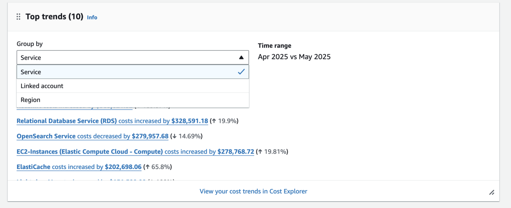
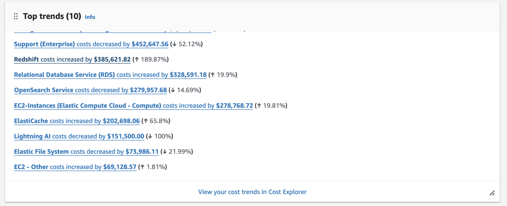
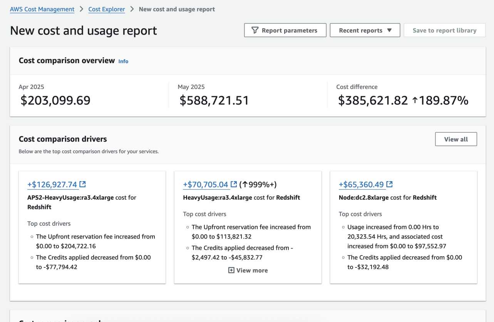
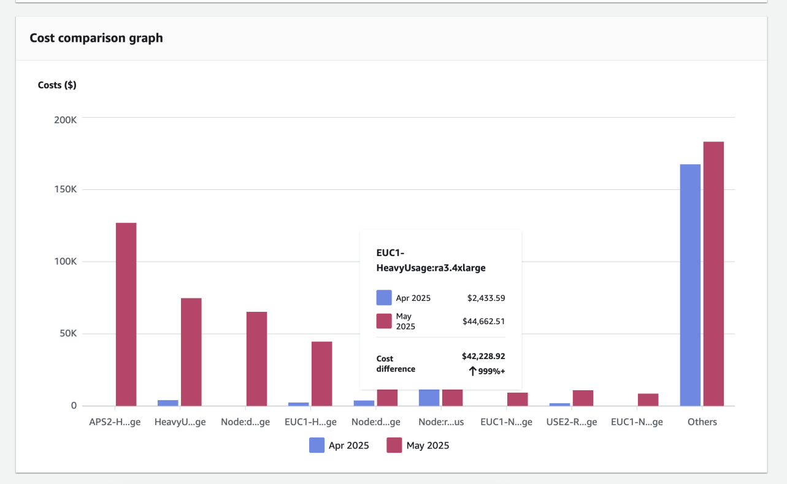
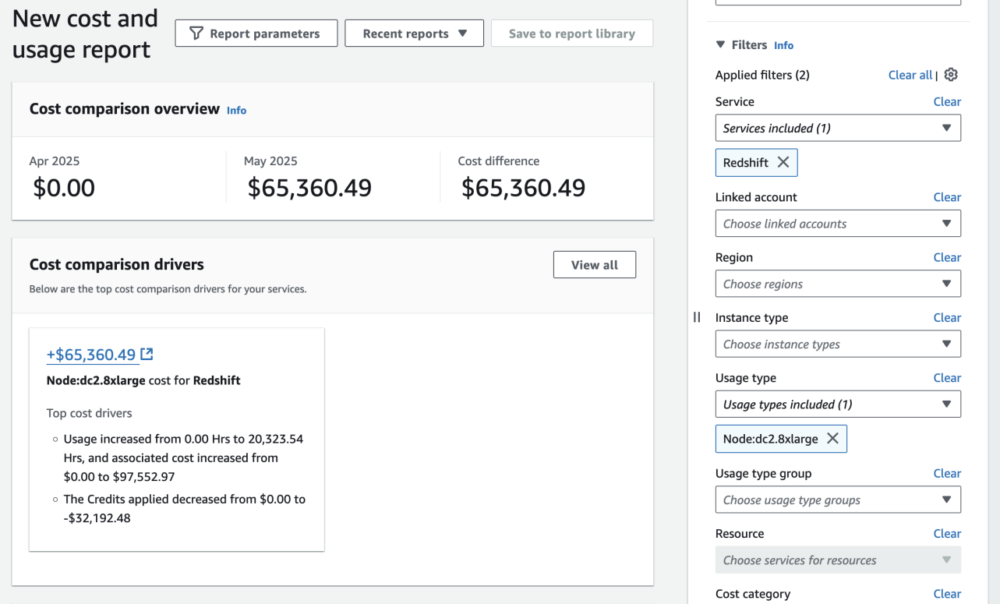
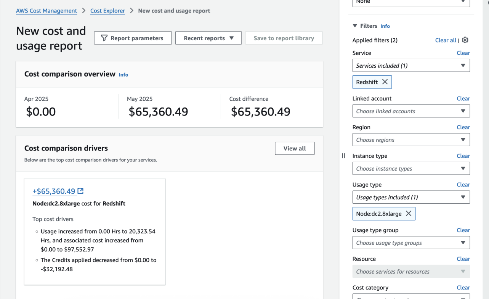

# Phân Tích Chi Phí Nhanh Theo Tháng với Tính Năng So Sánh Chi Phí Mới trong AWS Cost Explorer

> **📖 Bài viết gốc**: [Fast Monthly Cost Analysis with New Cost Comparison Feature in AWS Cost Explorer](https://aws.amazon.com/blogs/aws-cloud-financial-management/)  
> **👤 Tác giả**: Fredrik Tunvall và Shubir Kapoor - AWS Product Managers  
> **📅 Ngày xuất bản**: 05 THÁNG 6 2025  
> **🌐 Nguồn**: AWS Cloud Financial Management Blog  
> **👨‍💻 Người dịch**: Nguyen Viet Quoc - FCJ Intern  
> **📅 Ngày dịch**: 06 JUL 2025  
> **⏱️ Thời gian đọc**: 20 phút

---

## 📋 Tóm tắt

AWS Cost Explorer giới thiệu tính năng so sánh chi phí mới giúp các tổ chức phân tích tự động các biến động chi phí theo tháng. Thay vì dành hàng giờ để hiểu tại sao chi phí thay đổi, tính năng này cho phép nhanh chóng xác định, hiểu và giải thích các biến động trong chi tiêu AWS. Bài viết trình bày hai trường hợp sử dụng thực tế: phân tích thay đổi chi phí tổng thể theo tháng và đi sâu vào yếu tố chi phí cụ thể. Tính năng mới cung cấp widget Top Trends hiển thị 10 biến động chi phí hàng đầu, phân tích tự động các thay đổi trong mô hình sử dụng, giảm giá cam kết và tín dụng được áp dụng. Điều này giúp các nhóm FinOps và quản lý chi phí đưa ra quyết định dựa trên dữ liệu một cách hiệu quả hơn.

**🎯 Đối tượng đọc**: FinOps Engineers, Cloud Cost Managers, AWS Solution Architects, DevOps Teams  
**📊 Độ khó**: Intermediate  
**🏷️ Tags**: AWS Cost Explorer, Cost Comparison, Financial Management, Cost Analysis, FinOps, AWS Billing

---

## 📚 Mục lục

- [Phần 1: Giới thiệu](#phần-1-giới-thiệu)
- [Phần 2: Trường hợp sử dụng 1 - Phân tích thay đổi chi phí theo tháng](#phần-2-trường-hợp-sử-dụng-1---phân-tích-thay-đổi-chi-phí-theo-tháng)
- [Phần 3: Trường hợp sử dụng 2 - Đi sâu vào yếu tố chi phí cụ thể](#phần-3-trường-hợp-sử-dụng-2---đi-sâu-vào-yếu-tố-chi-phí-cụ-thể)
- [Phần 4: Tích hợp với AWS Cost Explorer API](#phần-4-tích-hợp-với-aws-cost-explorer-api)
- [Kết luận](#kết-luận)
- [Về tác giả](#về-tác-giả)
- [Glossary - Thuật ngữ](#glossary---thuật-ngữ)
- [Tài liệu tham khảo](#tài-liệu-tham-khảo)

---

## Phần 1: Giới thiệu

Khi các tổ chức mở rộng quy mô sử dụng cloud, việc hiểu các biến động chi phí trở nên ngày càng phức tạp. Nhiều bạn đã chia sẻ với chúng tôi rằng đôi khi bạn phải dành hàng giờ để phân tích tại sao chi phí thay đổi từ tháng này sang tháng khác.

Để giải quyết vấn đề này, chúng tôi rất vui mừng thông báo về **tính năng so sánh chi phí mới trong AWS Cost Explorer** cung cấp phân tích tự động về sự thay đổi chi phí theo tháng. Tính năng này cho phép bạn nhanh chóng xác định, hiểu và giải thích các biến động trong chi tiêu AWS của mình.

### 🎯 Lợi ích chính

Với tính năng mới này, giờ đây bạn có thể:

- **Xác định chính xác** những thay đổi chi phí lớn nhất trên bất kỳ chiều chi phí nào (dịch vụ, tài khoản, khu vực)
- **Đi sâu vào các giải thích chi tiết** về những thay đổi này
- **Phân tích sự thay đổi** trong mô hình sử dụng, giảm giá dựa trên cam kết và tín dụng được áp dụng
- **Hoàn thành phân tích trong vòng vài giây** thay vì hàng giờ

---

## Phần 2: Trường hợp sử dụng 1 - Phân tích thay đổi chi phí theo tháng

Một startup công nghệ đang phát triển nhanh chóng đối mặt với thách thức hiểu được những thay đổi đáng kể trong hóa đơn AWS hàng tháng của họ. Sử dụng tính năng So sánh Chi phí mới, họ so sánh chi phí tháng 6 và tháng 7 năm 2024 để xác định dịch vụ nào đang tạo ra những biến động chi phí đáng kể nhất.

### 🔧 Cấu hình phân tích

Họ cấu hình phân tích để:
- **Nhóm chi phí theo dịch vụ**
- **Kiểm tra chi phí không pha trộn** để có cái nhìn rõ ràng về chi tiêu gốc trước khi giảm giá

### Bước 1: Truy cập bảng điều khiển Billing và Cost Management

1. **Mở bảng điều khiển AWS Billing và Cost Management**
2. **Xem widget Top Trends mới** - Widget này cung cấp tổng quan nhanh về những thay đổi chi phí đáng kể nhất của bạn giữa hai tháng trước
3. **Phân tích 10 biến động chi phí hàng đầu** - được sắp xếp theo chênh lệch đô la tuyệt đối, hiển thị cả thay đổi phần trăm và giá trị tuyệt đối


*Hình 1: Widget Top Trends hiển thị các biến động chi phí hàng đầu*

> **💡 Tip**: Widget Top Trends làm nổi bật các dịch vụ, tài khoản hoặc khu vực cụ thể nơi xảy ra thay đổi, và cho phép bạn chọn bất kỳ xu hướng nào để phân tích thêm trong chế độ xem So sánh của Cost Explorer.

### Bước 2: Khám phá xu hướng chi phí

Khi nhóm FinOps của startup truy cập bảng điều khiển AWS Billing và Cost Management, họ ngay lập tức nhận thấy những thay đổi chi phí trong widget Top Trends mới.


*Hình 2: Phân tích chi tiết các thay đổi chi phí theo dịch vụ*

**📊 Các thay đổi chi phí đáng kể được phát hiện:**

| Dịch vụ | Thay đổi chi phí | Phần trăm thay đổi |
|---------|------------------|-------------------|
| Amazon Redshift | +$385,621.82 | ↑ 189.87% |
| Amazon OpenSearch Service | -$279,957.68 | ↓ 14.69% |
| Amazon EC2-Instances | +$278,768.72 | ↑ 19.81% |
| Amazon ElastiCache | +$202,698.06 | ↑ 65.8% |

### Bước 3: Đi sâu vào thay đổi chi phí Redshift

Bị thu hút bởi sự gia tăng chi phí Redshift đáng kể, nhóm đã **nhấp vào liên kết "Redshift costs increased"** trong widget Top Trends. Điều này đưa họ đến chế độ xem So sánh mới của Cost Explorer để phân tích chi tiết.


*Hình 3: Chế độ xem So sánh chi phí cho Amazon Redshift*

**🔍 Trong chế độ xem So sánh, họ:**

1. **Xác nhận so sánh khoảng thời gian** (tháng 4 2025 so với tháng 5 2025)
2. **Giữ chiều "Service" mặc định** để tập trung vào Redshift
3. **Xem phân tích chi tiết** về những gì thúc đẩy sự gia tăng chi phí này


*Hình 4: Phân tích chi tiết các yếu tố thúc đẩy thay đổi chi phí Redshift*

**📈 Phân tích tự động tiết lộ:**

- ✅ **Thay đổi trong mô hình sử dụng** trên các loại instance khác nhau
- ✅ **Tăng phí trả trước** cho RDS Reserved Instances
- ✅ **Tác động của giảm giá** được áp dụng

> **🔍 Advanced Analysis**: Nút "View all" ở góc trên bên phải cho phép nhóm khám phá các yếu tố chi phí bổ sung ngoài ba thay đổi hàng đầu này.

---

## Phần 3: Trường hợp sử dụng 2 - Đi sâu vào yếu tố chi phí cụ thể

Sử dụng khả năng lọc của chế độ xem So sánh, nhóm muốn hiểu điều gì thúc đẩy sự gia tăng chi phí cho một instance cụ thể. Họ đã **nhấp vào liên kết "+$65,360.49"** trong widget Top Trends để mở tab phân tích chi tiết mới.


*Hình 5: Phân tích chi phí cho instance cụ thể*

### 🔬 Quy trình phân tích chi tiết

**Trong chế độ xem tab mới, họ:**

1. **Xác nhận so sánh khoảng thời gian** (tháng 4 2025 so với tháng 5 2025)
2. **Giữ chiều "Service" mặc định** để tập trung vào Redshift
3. **Đặt loại sử dụng** thành instance đã chọn
4. **Xem phân tích chi tiết** về những gì thúc đẩy sự gia tăng chi phí cho instance cụ thể này

### 📊 Kết quả phân tích


*Hình 6: Kết quả phân tích chi tiết cho instance cụ thể*

**🔍 Phân tích tự động tiết lộ:**

- 🆕 **Workload mới**: Đây là workload mới không có chi tiêu tháng trước
- 💰 **Tác động giảm giá**: Phân tích tác động của giảm giá được áp dụng
- 📊 **Mô hình sử dụng**: Chi tiết về các tài khoản cụ thể đang sử dụng instance này

### 🚀 Phân tích nâng cao

Từ điểm này, nhóm có thể:

- **Kiểm tra thêm các mô hình sử dụng** trong các tài khoản cụ thể
- **Đi sâu hơn vào các yếu tố chi phí** bằng cách sử dụng các bộ lọc có sẵn
- **Tạo báo cáo tùy chỉnh** cho các stakeholder

---

## Phần 4: Tích hợp với AWS Cost Explorer API

Bạn cũng có thể tận dụng **AWS Cost Explorer API** để thực hiện so sánh và phân tích chi phí tương tự một cách có lập trình trong tổ chức của bạn.

### 🔧 Lợi ích của API

API cho phép bạn:

- 🔧 **Xây dựng các giải pháp quản lý chi phí tùy chỉnh**
- 🤖 **Tự động hóa quy trình phân tích chi phí**
- 🔗 **Tích hợp dữ liệu chi phí** vào các công cụ và dashboard hiện có của bạn
- 📈 **Tạo báo cáo tự động** theo lịch trình định kỳ

### 💻 Ví dụ sử dụng API

```python
# Ví dụ cơ bản sử dụng AWS Cost Explorer API
import boto3
from datetime import datetime, timedelta

# Khởi tạo client
client = boto3.client('ce')

# Định nghĩa khoảng thời gian so sánh
end_date = datetime.now().strftime('%Y-%m-%d')
start_date = (datetime.now() - timedelta(days=60)).strftime('%Y-%m-%d')

# Gọi API để lấy dữ liệu chi phí
response = client.get_cost_and_usage(
    TimePeriod={
        'Start': start_date,
        'End': end_date
    },
    Granularity='MONTHLY',
    Metrics=['BlendedCost', 'UnblendedCost'],
    GroupBy=[
        {
            'Type': 'DIMENSION',
            'Key': 'SERVICE'
        }
    ]
)

# Xử lý response để phân tích chi phí
for result in response['ResultsByTime']:
    print(f"Thời gian: {result['TimePeriod']['Start']} - {result['TimePeriod']['End']}")
    for group in result['Groups']:
        service_name = group['Keys'][0]
        blended_cost = group['Metrics']['BlendedCost']['Amount']
        unblended_cost = group['Metrics']['UnblendedCost']['Amount']
        print(f"  Service: {service_name}")
        print(f"    Blended Cost: ${blended_cost}")
        print(f"    Unblended Cost: ${unblended_cost}")
```

### 🔄 Tự động hóa báo cáo

```python
# Ví dụ tạo báo cáo so sánh chi phí tự động
def generate_cost_comparison_report():
    # Lấy dữ liệu tháng hiện tại và tháng trước
    current_month = get_monthly_costs(0)  # Tháng hiện tại
    previous_month = get_monthly_costs(1)  # Tháng trước
    
    # So sánh và tạo báo cáo
    comparison_report = compare_monthly_costs(current_month, previous_month)
    
    # Gửi báo cáo qua email hoặc Slack
    send_report_notification(comparison_report)
    
    return comparison_report

# Lên lịch chạy báo cáo hàng tháng
schedule.every().month.do(generate_cost_comparison_report)
```

---

## Kết luận

Tính năng so sánh chi phí trong AWS Cost Explorer đơn giản hóa nhiệm vụ phức tạp của việc hiểu các biến động chi phí cloud. Bằng cách tự động hóa quy trình phân tích, nó giúp bạn:

### 🎯 Lợi ích chính

- ⚡ **Nhanh chóng xác định** những thay đổi chi phí đáng kể
- 🔍 **Hiểu các yếu tố cơ bản** của những thay đổi này
- 📊 **Đưa ra quyết định dựa trên dữ liệu** về chi tiêu cloud của bạn
- ⏰ **Tiết kiệm thời gian** từ hàng giờ xuống còn vài giây

### 🚀 Bước tiếp theo

1. **Truy cập AWS Cost Explorer** trong bảng điều khiển của bạn
2. **Khám phá widget Top Trends** mới
3. **Thử nghiệm tính năng So sánh Chi phí** với dữ liệu của bạn
4. **Tích hợp với API** nếu cần tự động hóa

Chúng tôi rất hào hứng khi thấy cách bạn sẽ sử dụng So sánh Chi phí để có được những hiểu biết sâu sắc hơn về chi phí AWS của mình.

---

## Về tác giả

### Fredrik Tunvall
**Senior Technical Product Manager - AWS Billing và Cost Management**


Fredrik là Senior Technical Product Manager trong AWS Billing và Cost Management. Anh ấy dẫn dắt Cost Anomaly Detection và thúc đẩy các sáng kiến quan trọng khác giúp khách hàng giám sát, hiểu và tối ưu hóa chi phí và sử dụng AWS cloud của họ.

**🔗 Liên kết**: [LinkedIn Profile](https://www.linkedin.com/in/fredrik-tunvall/)

### Shubir Kapoor
**Principal Product Manager - AWS Billing và Cost Management**


Shubir Kapoor là Principal Product Manager cho các dịch vụ AWS Billing và Cost Management. Anh ấy tập trung vào các sản phẩm giúp khách hàng khám phá giá trị, đưa ra quyết định sáng suốt và tối ưu hóa chi phí cloud của họ.

**🔗 Liên kết**: [LinkedIn Profile](https://www.linkedin.com/in/shubir-kapoor/)

---

## 📖 Glossary - Thuật ngữ

| English | Tiếng Việt | Định nghĩa |
|---------|------------|------------|
| Cost Comparison | So sánh chi phí | Tính năng phân tích sự khác biệt chi phí giữa các khoảng thời gian |
| Top Trends Widget | Widget Top Trends | Bảng điều khiển hiển thị 10 biến động chi phí hàng đầu |
| Unblended Cost | Chi phí không pha trộn | Chi phí gốc trước khi áp dụng giảm giá và tín dụng |
| Cost Variance | Biến động chi phí | Sự thay đổi trong chi phí giữa các khoảng thời gian |
| FinOps | FinOps | Phương pháp quản lý tài chính cloud kết hợp Finance và DevOps |
| Usage Pattern | Mô hình sử dụng | Cách thức sử dụng tài nguyên cloud theo thời gian |
| Reserved Instance | Reserved Instance | Cam kết sử dụng tài nguyên dài hạn để được giảm giá |
| Commitment Discount | Giảm giá cam kết | Giảm giá dựa trên cam kết sử dụng dài hạn |
| Cost Anomaly Detection | Phát hiện bất thường chi phí | Tự động phát hiện các thay đổi bất thường trong chi phí |
| Billing Dashboard | Bảng điều khiển thanh toán | Giao diện quản lý và theo dõi chi phí AWS |

## 🔗 Tài liệu tham khảo

### Tài liệu gốc
- [Original Article](https://aws.amazon.com/blogs/aws-cloud-financial-management/): Bài viết gốc về tính năng so sánh chi phí
- [Fredrik Tunvall's Profile](https://www.linkedin.com/in/fredrik-tunvall/): Thông tin tác giả Fredrik Tunvall
- [Shubir Kapoor's Profile](https://www.linkedin.com/in/shubir-kapoor/): Thông tin tác giả Shubir Kapoor

### Tài liệu tiếng Việt
- [AWS Documentation VN](https://docs.aws.amazon.com/): Tài liệu AWS tiếng Việt
- [AWS Learning Resources](https://aws.amazon.com/training/): Tài nguyên học tập AWS
- [AWS Community Vietnam](https://www.facebook.com/groups/awsvietnam): Cộng đồng AWS Việt Nam

### Tools và Services
- [AWS Cost Explorer](https://aws.amazon.com/aws-cost-management/aws-cost-explorer/): Công cụ phân tích chi phí AWS
- [AWS Cost Explorer API](https://docs.aws.amazon.com/aws-cost-management/latest/APIReference/Welcome.html): API để tích hợp phân tích chi phí
- [AWS Billing and Cost Management](https://aws.amazon.com/aws-cost-management/): Dịch vụ quản lý chi phí AWS
- [AWS Cost Anomaly Detection](https://aws.amazon.com/aws-cost-management/aws-cost-anomaly-detection/): Phát hiện bất thường chi phí
- [AWS Cost Optimization Hub](https://aws.amazon.com/aws-cost-management/cost-optimization-hub/): Trung tâm tối ưu hóa chi phí
- [FinOps Foundation](https://www.finops.org/): Tổ chức FinOps quốc tế
- [AWS Well-Architected Cost Optimization](https://docs.aws.amazon.com/wellarchitected/latest/cost-optimization-pillar/welcome.html): Nguyên tắc tối ưu hóa chi phí

---

## 💬 Ghi chú của người dịch

Bài dịch này được thực hiện trong khuôn khổ **FCJ Internship Program** với mục tiêu chia sẻ kiến thức về quản lý chi phí AWS đến cộng đồng Việt Nam.

### Challenges trong quá trình dịch
- **Technical Terms**: Một số thuật ngữ như "FinOps", "Cost Anomaly Detection" được giữ nguyên tiếng Anh vì đã trở thành thuật ngữ chuẩn trong ngành
- **Cultural Context**: Điều chỉnh các ví dụ về startup công nghệ để phù hợp với bối cảnh doanh nghiệp Việt Nam
- **Complex Concepts**: Giải thích chi tiết các khái niệm phức tạp về quản lý chi phí cloud để người đọc dễ hiểu

### Insights gained
- **Technical Learning**: Hiểu sâu hơn về các tính năng mới của AWS Cost Explorer và cách áp dụng trong thực tế
- **Language Skills**: Phát triển kỹ năng dịch thuật chuyên ngành công nghệ và tài chính
- **Industry Knowledge**: Nắm bắt xu hướng FinOps và quản lý chi phí cloud hiện đại

---

## 🤝 Đóng góp và Feedback

Bài dịch này được thực hiện trong khuôn khổ **FCJ Internship Program**. 

**📧 Liên hệ**: nguyenvietquoc.fcj@gmail.com  
**💬 Feedback**: Mọi góp ý để cải thiện chất lượng dịch thuật xin gửi về email trên  
**🔄 Updates**: Bài dịch sẽ được cập nhật dựa trên feedback từ cộng đồng

---

*© 2025 - Bản dịch thuộc về Nguyen Viet Quoc. Vui lòng credit khi sử dụng.*
