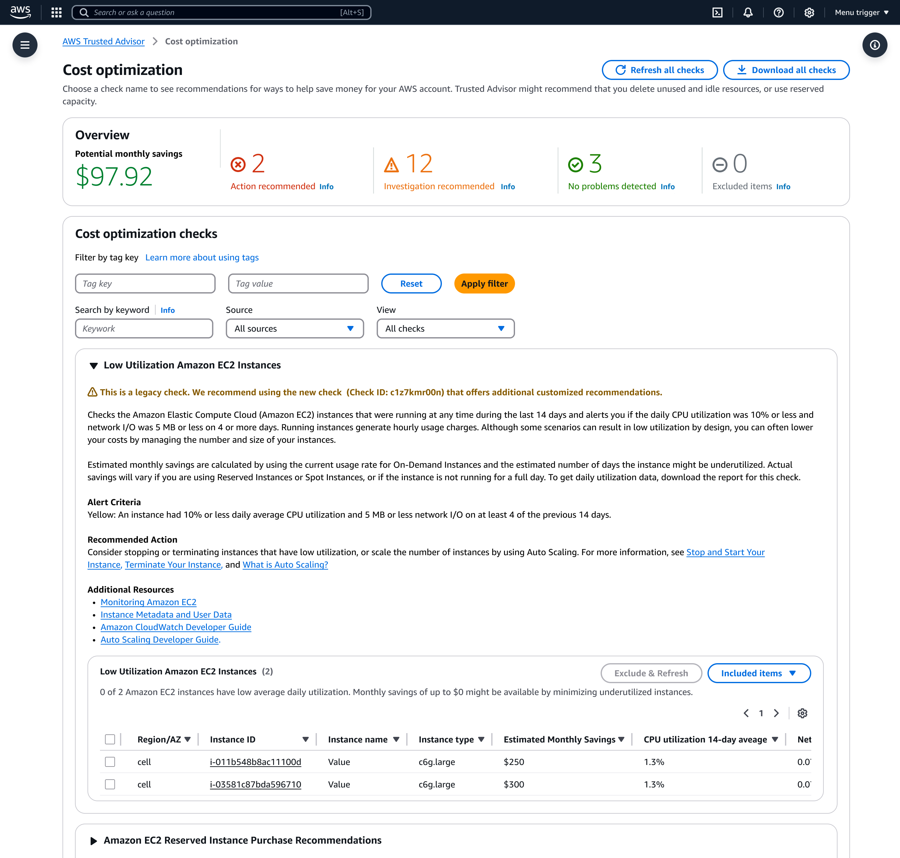
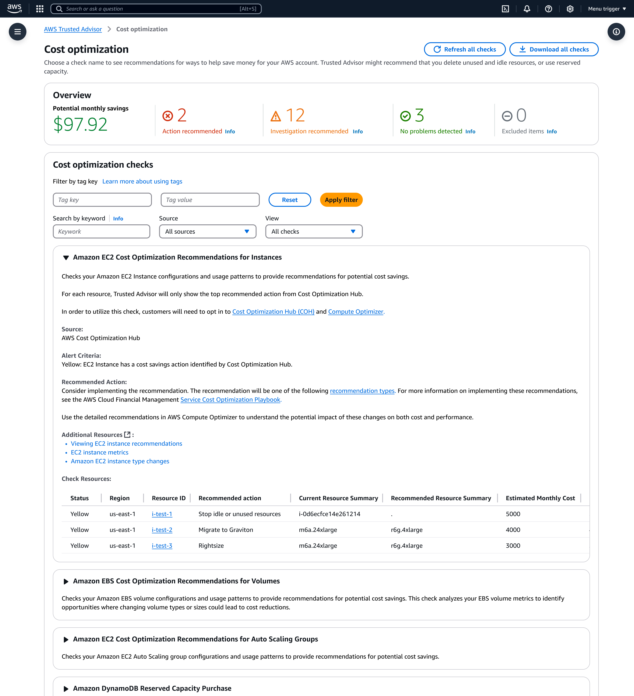

# Tối ưu hóa chi phí AWS của bạn với các tính năng tiết kiệm chi phí mới trong AWS Trusted Advisor

> **📖 Bài viết gốc**: [Optimize Your AWS Spend with New Cost Savings Features in AWS Trusted Advisor](https://aws.amazon.com/blogs/aws-cloud-financial-management/optimize-your-aws-spend-with-new-cost-savings-features-in-aws-trusted-advisor/)  
> **👤 Tác giả**: Logan Kleier - Product Manager, AWS Trusted Advisor and Well Architected  
> **📅 Ngày xuất bản**: 05 THÁNG 6 2025  
> **🌐 Nguồn**: AWS Cloud Financial Management Blog  
> **👨‍💻 Người dịch**: Nguyen Viet Quoc - FCJ Intern  
> **📅 Ngày dịch**: 06 JUL 2025  
> **⏱️ Thời gian đọc**: 30 phút

---

## 📋 Tóm tắt

AWS Trusted Advisor đang mở rộng khả năng của mình để đáp ứng yêu cầu của khách hàng về trải nghiệm tiết kiệm chi phí nhất quán hơn và bộ khuyến nghị rộng hơn. Bài viết thông báo về việc tích hợp 16 kiểm tra mới từ AWS Cost Optimization Hub vào Trusted Advisor, cung cấp nhiều thông tin chi tiết có thể hành động hơn để tối ưu hóa chi phí AWS. Các kiểm tra mới này cung cấp khuyến nghị được tùy chỉnh và cụ thể hơn, bộ kiểm tra tối ưu hóa rộng hơn, và cải thiện sự phù hợp giữa ước tính tiết kiệm chi phí và khuyến nghị. Để sử dụng các tính năng mới, khách hàng cần đăng ký Cost Optimization Hub và Compute Optimizer. Bài viết cũng so sánh chi tiết giữa các kiểm tra cũ và mới, giải thích lợi ích của việc sử dụng các khuyến nghị từ Cost Optimization Hub với ví dụ minh họa cụ thể.

**🎯 Đối tượng đọc**: AWS Solution Architects, Cloud Cost Engineers, FinOps Practitioners, DevOps Teams  
**📊 Độ khó**: Intermediate  
**🏷️ Tags**: AWS Trusted Advisor, Cost Optimization Hub, AWS Compute Optimizer, Cost Management, Cloud Financial Management

---

## 📚 Mục lục

- [Phần 1: Giới thiệu](#phần-1-giới-thiệu)
- [Phần 2: Lợi ích của các kiểm tra tối ưu hóa chi phí mới](#phần-2-lợi-ích-của-các-kiểm-tra-tối-ưu-hóa-chi-phí-mới)
- [Phần 3: Hướng dẫn bắt đầu](#phần-3-hướng-dẫn-bắt-đầu)
- [Phần 4: Cost Optimization Hub và tích hợp](#phần-4-cost-optimization-hub-và-tích-hợp)
- [Phần 5: Danh sách các kiểm tra mới](#phần-5-danh-sách-các-kiểm-tra-mới)
- [Phần 6: So sánh kiểm tra cũ và mới](#phần-6-so-sánh-kiểm-tra-cũ-và-mới)
- [Kết luận](#kết-luận)
- [Về tác giả](#về-tác-giả)
- [Glossary - Thuật ngữ](#glossary---thuật-ngữ)
- [Tài liệu tham khảo](#tài-liệu-tham-khảo)

---
## Phần 1: Giới thiệu

Để đáp ứng yêu cầu của khách hàng về trải nghiệm tiết kiệm chi phí nhất quán hơn và bộ khuyến nghị rộng hơn, [AWS Trusted Advisor](https://aws.amazon.com/premiumsupport/technology/trusted-advisor) đang mở rộng khả năng của mình. Chúng tôi vui mừng thông báo việc tích hợp **16 kiểm tra mới** từ [AWS Cost Optimization Hub](https://aws.amazon.com/aws-cost-management/cost-optimization-hub/) vào Trusted Advisor. 

Bản cập nhật quan trọng này cung cấp nhiều thông tin chi tiết có thể hành động hơn để giúp bạn tối ưu hóa chi phí AWS của mình.

> **💡 Lưu ý**: Bạn có thể tìm hiểu thêm về các kiểm tra mới trong [Hướng dẫn tham khảo kiểm tra Trusted Advisor](https://docs.aws.amazon.com/awssupport/latest/user/trusted-advisor-check-reference.html).

---

## Phần 2: Lợi ích của các kiểm tra tối ưu hóa chi phí mới

### 🎯 Tại sao bạn nên sử dụng các kiểm tra tối ưu hóa chi phí mới từ Cost Optimization Hub?

Các kiểm tra và khuyến nghị mới này cung cấp cho khách hàng Trusted Advisor:

- ✅ **Các khuyến nghị tối ưu hóa chi phí được tùy chỉnh và cụ thể hơn**
- ✅ **Một loạt các kiểm tra tối ưu hóa tiết kiệm chi phí rộng hơn** so với trước đây
- ✅ **Cải thiện sự phù hợp** của ước tính tiết kiệm chi phí và khuyến nghị giữa Trusted Advisor và Cost Optimization Hub

### 🔍 Lợi ích chi tiết

| Lợi ích | Mô tả | Tác động |
|---------|-------|----------|
| **Tùy chỉnh cao** | Khuyến nghị dựa trên mô hình sử dụng thực tế | Tiết kiệm chi phí chính xác hơn |
| **Phạm vi rộng** | 16 loại kiểm tra mới từ nhiều dịch vụ AWS | Bao phủ toàn diện hơn |
| **Nhất quán** | Đồng bộ giữa các công cụ AWS | Trải nghiệm người dùng tốt hơn |

---

## Phần 3: Hướng dẫn bắt đầu

### 🚀 Làm thế nào bạn có thể bắt đầu với các kiểm tra và khuyến nghị Trusted Advisor mới?

Để nhận được các kiểm tra và khuyến nghị này trong Trusted Advisor, bạn sẽ muốn:

#### Bước 1: Đăng ký Cost Optimization Hub
1. Truy cập [AWS Cost Management Console](https://console.aws.amazon.com/cost-management/)
2. Xem hướng dẫn [Bắt đầu với Cost Optimization Hub](https://docs.aws.amazon.com/cost-management/latest/userguide/coh-getting-started.html)

#### Bước 2: Đăng ký Compute Optimizer  
1. Truy cập [AWS Compute Optimizer Console](https://console.aws.amazon.com/compute-optimizer/)
2. Xem hướng dẫn [Đăng ký AWS Compute Optimizer](https://docs.aws.amazon.com/compute-optimizer/latest/ug/account-opt-in.html)

### ⚠️ Yêu cầu quan trọng

**Khách hàng AWS Trusted Advisor cần đăng ký Cost Optimization Hub và Compute Optimizer** để nhận được đầy đủ lợi ích của các kiểm tra và khuyến nghị Cost Optimization Hub này. 

**Tại sao cần Compute Optimizer?**
- Cost Optimization Hub sử dụng dữ liệu từ Compute Optimizer để cung cấp các khuyến nghị về kích thước phù hợp và tài nguyên nhàn rỗi
- Cả hai sản phẩm tối ưu hóa này đều **miễn phí**, trừ khi bạn cấu hình thời gian nhìn lại 93 ngày cho các khuyến nghị kích thước phù hợp EC2 và RDS

> **📚 Tham khảo thêm**: 
> - [Enhanced infrastructure metrics](https://docs.aws.amazon.com/compute-optimizer/latest/ug/enhanced-infrastructure-metrics.html)
> - [AWS Compute Optimizer pricing](https://aws.amazon.com/compute-optimizer/pricing/)

### ⏰ Thời gian xử lý

**Sau khi bạn đăng ký Cost Optimization Hub và Compute Optimizer, sẽ mất tới 24 giờ** trước khi bạn bắt đầu thấy các khuyến nghị cho các kiểm tra Trusted Advisor mới sử dụng Cost Optimization Hub.

**Khách hàng hiện tại**: Những khách hàng đã đăng ký Cost Optimization Hub và AWS Compute Optimizer và có AWS Business Support hoặc cao hơn sẽ **tự động nhận được** các kiểm tra và khuyến nghị Trusted Advisor mới hơn.

---

## Phần 4: Cost Optimization Hub và tích hợp

### 🤔 Cost Optimization Hub là gì và tại sao Trusted Advisor tích hợp với nó?

**Cost Optimization Hub** là một tính năng của AWS Billing and Cost Management, hợp nhất và ưu tiên các khuyến nghị tối ưu hóa chi phí trên các tài khoản thành viên AWS Organizations và AWS Regions.

### 🔧 Khả năng chính

Cost Optimization Hub cho phép bạn:

- 🔍 **Dễ dàng xác định, lọc và tổng hợp** hơn 16 loại khuyến nghị tối ưu hóa chi phí AWS
- 📊 **Xem thông qua một bảng điều khiển duy nhất**
- 📈 **Nhận khuyến nghị từ nhiều nguồn**:
  - **Cost Explorer**: cho các khuyến nghị Reservation và Savings Plan
  - **AWS Compute Optimizer**: cho các khuyến nghị về kích thước phù hợp và tài nguyên nhàn rỗi

### 💰 Lợi ích tích hợp

Cost Optimization Hub giúp bạn:

1. **Định lượng và tổng hợp ước tính tiết kiệm** khi bạn thực hiện các khuyến nghị tối ưu hóa chi phí
2. **Tính đến các điều khoản thương mại cụ thể** của bạn với AWS (như Reserved Instances và Savings Plans)
3. **Dễ dàng so sánh và ưu tiên các khuyến nghị**

> **🎯 Kết quả**: Bằng cách tích hợp các kiểm tra và khuyến nghị này vào Trusted Advisor, Trusted Advisor cung cấp nhiều thông tin chi tiết có thể hành động hơn cho khách hàng.

---

## Phần 5: Danh sách các kiểm tra mới

### 📋 Danh sách các kiểm tra Trusted Advisor mới là gì?

Chúng tôi đang giới thiệu **16 kiểm tra mới**. Dưới đây là danh sách chi tiết các kiểm tra hiện tại và các kiểm tra mới từ Cost Optimization Hub:

#### Bảng 1: Các kiểm tra Trusted Advisor hiện tại và thay thế từ Cost Optimization Hub

| Tên kiểm tra Trusted Advisor hiện tại | CheckID | Tên kiểm tra Cost Optimization Hub mới | CheckID mới |
|---------------------------------------|---------|----------------------------------------|-------------|
| [Low Utilization Amazon EC2 Instances](https://docs.aws.amazon.com/awssupport/latest/user/cost-optimization-checks.html#low-utilization-amazon-ec2-instances) | Qch7DwouX1 | [Amazon EC2 Cost Optimization recommendations for instances](https://docs.aws.amazon.com/awssupport/latest/user/cost-optimization-checks.html#ec2-cost-opt-for-instances) | c1z7kmr00n |
| [Underutilized Amazon EBS Volumes](https://docs.aws.amazon.com/awssupport/latest/user/cost-optimization-checks.html#underutilized-amazon-ebs-volumes) | DAvU99Dc4C | [Amazon EBS cost optimization recommendations for volumes](https://docs.aws.amazon.com/awssupport/latest/user/cost-optimization-checks.html#ebs-cost-opt-for-volumes) | c1z7kmr02n |
| [Amazon EBS over-provisioned volumes](https://docs.aws.amazon.com/awssupport/latest/user/cost-optimization-checks.html#amazon-ebs-over-provisioned-volumes) | COr6dfpM03 | [Amazon EBS cost optimization recommendations for volumes](https://docs.aws.amazon.com/awssupport/latest/user/cost-optimization-checks.html#ebs-cost-opt-for-volumes) | c1z7kmr02n |
| [Amazon RDS Idle DB Instances](https://docs.aws.amazon.com/awssupport/latest/user/cost-optimization-checks.html#amazon-rds-idle-dbs-instances) | Ti39halfu8 | [Amazon RDS cost optimization recommendations for DB instances](https://docs.aws.amazon.com/awssupport/latest/user/cost-optimization-checks.html#rds-cost-opt-for-db-instances) | c1z7kmr03n |
| [AWS Lambda over-provisioned functions for memory size](https://docs.aws.amazon.com/awssupport/latest/user/cost-optimization-checks.html#aws-lambda-over-provisioned-functions-memory-size) | COr6dfpM05 | [AWS Lambda cost optimization recommendations for functions](https://docs.aws.amazon.com/awssupport/latest/user/cost-optimization-checks.html#lambda-cost-opt-for-functions) | c1z7kmr05n |
| [Savings Plan](https://docs.aws.amazon.com/awssupport/latest/user/cost-optimization-checks.html#savings-plan) | vZ2c2W1srf | [AWS Savings Plan purchase recommendations for compute](https://docs.aws.amazon.com/awssupport/latest/user/cost-optimization-checks.html#savings-plans-purchase-recommendations-compute) | c1z7kmr09n |

> **⚠️ Lưu ý quan trọng**: Hai kiểm tra sử dụng EBS Trusted được liệt kê ở trên (Underutilized Amazon EBS Volumes và Amazon EBS over-provisioned volumes) đang được thay thế bằng một kiểm tra mới hơn (Amazon EBS Cost Optimization Recommendations for Volumes).

#### Bảng 2: 7 kiểm tra hoàn toàn mới từ Cost Optimization Hub

| Tên kiểm tra Cost Optimization Hub | Check ID |
|-----------------------------------|----------|
| [Amazon EC2 cost optimization recommendations for Amazon EC2 Auto Scaling groups](https://docs.aws.amazon.com/awssupport/latest/user/cost-optimization-checks.html#ec2-cost-opt-for-autoscaling) | c1z7kmr01n |
| [Amazon RDS cost optimization recommendations for DB instance storage](https://docs.aws.amazon.com/awssupport/latest/user/cost-optimization-checks.html#rds-cost-opt-for-db-instance-storage) | c1z7kmr04n |
| [AWS Fargate cost optimization recommendations for Amazon ECS](https://docs.aws.amazon.com/awssupport/latest/user/cost-optimization-checks.html#fargate-cost-opt-for-ecs) | c1z7kmr06n |
| [AWS Savings Plan purchase recommendations for Amazon SageMaker AI](https://docs.aws.amazon.com/awssupport/latest/user/cost-optimization-checks.html#savings-plans-purchase-recommendations-sagemaker) | c1z7kmr08n |
| [Amazon DynamoDB reserved capacity purchase recommendations](https://docs.aws.amazon.com/awssupport/latest/user/cost-optimization-checks.html#dynamodb-reserved-capacity-purchase-rec) | c1z7kmr15n |
| [Amazon MemoryDB reserved node purchase recommendations](https://docs.aws.amazon.com/awssupport/latest/user/cost-optimization-checks.html#memorydb-reserved-node-purchase-recommendations) | c1z7kmr16n |
| [Amazon Aurora cost optimization recommendations for DB cluster storage](https://docs.aws.amazon.com/awssupport/latest/user/cost-optimization-checks.html#aurora-cost-opt-db-cluster-storage) | c1z7kmr17n |

---

## Phần 6: So sánh kiểm tra cũ và mới

### 🤔 Kiểm tra và khuyến nghị tối ưu hóa chi phí nào nên sử dụng?

**Khuyến nghị**: Bạn nên sử dụng các kiểm tra và khuyến nghị **mới hơn từ Cost Optimization Hub** được liệt kê trong Bảng 1 (Cột 3 và 4). 

**Lý do**: Các kiểm tra và khuyến nghị này cung cấp:
- 🎯 **Ước tính tiết kiệm chi phí chính xác hơn**
- 🔧 **Khuyến nghị được cá nhân hóa** dựa trên việc sử dụng tài nguyên của bạn
- 📊 **Phân tích chi tiết hơn** so với các kiểm tra Trusted Advisor cũ

### 🔄 Bạn có quyền truy cập vào cả kiểm tra hiện có và mới không?

**Có**, chúng tôi sẽ tiếp tục cung cấp quyền truy cập vào cả hai bộ kiểm tra. Tuy nhiên:

- ⚠️ **Các kiểm tra Trusted Advisor cũ hơn** được coi là **kiểm tra kế thừa**
- ✅ **Chúng tôi khuyến khích** bạn sử dụng các kiểm tra mới hơn
- 🏷️ **Sẽ có biểu ngữ** trong các kiểm tra kế thừa cũ hơn để chỉ ra rằng đây là kiểm tra kế thừa và khuyến nghị sử dụng các kiểm tra thay thế mới hơn

### 🔍 Sự khác biệt giữa các kiểm tra cũ và mới

Các kiểm tra Cost Optimization Hub mới hơn cung cấp **độ chính xác được cải thiện** về ước tính tiết kiệm chi phí. Các kiểm tra này:

1. **Tính đến các điều khoản thương mại cụ thể** của bạn với AWS (như Reserved Instances và Savings Plans)
2. **Dễ dàng so sánh và ưu tiên các khuyến nghị**
3. **Tính đến nhiều thông tin ngữ cảnh và lịch sử hơn** về cách sử dụng tài nguyên của bạn

#### Ví dụ so sánh cụ thể

**Kiểm tra hiện tại (Qch7DwouX1 TA check)**:

*Hình 1: Kiểm tra tối ưu hóa chi phí Trusted Advisor hiện tại*

- Hiển thị ước tính tiết kiệm
- Khuyến nghị: **Dừng hoặc chấm dứt instance** để đạt được tiết kiệm chi phí

**Kiểm tra mới (c1z7kmr00n)**:

*Hình 2: Kiểm tra Cost Optimization Hub mới trong Trusted Advisor*

- Hiển thị **nhiều loại khuyến nghị khác nhau**:
  - 🔄 **Migrating to Graviton** (Chuyển sang Graviton)
  - 📏 **Right Sizing the instance** (Điều chỉnh kích thước instance)
  - 🛠️ **Các tùy chọn tối ưu hóa khác**

> **💡 Insight**: Kiểm tra mới cung cấp nhiều lựa chọn tối ưu hóa thay vì chỉ đề xuất dừng/chấm dứt instance.

---

## Kết luận

Với các kiểm tra và khuyến nghị tối ưu hóa chi phí Trusted Advisor mới từ Cost Optimization Hub, bạn sẽ nhận được các cơ hội tối ưu hóa chi phí **chính xác và được cá nhân hóa hơn** để tiết kiệm tiền trên hóa đơn AWS của mình.

### 🚀 Bước tiếp theo

1. **Đăng ký** Cost Optimization Hub và Compute Optimizer
2. **Chờ 24 giờ** để hệ thống xử lý
3. **Khám phá** các kiểm tra mới trong Trusted Advisor
4. **Áp dụng** các khuyến nghị phù hợp với môi trường của bạn

### 💬 Gửi phản hồi

Chúng tôi rất hào hứng khi thấy cách bạn sử dụng các tính năng mới này! Hãy cho chúng tôi biết ý kiến của bạn:

- **Gửi phản hồi** cho các kiểm tra Trusted Advisor mới
- **Đề xuất** các tính năng tối ưu hóa chi phí mới trong AWS console
- **Chọn Feedback** ở góc dưới bên phải của console
- **Sử dụng** [AWS re:Post](https://repost.aws/) để thảo luận với cộng đồng

---

## Về tác giả

### Logan Kleier
**Product Manager - AWS Trusted Advisor and Well Architected Team**

Logan làm việc với tư cách là product manager trong nhóm AWS Trusted Advisor và Well Architected. Trước đó, anh ấy đã xây dựng các tiêu chuẩn bảo mật đám mây cho Oracle Cloud. Logan có kinh nghiệm sâu rộng trong việc phát triển các sản phẩm giúp khách hàng tối ưu hóa chi phí và cải thiện kiến trúc cloud.

**🔗 Liên kết**: [LinkedIn Profile](https://www.linkedin.com/in/logan-kleier/)

---

## 📖 Glossary - Thuật ngữ

| English | Tiếng Việt | Định nghĩa |
|---------|------------|------------|
| Cost Optimization Hub | Trung tâm Tối ưu hóa Chi phí | Tính năng của AWS Billing and Cost Management để hợp nhất và ưu tiên khuyến nghị tối ưu hóa chi phí |
| Trusted Advisor | Trusted Advisor | Dịch vụ AWS cung cấp khuyến nghị về hiệu suất, bảo mật, và tối ưu hóa chi phí |
| Legacy Checks | Kiểm tra Kế thừa | Các kiểm tra cũ vẫn được hỗ trợ nhưng không được khuyến nghị sử dụng |
| Right Sizing | Điều chỉnh Kích thước Phù hợp | Quá trình tối ưu hóa kích thước tài nguyên cloud để phù hợp với nhu cầu thực tế |
| Reserved Instance | Phiên bản Dự trữ | Cam kết sử dụng tài nguyên trong thời gian dài để được giảm giá |
| Savings Plan | Kế hoạch Tiết kiệm | Cam kết chi tiêu để nhận được giá ưu đãi cho compute usage |
| Compute Optimizer | Compute Optimizer | Dịch vụ AWS đưa ra khuyến nghị tối ưu hóa cho EC2, EBS, Lambda và ECS |
| Cost Explorer | Cost Explorer | Công cụ AWS để phân tích và visualize chi phí và usage |
| Graviton | Graviton | Bộ xử lý ARM-based của AWS cung cấp hiệu suất tốt hơn với chi phí thấp hơn |
| FinOps | FinOps | Phương pháp quản lý tài chính cloud kết hợp Finance, DevOps và Engineering |

## 🔗 Tài liệu tham khảo

### Tài liệu gốc
- [Original Blog Post](https://aws.amazon.com/blogs/aws-cloud-financial-management/optimize-your-aws-spend-with-new-cost-savings-features-in-aws-trusted-advisor/): Bài viết gốc về tính năng mới trong Trusted Advisor
- [Logan Kleier's Profile](https://www.linkedin.com/in/logan-kleier/): Thông tin tác giả Logan Kleier
- [AWS Trusted Advisor](https://aws.amazon.com/premiumsupport/technology/trusted-advisor/): Trang chính thức AWS Trusted Advisor

### Tài liệu tiếng Việt
- [AWS Documentation VN](https://docs.aws.amazon.com/): Tài liệu AWS tiếng Việt
- [AWS Training Vietnam](https://aws.amazon.com/training/): Khóa học AWS tại Việt Nam
- [AWS Community Vietnam](https://www.facebook.com/groups/awsvietnam): Cộng đồng AWS Việt Nam

### Tools và Services
- [AWS Cost Optimization Hub](https://aws.amazon.com/aws-cost-management/cost-optimization-hub/): Trung tâm tối ưu hóa chi phí AWS
- [AWS Compute Optimizer](https://aws.amazon.com/compute-optimizer/): Dịch vụ tối ưu hóa compute resources
- [AWS Trusted Advisor Check Reference](https://docs.aws.amazon.com/awssupport/latest/user/trusted-advisor-check-reference.html): Tài liệu tham khảo các kiểm tra
- [Getting Started with Cost Optimization Hub](https://docs.aws.amazon.com/cost-management/latest/userguide/coh-getting-started.html): Hướng dẫn bắt đầu
- [AWS Compute Optimizer Pricing](https://aws.amazon.com/compute-optimizer/pricing/): Giá dịch vụ Compute Optimizer
- [Enhanced Infrastructure Metrics](https://docs.aws.amazon.com/compute-optimizer/latest/ug/enhanced-infrastructure-metrics.html): Metrics nâng cao
- [AWS re:Post](https://repost.aws/): Cộng đồng hỏi đáp AWS

---

## 💬 Ghi chú của người dịch

Bài dịch này được thực hiện trong khuôn khổ **FCJ Internship Program** với mục tiêu chia sẻ kiến thức về AWS Trusted Advisor và Cost Optimization đến cộng đồng Việt Nam.

### Challenges trong quá trình dịch
- **Technical Terms**: Một số thuật ngữ như "Right Sizing", "FinOps" được giữ nguyên hoặc dịch kèm thuật ngữ gốc vì đã trở thành chuẩn trong ngành
- **Cultural Context**: Điều chỉnh các ví dụ và ngữ cảnh để phù hợp với môi trường doanh nghiệp Việt Nam
- **Complex Concepts**: Giải thích chi tiết các khái niệm phức tạp về tối ưu hóa chi phí cloud để người đọc dễ hiểu

### Insights gained
- **Technical Learning**: Hiểu sâu hơn về sự tích hợp giữa Trusted Advisor và Cost Optimization Hub
- **Language Skills**: Phát triển kỹ năng dịch thuật chuyên ngành cloud computing và cost management
- **Industry Knowledge**: Nắm bắt xu hướng FinOps và các best practices trong quản lý chi phí cloud

---

## 🤝 Đóng góp và Feedback

Bài dịch này được thực hiện trong khuôn khổ **FCJ Internship Program**. 

**📧 Liên hệ**: nguyenvietquoc.fcj@gmail.com  
**💬 Feedback**: Mọi góp ý để cải thiện chất lượng dịch thuật xin gửi về email trên  
**🔄 Updates**: Bài dịch sẽ được cập nhật dựa trên feedback từ cộng đồng

---

*© 2025 - Bản dịch thuộc về Nguyen Viet Quoc. Vui lòng credit khi sử dụng.*
