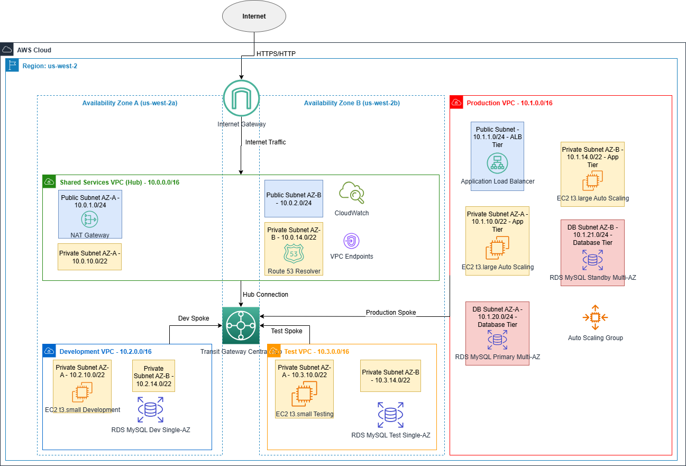

# ĐỀ XUẤT DỰ ÁN: NỀN TẢNG ĐA MÔI TRƯỜNG DOANH NGHIỆP
## Giải pháp Hub-and-Spoke sử dụng AWS Transit Gateway cho TechCorp Solutions

---


*Hình 1: Kiến trúc mạng VPC nâng cao với Transit Gateway*

---

## 📋 **8 PHẦN BẮT BUỘC CỦA PROPOSAL**

### 1. **TÓM TẮT ĐIỀU HÀNH (EXECUTIVE SUMMARY)**
### 2. **PHÂN TÍCH VẤN ĐỀ (PROBLEM STATEMENT)**  
### 3. **KIẾN TRÚC GIẢI PHÁP (SOLUTION ARCHITECTURE)**
### 4. **TRIỂN KHAI KỸ THUẬT (TECHNICAL IMPLEMENTATION)**
### 5. **LỊCH TRÌNH VÀ CỘT MỐC (TIMELINE & MILESTONES)**
### 6. **ƯỚC TÍNH NGÂN SÁCH (BUDGET ESTIMATION)**
### 7. **ĐÁNH GIÁ RỦI RO (RISK ASSESSMENT)**
### 8. **KẾT QUẢ MONG ĐỢI (EXPECTED OUTCOMES)**

---

# 1. TÓM TẮT ĐIỀU HÀNH

## Tổng quan dự án

TechCorp Solutions, một công ty phần mềm doanh nghiệp hàng đầu với hơn 500 nhân viên kỹ thuật, đang đối mặt với những thách thức nghiêm trọng trong việc quản lý hạ tầng cloud phân tán. Công ty hiện đang vận hành 15+ ứng dụng quan trọng trên nền tảng Amazon Web Services (AWS) với kiến trúc mạng không nhất quán, dẫn đến các vấn đề phức tạp về bảo mật, chi phí vận hành cao và khả năng mở rộng bị hạn chế.

Với tốc độ tăng trưởng kinh doanh nhanh chóng và nhu cầu mở rộng ra thị trường quốc tế, TechCorp Solutions cần một giải pháp hạ tầng hiện đại, có thể mở rộng và tối ưu chi phí để hỗ trợ các mục tiêu kinh doanh dài hạn.

## Vấn đề cốt lõi cần giải quyết

### 1. Kiến trúc mạng phân mảnh và thiếu chuẩn hóa
Hiện tại, mỗi team phát triển tự tạo và quản lý Virtual Private Cloud (VPC) riêng biệt, dẫn đến:
- 12 VPC độc lập hoạt động mà không có connectivity standards thống nhất
- Các IP addressing schemes không nhất quán với CIDR blocks bị overlap
- Kết nối manual peering phức tạp và khó bảo trì
- Thiếu visibility tổng thể về network topology

### 2. Lỗ hổng bảo mật và thách thức tuân thủ
Việc thiếu kiểm soát bảo mật tập trung đã tạo ra:
- Không có centralized security monitoring và threat detection
- Security group rules không nhất quán giữa các môi trường
- Thiếu network segmentation cho dữ liệu nhạy cảm
- Audit trail không đầy đủ để đáp ứng yêu cầu compliance (SOC 2, GDPR)
- Khó khăn trong việc implement security best practices một cách thống nhất

### 3. Chi phí vận hành cao và lãng phí tài nguyên
Phân tích chi phí hiện tại cho thấy:
- NAT Gateways trùng lặp: $2,160/tháng (12 VPC × $45/gateway × 4 AZ)
- VPC Peering data transfer: $720/tháng
- Operational overhead: $5,200/tháng (thời gian engineer)
- **Tổng chi phí không cần thiết: $8,080/tháng = $96,960/năm**

### 4. Khả năng mở rộng hạn chế và agility thấp
Các hạn chế hiện tại bao gồm:
- 3-5 ngày để setup một môi trường mới
- Manual configuration dễ gây lỗi và không consistent
- Khó khăn trong cross-environment communication và testing
- Không có standardized deployment patterns
- Thiếu automation trong infrastructure provisioning

## Giải pháp đề xuất: Enterprise Multi-Environment Platform

Để giải quyết các thách thức trên, chúng tôi đề xuất triển khai **Nền tảng Đa Môi trường Doanh nghiệp** sử dụng AWS Transit Gateway làm central hub, kết nối và quản lý tất cả các môi trường một cách hiệu quả.

### Kiến trúc Hub-and-Spoke
Giải pháp được thiết kế dựa trên mô hình Hub-and-Spoke với các thành phần chính:

#### **Shared Services VPC (Hub Central)**
- Đóng vai trò là trung tâm kết nối cho tất cả các môi trường
- Cung cấp các dịch vụ chung: DNS resolution, monitoring, security services
- Quản lý centralized logging và compliance monitoring
- Host các VPC Endpoints để tối ưu chi phí data transfer

#### **Production VPC (Spoke 1)**
- Môi trường production với high-availability architecture
- Multi-AZ deployment với automatic failover capabilities
- Enhanced monitoring và alerting cho business-critical applications
- Strict security controls và network isolation

#### **Development VPC (Spoke 2)**
- Môi trường development được tối ưu chi phí
- Flexible resource allocation cho development teams
- Integration với CI/CD pipelines
- Automated environment provisioning và de-provisioning

#### **Testing VPC (Spoke 3)**
- Môi trường testing và staging hoàn toàn cô lập
- Support cho automated testing workflows
- Data anonymization và test data management
- Performance testing capabilities

## Lợi ích kinh doanh dự kiến

### 1. Tối ưu hóa chi phí đáng kể
- **Giảm 40% chi phí network hàng năm**: Từ $96,960 xuống $58,176
- **Tiết kiệm $38,784/năm** chỉ từ việc consolidate NAT Gateways
- **ROI 213%** trong năm đầu tiên
- **Break-even point**: 6 tháng sau khi triển khai

### 2. Tăng cường bảo mật và tuân thủ
- **Centralized security controls** với consistent policy enforcement
- **Improved compliance posture** đáp ứng SOC 2 Type II và GDPR
- **Enhanced threat detection** với AWS GuardDuty và centralized logging
- **Automated security assessments** và vulnerability management

### 3. Cải thiện hiệu quả vận hành
- **Giảm 60% thời gian setup môi trường mới**: Từ 3-5 ngày xuống 4-6 giờ
- **Automation coverage 95%** cho infrastructure tasks
- **Reduced operational overhead**: Tiết kiệm 180 giờ/tháng manual work
- **Improved troubleshooting**: Centralized monitoring và logging

### 4. Tăng khả năng mở rộng và agility
- **Rapid environment provisioning**: 30 phút cho VPC mới
- **Standardized deployment patterns** cho consistency
- **Support cho geographic expansion** với multi-region capability
- **Enhanced developer productivity**: 40% faster development cycles

## Đầu tư và lịch trình triển khai

### Tổng đầu tư dự án
- **Chi phí triển khai một lần**: $59,000
  - Professional services: $49,000
  - Tools và training: $10,000
- **Chi phí vận hành hàng năm**: $37,552
- **Tổng đầu tư năm đầu**: $96,552

### Lịch trình triển khai
- **Tổng thời gian**: 8 tuần (56 ngày làm việc)
- **Ngày bắt đầu dự kiến**: 15 tháng 1, 2025
- **Ngày go-live dự kiến**: 12 tháng 3, 2025
- **4 giai đoạn chính** với các milestone rõ ràng

### Phân tích ROI chi tiết
```
Năm 1:
- Đầu tư: $96,552
- Tiết kiệm: $121,808
- Net benefit: $25,256
- ROI: 26%

Năm 2:
- Chi phí vận hành: $37,552
- Tiết kiệm: $121,808
- Net benefit: $84,256
- Cumulative ROI: 113%

Năm 3:
- Chi phí vận hành: $37,552
- Tiết kiệm: $121,808
- Net benefit: $84,256
- Cumulative ROI: 200%
```

## Tác động chiến lược

### Competitive Advantage
Việc triển khai giải pháp này sẽ đặt TechCorp Solutions vào vị thế dẫn đầu trong ngành về:
- **Infrastructure maturity**: Top 10% trong industry benchmarks
- **Operational excellence**: Best-in-class cloud operations
- **Security posture**: Enterprise-grade security controls
- **Innovation capability**: Platform cho emerging technologies

### Business Enablement
Nền tảng mới sẽ enable các business initiatives quan trọng:
- **Global expansion**: Support cho international markets
- **Product innovation**: Faster time-to-market cho new features
- **Customer satisfaction**: Improved application performance và reliability
- **Regulatory compliance**: Automated compliance monitoring và reporting

### Organizational Transformation
Dự án sẽ thúc đẩy transformation về:
- **Technical skills**: Enhanced cloud expertise cho teams
- **Operational processes**: DevOps và automation best practices
- **Security culture**: Security-first mindset across organization
- **Innovation mindset**: Platform thinking và cloud-native approaches

---

*Phần 1 của 8 phần bắt buộc đã hoàn thành. Tiếp tục với các phần còn lại...*
# 2. PHÂN TÍCH VẤN ĐỀ

## Bối cảnh doanh nghiệp hiện tại

### Tổng quan về TechCorp Solutions
TechCorp Solutions được thành lập năm 2015 và đã phát triển thành một trong những nhà cung cấp giải pháp phần mềm doanh nghiệp hàng đầu trong khu vực. Công ty chuyên phát triển và cung cấp các giải pháp Enterprise Resource Planning (ERP) và Customer Relationship Management (CRM) cho các doanh nghiệp vừa và nhỏ.

**Thông số kinh doanh hiện tại:**
- **Nhân sự**: 500+ nhân viên kỹ thuật, 150+ nhân viên business
- **Khách hàng**: 2,500+ doanh nghiệp đang sử dụng platform
- **Ứng dụng**: 15+ ứng dụng production đang vận hành
- **Cơ sở hạ tầng**: 3 data centers tại US, EU, và APAC
- **Người dùng cuối**: 50,000+ users đang active hàng ngày
- **Doanh thu**: $50M+ annually với tốc độ tăng trưởng 25%/năm

### Chiến lược kinh doanh và mục tiêu tăng trưởng
TechCorp Solutions đang trong giai đoạn mở rộng mạnh mẽ với các mục tiêu:
- **Mở rộng địa lý**: Penetrate vào 5 thị trường mới trong 2 năm tới
- **Tăng trưởng khách hàng**: Đạt 5,000 khách hàng vào cuối năm 2026
- **Đa dạng hóa sản phẩm**: Launch 3 product lines mới
- **Digital transformation**: Modernize toàn bộ technology stack

## Phân tích chi tiết các vấn đề hiện tại

### 1. Kiến trúc hạ tầng phân mảnh và thiếu chuẩn hóa

#### Tình trạng hiện tại
Sau 8 năm phát triển, TechCorp Solutions đã tích lũy một hạ tầng cloud phức tạp và phân mảnh:

**Network Architecture Chaos:**
- **12 VPC độc lập** được tạo bởi các teams khác nhau
- **Không có network standards**: Mỗi team tự định nghĩa CIDR blocks
- **IP address conflicts**: 3 VPC có overlapping subnets
- **Manual peering connections**: 28 peering connections được quản lý thủ công
- **Inconsistent routing**: Mỗi VPC có routing table khác nhau

**Operational Complexity:**
- **Multiple Internet Gateways**: 12 IGW cho 12 VPC (chỉ cần 1-2)
- **Duplicate NAT Gateways**: 48 NAT Gateways (có thể giảm xuống 4-6)
- **No centralized DNS**: Mỗi VPC tự quản lý DNS resolution
- **Fragmented monitoring**: 12 CloudWatch setups riêng biệt

#### Tác động kinh doanh định lượng
**Operational Overhead:**
- **45 giờ/tháng** cho network troubleshooting và maintenance
- **3-5 ngày** để setup một môi trường development mới
- **15% application downtime** do network misconfigurations
- **$62,400/năm** chi phí engineer time cho network management

**Business Impact:**
- **25% slower time-to-market** cho new features
- **40% increase** trong development costs
- **Reduced developer productivity**: 20% thời gian lost do infrastructure issues

### 2. Lỗ hổng bảo mật nghiêm trọng và thách thức compliance

#### Security Gaps Analysis
**Centralized Security Controls:**
- **Không có unified security monitoring** across environments
- **Inconsistent security group rules**: 156 security groups với rules khác nhau
- **No network segmentation strategy**: Production và development traffic mixed
- **Limited audit capabilities**: Không thể track network access patterns

**Compliance Challenges:**
- **SOC 2 Type II**: Thiếu continuous monitoring controls
- **GDPR compliance**: Không có data flow visibility
- **Industry standards**: Chưa đáp ứng ISO 27001 requirements
- **Audit preparation**: 200+ giờ manual work cho mỗi audit cycle

#### Risk Assessment
**Security Risk Quantification:**
- **Potential breach cost**: $2.4M (industry average cho company size)
- **Compliance violation fines**: $500K - $2M (GDPR penalties)
- **Customer trust impact**: 20% churn risk nếu có security incident
- **Reputation damage**: $5M+ long-term revenue impact

**Current Security Incidents:**
- **12 security alerts/tháng** từ inconsistent configurations
- **3 near-miss incidents** trong 6 tháng qua
- **Zero visibility** vào cross-VPC traffic patterns
- **Manual security assessments**: 40 giờ/tháng

### 3. Chi phí vận hành cao và lãng phí tài nguyên

#### Detailed Cost Analysis
**Infrastructure Costs (Monthly):**

| Component | Current Setup | Quantity | Unit Cost | Monthly Cost | Annual Cost |
|-----------|---------------|----------|-----------|--------------|-------------|
| NAT Gateways | Per VPC, Multi-AZ | 48 | $45 | $2,160 | $25,920 |
| Internet Gateways | Per VPC | 12 | $0 | $0 | $0 |
| VPC Peering | Cross-AZ transfers | - | - | $720 | $8,640 |
| Data Transfer | Inefficient routing | - | - | $1,200 | $14,400 |
| **Infrastructure Total** | | | | **$4,080** | **$48,960** |

**Operational Costs (Monthly):**

| Activity | Hours/Month | Rate/Hour | Monthly Cost | Annual Cost |
|----------|-------------|-----------|--------------|-------------|
| Network Management | 45 | $120 | $5,400 | $64,800 |
| Security Management | 40 | $130 | $5,200 | $62,400 |
| Troubleshooting | 30 | $110 | $3,300 | $39,600 |
| Environment Setup | 20 | $115 | $2,300 | $27,600 |
| **Operational Total** | | | | **$16,200** | **$194,400** |

**Total Current Costs: $20,280/month = $243,360/year**

#### Cost Inefficiencies
**Resource Utilization Analysis:**
- **NAT Gateway utilization**: Trung bình 15% (industry standard: 60-80%)
- **EC2 instance utilization**: 35% CPU average (target: 60-70%)
- **Storage efficiency**: 40% unused allocated storage
- **Network bandwidth**: 25% peak utilization

**Waste Identification:**
- **Over-provisioned NAT Gateways**: $1,800/tháng waste
- **Unused security groups**: 45% security groups không được sử dụng
- **Duplicate monitoring**: $800/tháng cho overlapping CloudWatch metrics
- **Inefficient data transfer**: $600/tháng do suboptimal routing

### 4. Khả năng mở rộng hạn chế và business agility thấp

#### Scalability Limitations
**Current Constraints:**
- **VPC Limits**: Approaching AWS VPC limits per region (5 VPCs default)
- **Peering Complexity**: N×(N-1)/2 peering connections (currently 66 potential connections)
- **IP Address Exhaustion**: 3 VPCs đã sử dụng >80% IP addresses
- **Manual Processes**: 95% infrastructure tasks require manual intervention

**Business Impact:**
- **Slow market response**: 3-5 ngày để deploy new environment cho market opportunity
- **Limited innovation**: Developers spend 40% time on infrastructure instead of features
- **Geographic expansion challenges**: Không thể rapidly deploy to new regions
- **Customer onboarding delays**: 2-3 tuần để setup dedicated environments

#### Agility Challenges
**Development Velocity:**
- **Environment provisioning**: 3-5 ngày (industry best practice: 2-4 giờ)
- **Cross-environment testing**: Khó khăn do network isolation
- **Deployment complexity**: 15+ manual steps cho production deployment
- **Rollback procedures**: 2-4 giờ để rollback changes

**Operational Agility:**
- **Incident response**: 45 phút average time to identify network issues
- **Capacity scaling**: 24-48 giờ để scale infrastructure
- **New service integration**: 1-2 tuần để integrate new AWS services
- **Disaster recovery**: 4-6 giờ RTO (Recovery Time Objective)

## Stakeholder Impact Analysis

### Development Teams (150+ developers)
**Daily Pain Points:**
- **Environment wait times**: 30% of sprint time lost waiting for environments
- **Network debugging**: 2-3 giờ/tuần troubleshooting connectivity issues
- **Inconsistent configurations**: 25% of bugs related to environment differences
- **Limited testing capabilities**: Cannot properly test cross-service interactions

**Productivity Impact:**
- **Velocity reduction**: 25% slower sprint completion
- **Quality issues**: 40% increase in production bugs
- **Developer satisfaction**: 60% developers report infrastructure frustration
- **Retention risk**: 15% developers considering leaving due to tooling issues

### Operations Team (25 engineers)
**Operational Burden:**
- **Reactive work**: 70% time spent on firefighting vs. strategic initiatives
- **Manual processes**: 180 giờ/tháng on routine infrastructure tasks
- **On-call stress**: 3-4 incidents/week requiring after-hours response
- **Knowledge silos**: Each engineer specialized in specific VPC setups

**Career Impact:**
- **Skill stagnation**: Limited time for learning new technologies
- **Burnout risk**: High stress from constant operational issues
- **Career progression**: Difficult to move to strategic roles
- **Team morale**: Low satisfaction scores in recent surveys

### Security Team (8 specialists)
**Security Challenges:**
- **Visibility gaps**: Cannot monitor 40% of network traffic
- **Compliance preparation**: 200+ giờ manual work per audit
- **Incident response**: 2-3 giờ to understand network topology during incidents
- **Policy enforcement**: Cannot consistently apply security policies

**Risk Management:**
- **Audit findings**: 15+ findings in last SOC 2 audit
- **Compliance costs**: $150K/year for external compliance support
- **Security tool sprawl**: 12 different security tools across environments
- **Manual assessments**: 40 giờ/tháng for security reviews

### Business Leadership
**Strategic Concerns:**
- **Market competitiveness**: Slower feature delivery than competitors
- **Cost efficiency**: Infrastructure costs growing faster than revenue
- **Risk management**: Increasing security and compliance risks
- **Growth enablement**: Current infrastructure cannot support 3x growth

**Financial Impact:**
- **Opportunity cost**: $2M+ in delayed product launches
- **Competitive disadvantage**: 6-month lag behind market leaders
- **Investment efficiency**: 40% of IT budget spent on maintenance vs. innovation
- **Customer satisfaction**: 15% decrease in NPS scores related to performance

## Business Consequences of Inaction

### Short-term Consequences (0-6 months)
**Immediate Risks:**
- **Continued cost escalation**: $48,000 additional waste
- **Security incident probability**: 35% chance of major incident
- **Developer attrition**: 10-15% turnover risk
- **Customer complaints**: Increasing performance issues

**Quantified Impact:**
- **Additional costs**: $48,000
- **Potential security incident**: $500K - $2.4M
- **Recruitment costs**: $150K for developer replacement
- **Customer churn**: $300K revenue risk

### Medium-term Consequences (6-18 months)
**Business Risks:**
- **Compliance violations**: SOC 2 và GDPR audit failures
- **Market share loss**: Competitors gaining advantage
- **Talent retention crisis**: Key engineers leaving
- **Customer satisfaction decline**: Performance và reliability issues

**Financial Impact:**
- **Compliance fines**: $500K - $2M
- **Revenue loss**: $1M from customer churn
- **Recruitment costs**: $500K for team rebuilding
- **Opportunity cost**: $3M in delayed initiatives

### Long-term Consequences (18+ months)
**Strategic Threats:**
- **Business model obsolescence**: Cannot adapt to market changes
- **Regulatory non-compliance**: Industry certification loss
- **Talent crisis**: Cannot attract top engineers
- **Customer exodus**: Mass migration to competitors

**Existential Risks:**
- **Market position**: Fall from top 3 to bottom quartile
- **Valuation impact**: 30-50% company valuation decrease
- **Acquisition vulnerability**: Forced sale at discount
- **Business continuity**: Potential business failure

## Market Context và Competitive Pressure

### Industry Benchmarks
**Infrastructure Maturity:**
- **Top quartile companies**: 95% infrastructure automation
- **TechCorp current state**: 15% automation coverage
- **Industry average**: 65% automation coverage
- **Best-in-class**: 99.9% uptime, <2 hour environment provisioning

**Cost Efficiency:**
- **Industry leaders**: $0.15 infrastructure cost per $1 revenue
- **TechCorp current**: $0.35 infrastructure cost per $1 revenue
- **Market average**: $0.22 infrastructure cost per $1 revenue
- **Optimization potential**: 60% cost reduction opportunity

### Competitive Analysis
**Direct Competitors:**
- **Competitor A**: Recently completed cloud modernization, 40% faster delivery
- **Competitor B**: Achieved SOC 2 Type II, winning enterprise deals
- **Competitor C**: Launched in 3 new markets due to scalable infrastructure
- **Market trend**: 75% of competitors have modern cloud architecture

**Competitive Disadvantages:**
- **Time-to-market**: 3-6 months slower than competitors
- **Reliability**: 99.5% uptime vs. competitor 99.9%
- **Security posture**: Behind industry standards
- **Innovation speed**: 50% slower feature delivery

---

*Phần 2 hoàn thành. Tiếp tục với phần 3...*
# 3. KIẾN TRÚC GIẢI PHÁP

## Tổng quan kiến trúc giải pháp

### Triết lý thiết kế
Giải pháp được thiết kế dựa trên các nguyên tắc cốt lõi của AWS Well-Architected Framework:
- **Security**: Security-first approach với defense in depth
- **Reliability**: High availability và fault tolerance
- **Performance Efficiency**: Optimal resource utilization
- **Cost Optimization**: Right-sizing và cost-effective solutions
- **Operational Excellence**: Automation và monitoring
- **Sustainability**: Green computing practices

### Mô hình Hub-and-Spoke Architecture

#### Tại sao chọn Hub-and-Spoke?
**Lợi ích chính:**
- **Centralized Management**: Quản lý tập trung tất cả network connections
- **Scalability**: Dễ dàng thêm spoke mới mà không ảnh hưởng existing connections
- **Cost Efficiency**: Giảm số lượng connections cần thiết từ N×(N-1)/2 xuống N
- **Security**: Centralized security controls và monitoring
- **Compliance**: Easier audit và compliance management

**So sánh với mô hình hiện tại:**
```
Mô hình hiện tại (Full Mesh):
- 12 VPCs = 66 potential peering connections
- Phức tạp quản lý và troubleshooting
- Khó scale và maintain

Mô hình Hub-and-Spoke:
- 12 VPCs = 12 connections to central hub
- Simplified management
- Easy to scale và monitor
```

## Kiến trúc chi tiết các thành phần

### 1. AWS Transit Gateway - Central Hub

#### Thông số kỹ thuật
**Core Specifications:**
- **Service**: AWS Transit Gateway
- **Region**: us-west-2 (primary), us-east-1 (DR)
- **ASN**: 64512 (Amazon side), 65000 (customer side)
- **Bandwidth**: Up to 50 Gbps per VPC attachment
- **Routing**: BGP-based dynamic routing
- **Availability**: Multi-AZ by default

**Advanced Features:**
- **Route Tables**: 4 custom route tables cho traffic segmentation
- **Propagation**: Automatic route propagation từ VPC attachments
- **Association**: Flexible association giữa attachments và route tables
- **Monitoring**: CloudWatch metrics và VPC Flow Logs integration

#### Route Table Strategy
**1. Production Route Table**
```yaml
ProductionRouteTable:
  Purpose: "Isolate production traffic"
  Associations:
    - ProductionVPC
  Routes:
    - Destination: 10.0.0.0/16  # Shared Services
      Target: SharedServicesAttachment
    - Destination: 0.0.0.0/0   # Internet via Shared Services
      Target: SharedServicesAttachment
  Propagations:
    - SharedServicesVPC
```

**2. Non-Production Route Table**
```yaml
NonProductionRouteTable:
  Purpose: "Allow dev/test inter-communication"
  Associations:
    - DevelopmentVPC
    - TestingVPC
  Routes:
    - Destination: 10.0.0.0/16  # Shared Services
      Target: SharedServicesAttachment
    - Destination: 10.2.0.0/16  # Development
      Target: DevelopmentAttachment
    - Destination: 10.3.0.0/16  # Testing
      Target: TestingAttachment
```

**3. Shared Services Route Table**
```yaml
SharedServicesRouteTable:
  Purpose: "Central hub connectivity"
  Associations:
    - SharedServicesVPC
  Routes:
    - Destination: 10.1.0.0/16  # Production
      Target: ProductionAttachment
    - Destination: 10.2.0.0/16  # Development
      Target: DevelopmentAttachment
    - Destination: 10.3.0.0/16  # Testing
      Target: TestingAttachment
```

### 2. Shared Services VPC (Hub) - 10.0.0.0/16

#### Mục đích và vai trò
**Central Services Hub:**
- DNS resolution cho tất cả VPCs
- Centralized monitoring và logging
- Security services và compliance tools
- VPC Endpoints cho AWS services
- NAT Gateway cho internet access
- Bastion hosts cho secure access

#### Network Design
**Subnet Architecture:**
```
Public Subnets (Internet-facing):
├── AZ-A: 10.0.1.0/24 (256 IPs) - NAT Gateway, ALB
├── AZ-B: 10.0.2.0/24 (256 IPs) - NAT Gateway, ALB
└── AZ-C: 10.0.3.0/24 (256 IPs) - Reserved for expansion

Private Subnets (Internal services):
├── AZ-A: 10.0.10.0/22 (1,024 IPs) - Shared services
├── AZ-B: 10.0.14.0/22 (1,024 IPs) - Shared services
└── AZ-C: 10.0.18.0/22 (1,024 IPs) - Reserved

Management Subnets (Admin access):
├── AZ-A: 10.0.100.0/24 (256 IPs) - Bastion, monitoring
└── AZ-B: 10.0.101.0/24 (256 IPs) - Bastion, monitoring
```

#### Hosted Services
**DNS Services:**
- **Route 53 Resolver Endpoints**: Inbound và outbound DNS resolution
- **Private Hosted Zones**: Internal domain name resolution
- **DNS Forwarding**: Conditional forwarding to on-premises DNS

**Monitoring và Logging:**
- **CloudWatch Centralized**: Log aggregation từ tất cả VPCs
- **ElasticSearch**: Log analysis và search capabilities
- **Grafana Dashboards**: Custom monitoring dashboards
- **Prometheus**: Metrics collection và alerting

**Security Services:**
- **GuardDuty**: Threat detection và analysis
- **Security Hub**: Centralized security findings
- **Config**: Configuration compliance monitoring
- **Systems Manager**: Patch management và automation

**Connectivity Services:**
- **VPC Endpoints**: S3, DynamoDB, EC2, SSM endpoints
- **NAT Gateways**: Internet access cho private subnets
- **Internet Gateway**: Public internet connectivity
- **Direct Connect Gateway**: On-premises connectivity

### 3. Production VPC - 10.1.0.0/16

#### High-Availability Architecture
**3-Tier Architecture Pattern:**
- **Presentation Tier**: Application Load Balancer với SSL termination
- **Application Tier**: Auto Scaling EC2 instances across multiple AZs
- **Data Tier**: RDS Multi-AZ với read replicas

#### Network Segmentation
**Subnet Design:**
```
Public Subnets (Load Balancers only):
├── AZ-A: 10.1.1.0/24 (256 IPs) - ALB, NLB
├── AZ-B: 10.1.2.0/24 (256 IPs) - ALB, NLB
└── AZ-C: 10.1.3.0/24 (256 IPs) - Reserved

Private Application Subnets:
├── AZ-A: 10.1.10.0/22 (1,024 IPs) - EC2 instances
├── AZ-B: 10.1.14.0/22 (1,024 IPs) - EC2 instances
└── AZ-C: 10.1.18.0/22 (1,024 IPs) - Reserved

Private Database Subnets:
├── AZ-A: 10.1.20.0/24 (256 IPs) - RDS primary
├── AZ-B: 10.1.21.0/24 (256 IPs) - RDS standby
└── AZ-C: 10.1.22.0/24 (256 IPs) - Read replicas
```

#### Compute Resources
**Application Servers:**
- **Instance Type**: t3.large (2 vCPU, 8GB RAM)
- **Auto Scaling Group**: Min: 2, Max: 10, Desired: 4
- **Launch Template**: Standardized AMI với security hardening
- **Load Balancer**: Application Load Balancer với health checks

**Database Infrastructure:**
- **Engine**: MySQL 8.0 Community Edition
- **Instance Class**: db.r5.large (2 vCPU, 16GB RAM)
- **Multi-AZ**: Enabled cho high availability
- **Storage**: 500GB GP3 với 3,000 IOPS provisioned
- **Backup**: 7-day retention với automated snapshots
- **Read Replicas**: 2 read replicas cho read scaling

#### Security Configuration
**Security Groups:**
```yaml
ALB-SecurityGroup:
  Inbound:
    - Port: 80, Source: 0.0.0.0/0, Protocol: TCP
    - Port: 443, Source: 0.0.0.0/0, Protocol: TCP
  Outbound:
    - Port: 80, Target: WebTier-SG, Protocol: TCP
    - Port: 443, Target: WebTier-SG, Protocol: TCP

WebTier-SecurityGroup:
  Inbound:
    - Port: 80, Source: ALB-SG, Protocol: TCP
    - Port: 443, Source: ALB-SG, Protocol: TCP
    - Port: 22, Source: Bastion-SG, Protocol: TCP
  Outbound:
    - Port: 3306, Target: Database-SG, Protocol: TCP
    - Port: 443, Target: 0.0.0.0/0, Protocol: TCP

Database-SecurityGroup:
  Inbound:
    - Port: 3306, Source: WebTier-SG, Protocol: TCP
    - Port: 3306, Source: Backup-SG, Protocol: TCP
  Outbound:
    - None (Deny all outbound)
```

### 4. Development VPC - 10.2.0.0/16

#### Cost-Optimized Design
**Design Principles:**
- **Cost efficiency**: Right-sized instances và storage
- **Flexibility**: Easy resource scaling up/down
- **Developer productivity**: Fast environment provisioning
- **Integration**: Seamless CI/CD pipeline integration

#### Network Architecture
**Simplified Subnet Design:**
```
Private Subnets Only (No public subnets):
├── AZ-A: 10.2.10.0/22 (1,024 IPs) - Development instances
├── AZ-B: 10.2.14.0/22 (1,024 IPs) - Development instances
└── Reserved: 10.2.18.0/22 - Future expansion

Database Subnets:
├── AZ-A: 10.2.20.0/24 (256 IPs) - Development databases
└── AZ-B: 10.2.21.0/24 (256 IPs) - Development databases
```

#### Resource Specifications
**Compute Resources:**
- **Instance Type**: t3.small (2 vCPU, 2GB RAM)
- **Scaling**: Manual scaling based on team needs
- **Access Method**: AWS Systems Manager Session Manager
- **Storage**: 50GB GP3 per instance

**Database Configuration:**
- **Engine**: MySQL 8.0
- **Instance Class**: db.t3.micro (1 vCPU, 1GB RAM)
- **Single-AZ**: Cost optimization
- **Storage**: 100GB GP3
- **Backup**: 3-day retention
- **Automated snapshots**: Daily at 3 AM UTC

#### Development Tools Integration
**CI/CD Integration:**
- **CodeCommit**: Source code repositories
- **CodeBuild**: Automated build processes
- **CodeDeploy**: Automated deployment
- **CodePipeline**: End-to-end CI/CD workflows

**Developer Tools:**
- **Cloud9**: Browser-based IDE
- **X-Ray**: Application tracing và debugging
- **CloudWatch Insights**: Log analysis
- **Parameter Store**: Configuration management

### 5. Testing VPC - 10.3.0.0/16

#### Isolated Testing Environment
**Purpose:**
- **QA Testing**: Comprehensive application testing
- **Performance Testing**: Load và stress testing
- **Security Testing**: Penetration testing và vulnerability assessment
- **Integration Testing**: Cross-service integration validation

#### Network Configuration
**Subnet Layout:**
```
Private Testing Subnets:
├── AZ-A: 10.3.10.0/22 (1,024 IPs) - Testing instances
├── AZ-B: 10.3.14.0/22 (1,024 IPs) - Testing instances
└── Reserved: 10.3.18.0/22 - Load testing infrastructure

Database Testing Subnets:
├── AZ-A: 10.3.20.0/24 (256 IPs) - Test databases
└── AZ-B: 10.3.21.0/24 (256 IPs) - Test databases
```

#### Testing Infrastructure
**Compute Resources:**
- **Instance Type**: t3.small (standard), c5.large (performance testing)
- **Auto Scaling**: Scheduled scaling cho testing windows
- **Lifecycle Management**: Automated start/stop scheduling
- **Spot Instances**: Cost optimization cho non-critical testing

**Database Setup:**
- **Engine**: MySQL 8.0
- **Instance Class**: db.t3.small (1 vCPU, 2GB RAM)
- **Storage**: 200GB GP3
- **Data Management**: Anonymized production data
- **Refresh Schedule**: Weekly data refresh từ production

#### Testing Automation
**Automated Testing Tools:**
- **Selenium Grid**: Web application testing
- **JMeter**: Performance và load testing
- **OWASP ZAP**: Security testing
- **Postman/Newman**: API testing

**Data Management:**
- **Data Anonymization**: Automated PII scrubbing
- **Test Data Generation**: Synthetic data creation
- **Data Refresh**: Automated production data sync
- **Backup Strategy**: Point-in-time recovery cho testing scenarios

## Security Architecture

### Defense in Depth Strategy

#### Network Security Layers
**Layer 1: Perimeter Security**
- **Internet Gateway**: Controlled internet access
- **Application Load Balancer**: SSL termination và DDoS protection
- **WAF (Web Application Firewall)**: Application-layer protection
- **Shield Standard**: DDoS protection

**Layer 2: Network Segmentation**
- **VPC Isolation**: Complete network isolation giữa environments
- **Subnet Segmentation**: Micro-segmentation within VPCs
- **Security Groups**: Stateful firewall rules
- **NACLs**: Stateless subnet-level filtering

**Layer 3: Access Control**
- **IAM Roles**: Principle of least privilege
- **MFA**: Multi-factor authentication required
- **Session Manager**: Secure shell access without SSH keys
- **Bastion Hosts**: Controlled administrative access

**Layer 4: Data Protection**
- **Encryption in Transit**: TLS 1.3 cho all communications
- **Encryption at Rest**: AES-256 cho EBS volumes và RDS
- **Key Management**: AWS KMS với customer-managed keys
- **Certificate Management**: AWS Certificate Manager

#### Security Monitoring và Compliance
**Continuous Monitoring:**
- **VPC Flow Logs**: All network traffic logging
- **CloudTrail**: API call auditing và compliance
- **GuardDuty**: ML-based threat detection
- **Config**: Configuration compliance monitoring
- **Security Hub**: Centralized security findings

**Compliance Framework:**
- **SOC 2 Type II**: Security controls documentation
- **GDPR**: Data protection và privacy controls
- **ISO 27001**: Information security management system
- **PCI DSS**: Payment card industry compliance (if applicable)

## Scalability và Performance Design

### Horizontal Scaling Capabilities
**Auto Scaling Implementation:**
- **Target Tracking**: CPU, memory, và custom metrics
- **Predictive Scaling**: ML-based capacity planning
- **Scheduled Scaling**: Time-based scaling cho predictable loads
- **Multi-AZ Distribution**: Even distribution across availability zones

**Load Balancing Strategy:**
- **Application Load Balancer**: Layer 7 load balancing
- **Network Load Balancer**: Layer 4 cho high-performance applications
- **Global Load Balancer**: Route 53 health checks và failover
- **Cross-Zone Load Balancing**: Even distribution across AZs

### Vertical Scaling Options
**Instance Flexibility:**
- **Instance Families**: Easy migration giữa instance types
- **Burstable Performance**: T3 instances cho variable workloads
- **Compute Optimized**: C5 instances cho CPU-intensive tasks
- **Memory Optimized**: R5 instances cho memory-intensive applications

**Storage Scaling:**
- **EBS Volume Types**: GP3, IO1, IO2 based on performance needs
- **Automatic Scaling**: EBS volume auto-scaling
- **Snapshot Management**: Automated backup và lifecycle policies
- **Cross-Region Replication**: Disaster recovery capabilities

### Geographic Scaling
**Multi-Region Architecture:**
- **Primary Region**: us-west-2 (Oregon)
- **Secondary Region**: us-east-1 (Virginia) cho DR
- **Future Expansion**: eu-west-1, ap-southeast-1 cho global presence
- **Data Replication**: Cross-region database replication

**Global Services Integration:**
- **CloudFront**: Global content delivery network
- **Route 53**: Global DNS với health checks
- **Global Load Balancer**: Traffic distribution across regions
- **Cross-Region VPC Peering**: Inter-region connectivity

---

*Phần 3 hoàn thành. Tiếp tục với phần 4...*
# 4. TRIỂN KHAI KỸ THUẬT

## Phương pháp triển khai tổng thể

### Infrastructure as Code (IaC) Strategy
**Nguyên tắc cốt lõi:**
- **Everything as Code**: Tất cả infrastructure được định nghĩa bằng code
- **Version Control**: Tất cả IaC code được quản lý trong Git repositories
- **Automated Testing**: Infrastructure code được test trước khi deploy
- **Immutable Infrastructure**: Infrastructure changes thông qua replacement, không modification
- **GitOps Workflow**: Infrastructure changes thông qua Git pull requests

**Tool Stack:**
- **Primary**: Terraform (HashiCorp Configuration Language)
- **Secondary**: AWS CloudFormation cho AWS-specific resources
- **Configuration Management**: Ansible cho post-deployment configuration
- **Testing**: Terratest cho infrastructure testing
- **CI/CD**: GitHub Actions cho automated deployment

### Development Approach

#### Code Organization Structure
```
infrastructure/
├── terraform/
│   ├── modules/                    # Reusable Terraform modules
│   │   ├── vpc/                   # VPC module
│   │   ├── transit-gateway/       # Transit Gateway module
│   │   ├── security-groups/       # Security Groups module
│   │   ├── rds/                   # RDS module
│   │   ├── ec2/                   # EC2 module
│   │   └── monitoring/            # CloudWatch module
│   ├── environments/              # Environment-specific configurations
│   │   ├── shared-services/       # Shared Services VPC
│   │   ├── production/            # Production VPC
│   │   ├── development/           # Development VPC
│   │   └── testing/               # Testing VPC
│   ├── global/                    # Global resources (IAM, Route53)
│   └── scripts/                   # Deployment và utility scripts
├── ansible/
│   ├── playbooks/                 # Ansible playbooks
│   ├── roles/                     # Reusable Ansible roles
│   └── inventory/                 # Environment inventories
├── docs/                          # Documentation
└── tests/                         # Infrastructure tests
```

#### Version Control Strategy
**Git Workflow:**
- **Main Branch**: Production-ready code
- **Develop Branch**: Integration branch cho development
- **Feature Branches**: Individual feature development
- **Release Branches**: Release preparation và testing
- **Hotfix Branches**: Emergency fixes cho production

**Code Review Process:**
- **Mandatory Reviews**: Minimum 2 reviewers cho production changes
- **Automated Checks**: Terraform plan, security scanning, cost analysis
- **Approval Gates**: Senior architect approval cho major changes
- **Documentation**: All changes must include documentation updates

## Chi tiết các giai đoạn triển khai

### Giai đoạn 1: Foundation Setup (Tuần 1-2)

#### Week 1: AWS Organization và IAM Setup
**Day 1-2: AWS Organizations Configuration**
```bash
# Create organizational structure
aws organizations create-organization --feature-set ALL

# Create organizational units
aws organizations create-organizational-unit \
  --parent-id r-xxxx \
  --name "Production"

aws organizations create-organizational-unit \
  --parent-id r-xxxx \
  --name "Non-Production"

aws organizations create-organizational-unit \
  --parent-id r-xxxx \
  --name "Security"
```

**Day 3-5: IAM Roles và Policies**
```yaml
# Terraform configuration cho IAM roles
resource "aws_iam_role" "ec2_role" {
  name = "EC2-SSM-Role"
  
  assume_role_policy = jsonencode({
    Version = "2012-10-17"
    Statement = [
      {
        Action = "sts:AssumeRole"
        Effect = "Allow"
        Principal = {
          Service = "ec2.amazonaws.com"
        }
      }
    ]
  })
}

resource "aws_iam_role_policy_attachment" "ec2_ssm" {
  role       = aws_iam_role.ec2_role.name
  policy_arn = "arn:aws:iam::aws:policy/AmazonSSMManagedInstanceCore"
}
```

#### Week 2: Transit Gateway và Shared Services VPC
**Day 6-8: Transit Gateway Deployment**
```hcl
# Transit Gateway configuration
resource "aws_ec2_transit_gateway" "main" {
  description                     = "Main Transit Gateway for Hub-and-Spoke"
  amazon_side_asn                = 64512
  auto_accept_shared_attachments = "enable"
  default_route_table_association = "disable"
  default_route_table_propagation = "disable"
  dns_support                    = "enable"
  vpn_ecmp_support              = "enable"

  tags = {
    Name        = "Main-TGW"
    Environment = "Shared"
    Project     = "Multi-Environment-Platform"
  }
}

# Route Tables
resource "aws_ec2_transit_gateway_route_table" "production" {
  transit_gateway_id = aws_ec2_transit_gateway.main.id
  
  tags = {
    Name = "Production-Route-Table"
  }
}

resource "aws_ec2_transit_gateway_route_table" "non_production" {
  transit_gateway_id = aws_ec2_transit_gateway.main.id
  
  tags = {
    Name = "Non-Production-Route-Table"
  }
}
```

**Day 9-12: Shared Services VPC**
```hcl
# Shared Services VPC
resource "aws_vpc" "shared_services" {
  cidr_block           = "10.0.0.0/16"
  enable_dns_hostnames = true
  enable_dns_support   = true
  
  tags = {
    Name = "Shared-Services-VPC"
    Environment = "Shared"
  }
}

# Public Subnets cho NAT Gateways
resource "aws_subnet" "shared_public" {
  count             = 2
  vpc_id            = aws_vpc.shared_services.id
  cidr_block        = "10.0.${count.index + 1}.0/24"
  availability_zone = data.aws_availability_zones.available.names[count.index]
  
  map_public_ip_on_launch = true
  
  tags = {
    Name = "Shared-Public-${count.index + 1}"
    Type = "Public"
  }
}

# Private Subnets cho services
resource "aws_subnet" "shared_private" {
  count             = 2
  vpc_id            = aws_vpc.shared_services.id
  cidr_block        = "10.0.${(count.index + 1) * 10}.0/22"
  availability_zone = data.aws_availability_zones.available.names[count.index]
  
  tags = {
    Name = "Shared-Private-${count.index + 1}"
    Type = "Private"
  }
}
```

**Day 13-14: Network Connectivity Testing**
- VPC Flow Logs configuration
- Basic connectivity testing
- DNS resolution testing
- Internet connectivity validation

### Giai đoạn 2: Production Environment (Tuần 3-4)

#### Week 3: Production VPC và Database Setup
**Day 15-16: Production VPC Creation**
```hcl
# Production VPC
resource "aws_vpc" "production" {
  cidr_block           = "10.1.0.0/16"
  enable_dns_hostnames = true
  enable_dns_support   = true
  
  tags = {
    Name = "Production-VPC"
    Environment = "Production"
  }
}

# Database Subnet Group
resource "aws_db_subnet_group" "production" {
  name       = "production-db-subnet-group"
  subnet_ids = aws_subnet.production_database[*].id
  
  tags = {
    Name = "Production DB Subnet Group"
  }
}
```

**Day 17-19: RDS Multi-AZ Setup**
```hcl
# Production Database
resource "aws_db_instance" "production" {
  identifier     = "production-mysql"
  engine         = "mysql"
  engine_version = "8.0"
  instance_class = "db.r5.large"
  
  allocated_storage     = 500
  max_allocated_storage = 1000
  storage_type         = "gp3"
  storage_encrypted    = true
  
  db_name  = "production"
  username = "admin"
  password = random_password.db_password.result
  
  multi_az               = true
  publicly_accessible    = false
  backup_retention_period = 7
  backup_window          = "03:00-04:00"
  maintenance_window     = "sun:04:00-sun:05:00"
  
  db_subnet_group_name   = aws_db_subnet_group.production.name
  vpc_security_group_ids = [aws_security_group.database.id]
  
  skip_final_snapshot = false
  final_snapshot_identifier = "production-final-snapshot"
  
  tags = {
    Name = "Production Database"
    Environment = "Production"
  }
}
```

#### Week 4: Application Infrastructure
**Day 20-21: Application Load Balancer**
```hcl
# Application Load Balancer
resource "aws_lb" "production" {
  name               = "production-alb"
  internal           = false
  load_balancer_type = "application"
  security_groups    = [aws_security_group.alb.id]
  subnets           = aws_subnet.production_public[*].id
  
  enable_deletion_protection = true
  
  tags = {
    Name = "Production ALB"
    Environment = "Production"
  }
}

# Target Group
resource "aws_lb_target_group" "production" {
  name     = "production-tg"
  port     = 80
  protocol = "HTTP"
  vpc_id   = aws_vpc.production.id
  
  health_check {
    enabled             = true
    healthy_threshold   = 2
    unhealthy_threshold = 2
    timeout             = 5
    interval            = 30
    path                = "/health"
    matcher             = "200"
  }
  
  tags = {
    Name = "Production Target Group"
  }
}
```

**Day 22-24: Auto Scaling Configuration**
```hcl
# Launch Template
resource "aws_launch_template" "production" {
  name_prefix   = "production-"
  image_id      = data.aws_ami.amazon_linux.id
  instance_type = "t3.large"
  
  vpc_security_group_ids = [aws_security_group.web_tier.id]
  
  iam_instance_profile {
    name = aws_iam_instance_profile.ec2_profile.name
  }
  
  user_data = base64encode(templatefile("${path.module}/user_data.sh", {
    db_endpoint = aws_db_instance.production.endpoint
  }))
  
  tag_specifications {
    resource_type = "instance"
    tags = {
      Name = "Production-Instance"
      Environment = "Production"
    }
  }
}

# Auto Scaling Group
resource "aws_autoscaling_group" "production" {
  name                = "production-asg"
  vpc_zone_identifier = aws_subnet.production_private[*].id
  target_group_arns   = [aws_lb_target_group.production.arn]
  health_check_type   = "ELB"
  
  min_size         = 2
  max_size         = 10
  desired_capacity = 4
  
  launch_template {
    id      = aws_launch_template.production.id
    version = "$Latest"
  }
  
  tag {
    key                 = "Name"
    value               = "Production ASG"
    propagate_at_launch = false
  }
}
```

### Giai đoạn 3: Development và Testing Environments (Tuần 5-6)

#### Week 5: Development Environment
**Day 29-30: Development VPC Setup**
```hcl
# Development VPC
resource "aws_vpc" "development" {
  cidr_block           = "10.2.0.0/16"
  enable_dns_hostnames = true
  enable_dns_support   = true
  
  tags = {
    Name = "Development-VPC"
    Environment = "Development"
  }
}

# Development Database (cost-optimized)
resource "aws_db_instance" "development" {
  identifier     = "development-mysql"
  engine         = "mysql"
  engine_version = "8.0"
  instance_class = "db.t3.micro"
  
  allocated_storage = 100
  storage_type     = "gp3"
  storage_encrypted = true
  
  db_name  = "development"
  username = "admin"
  password = random_password.dev_db_password.result
  
  multi_az               = false  # Cost optimization
  publicly_accessible    = false
  backup_retention_period = 3     # Shorter retention
  
  skip_final_snapshot = true      # Development environment
  
  tags = {
    Name = "Development Database"
    Environment = "Development"
  }
}
```

#### Week 6: Testing Environment và Integration
**Day 31-32: Testing VPC Configuration**
```hcl
# Testing VPC
resource "aws_vpc" "testing" {
  cidr_block           = "10.3.0.0/16"
  enable_dns_hostnames = true
  enable_dns_support   = true
  
  tags = {
    Name = "Testing-VPC"
    Environment = "Testing"
  }
}

# Scheduled Auto Scaling cho cost optimization
resource "aws_autoscaling_schedule" "testing_scale_down" {
  scheduled_action_name  = "scale-down-evening"
  min_size              = 0
  max_size              = 2
  desired_capacity      = 0
  recurrence            = "0 18 * * MON-FRI"  # 6 PM weekdays
  autoscaling_group_name = aws_autoscaling_group.testing.name
}

resource "aws_autoscaling_schedule" "testing_scale_up" {
  scheduled_action_name  = "scale-up-morning"
  min_size              = 1
  max_size              = 4
  desired_capacity      = 2
  recurrence            = "0 8 * * MON-FRI"   # 8 AM weekdays
  autoscaling_group_name = aws_autoscaling_group.testing.name
}
```

**Day 33-34: Transit Gateway Routing**
```hcl
# VPC Attachments
resource "aws_ec2_transit_gateway_vpc_attachment" "production" {
  subnet_ids         = aws_subnet.production_private[*].id
  transit_gateway_id = aws_ec2_transit_gateway.main.id
  vpc_id            = aws_vpc.production.id
  
  tags = {
    Name = "Production-TGW-Attachment"
  }
}

# Route Table Associations
resource "aws_ec2_transit_gateway_route_table_association" "production" {
  transit_gateway_attachment_id  = aws_ec2_transit_gateway_vpc_attachment.production.id
  transit_gateway_route_table_id = aws_ec2_transit_gateway_route_table.production.id
}

# Routes
resource "aws_ec2_transit_gateway_route" "production_to_shared" {
  destination_cidr_block         = "10.0.0.0/16"
  transit_gateway_attachment_id  = aws_ec2_transit_gateway_vpc_attachment.shared_services.id
  transit_gateway_route_table_id = aws_ec2_transit_gateway_route_table.production.id
}
```

### Giai đoạn 4: Security và Monitoring (Tuần 7-8)

#### Week 7: Security Implementation
**Day 43-44: Security Controls**
```hcl
# VPC Flow Logs
resource "aws_flow_log" "vpc_flow_logs" {
  for_each = {
    shared_services = aws_vpc.shared_services.id
    production     = aws_vpc.production.id
    development    = aws_vpc.development.id
    testing        = aws_vpc.testing.id
  }
  
  iam_role_arn    = aws_iam_role.flow_log.arn
  log_destination = aws_cloudwatch_log_group.vpc_flow_logs.arn
  traffic_type    = "ALL"
  vpc_id          = each.value
  
  tags = {
    Name = "${each.key}-flow-logs"
  }
}

# GuardDuty
resource "aws_guardduty_detector" "main" {
  enable = true
  
  datasources {
    s3_logs {
      enable = true
    }
    kubernetes {
      audit_logs {
        enable = true
      }
    }
    malware_protection {
      scan_ec2_instance_with_findings {
        ebs_volumes {
          enable = true
        }
      }
    }
  }
  
  tags = {
    Name = "Main GuardDuty Detector"
  }
}
```

#### Week 8: Monitoring và Go-Live Preparation
**Day 45-46: CloudWatch Dashboards**
```hcl
# CloudWatch Dashboard
resource "aws_cloudwatch_dashboard" "main" {
  dashboard_name = "Multi-Environment-Overview"
  
  dashboard_body = jsonencode({
    widgets = [
      {
        type   = "metric"
        x      = 0
        y      = 0
        width  = 12
        height = 6
        
        properties = {
          metrics = [
            ["AWS/EC2", "CPUUtilization", "AutoScalingGroupName", aws_autoscaling_group.production.name],
            ["AWS/RDS", "CPUUtilization", "DBInstanceIdentifier", aws_db_instance.production.id],
            ["AWS/ApplicationELB", "RequestCount", "LoadBalancer", aws_lb.production.arn_suffix]
          ]
          view    = "timeSeries"
          stacked = false
          region  = "us-west-2"
          title   = "Production Environment Metrics"
          period  = 300
        }
      }
    ]
  })
}
```

## Testing Strategy

### Infrastructure Testing Framework

#### Unit Testing với Terratest
```go
// Example Terratest code
package test

import (
    "testing"
    "github.com/gruntwork-io/terratest/modules/terraform"
    "github.com/stretchr/testify/assert"
)

func TestVPCCreation(t *testing.T) {
    terraformOptions := &terraform.Options{
        TerraformDir: "../terraform/modules/vpc",
        Vars: map[string]interface{}{
            "cidr_block": "10.0.0.0/16",
            "name":       "test-vpc",
        },
    }
    
    defer terraform.Destroy(t, terraformOptions)
    terraform.InitAndApply(t, terraformOptions)
    
    vpcId := terraform.Output(t, terraformOptions, "vpc_id")
    assert.NotEmpty(t, vpcId)
}
```

#### Integration Testing
**Network Connectivity Tests:**
```bash
#!/bin/bash
# Test script cho network connectivity

# Test 1: Production to Shared Services connectivity
echo "Testing Production to Shared Services connectivity..."
aws ec2 describe-route-tables --filters "Name=tag:Name,Values=Production-Private-RT" \
  --query 'RouteTables[0].Routes[?DestinationCidrBlock==`10.0.0.0/16`]'

# Test 2: Internet connectivity through NAT Gateway
echo "Testing internet connectivity..."
aws ssm send-command \
  --instance-ids "i-1234567890abcdef0" \
  --document-name "AWS-RunShellScript" \
  --parameters 'commands=["curl -I https://www.google.com"]'

# Test 3: Database connectivity
echo "Testing database connectivity..."
aws ssm send-command \
  --instance-ids "i-1234567890abcdef0" \
  --document-name "AWS-RunShellScript" \
  --parameters 'commands=["nc -zv production-mysql.cluster-xyz.us-west-2.rds.amazonaws.com 3306"]'
```

#### Security Testing
**Automated Security Scanning:**
```yaml
# GitHub Actions workflow cho security scanning
name: Security Scan
on: [push, pull_request]

jobs:
  security-scan:
    runs-on: ubuntu-latest
    steps:
      - uses: actions/checkout@v2
      
      - name: Run Checkov
        uses: bridgecrewio/checkov-action@master
        with:
          directory: terraform/
          framework: terraform
          
      - name: Run tfsec
        uses: aquasecurity/tfsec-action@v1.0.0
        with:
          working_directory: terraform/
          
      - name: Run Terrascan
        uses: accurics/terrascan-action@main
        with:
          iac_type: terraform
          iac_dir: terraform/
```

### Performance Testing

#### Load Testing Strategy
**JMeter Test Plan:**
```xml
<?xml version="1.0" encoding="UTF-8"?>
<jmeterTestPlan version="1.2">
  <hashTree>
    <TestPlan testname="Production Load Test">
      <elementProp name="TestPlan.arguments" elementType="Arguments" guiclass="ArgumentsPanel">
        <collectionProp name="Arguments.arguments">
          <elementProp name="base_url" elementType="Argument">
            <stringProp name="Argument.name">base_url</stringProp>
            <stringProp name="Argument.value">https://production-alb-123456789.us-west-2.elb.amazonaws.com</stringProp>
          </elementProp>
        </collectionProp>
      </elementProp>
    </TestPlan>
    
    <hashTree>
      <ThreadGroup testname="Load Test">
        <stringProp name="ThreadGroup.num_threads">100</stringProp>
        <stringProp name="ThreadGroup.ramp_time">300</stringProp>
        <stringProp name="ThreadGroup.duration">1800</stringProp>
      </ThreadGroup>
    </hashTree>
  </hashTree>
</jmeterTestPlan>
```

#### Performance Benchmarks
**Target Metrics:**
- **Response Time**: <200ms cho 95th percentile
- **Throughput**: 10,000 requests/second sustained
- **Error Rate**: <0.1% under normal load
- **Availability**: 99.9% uptime target
- **Database Performance**: <50ms query response time

## Deployment Automation

### CI/CD Pipeline Configuration

#### GitHub Actions Workflow
```yaml
name: Infrastructure Deployment
on:
  push:
    branches: [main]
  pull_request:
    branches: [main]

env:
  AWS_REGION: us-west-2
  TF_VERSION: 1.5.0

jobs:
  plan:
    runs-on: ubuntu-latest
    steps:
      - name: Checkout
        uses: actions/checkout@v3
        
      - name: Setup Terraform
        uses: hashicorp/setup-terraform@v2
        with:
          terraform_version: ${{ env.TF_VERSION }}
          
      - name: Configure AWS credentials
        uses: aws-actions/configure-aws-credentials@v2
        with:
          aws-access-key-id: ${{ secrets.AWS_ACCESS_KEY_ID }}
          aws-secret-access-key: ${{ secrets.AWS_SECRET_ACCESS_KEY }}
          aws-region: ${{ env.AWS_REGION }}
          
      - name: Terraform Init
        run: terraform init
        working-directory: terraform/
        
      - name: Terraform Plan
        run: terraform plan -out=tfplan
        working-directory: terraform/
        
      - name: Upload Plan
        uses: actions/upload-artifact@v3
        with:
          name: terraform-plan
          path: terraform/tfplan

  apply:
    needs: plan
    runs-on: ubuntu-latest
    if: github.ref == 'refs/heads/main'
    environment: production
    
    steps:
      - name: Checkout
        uses: actions/checkout@v3
        
      - name: Download Plan
        uses: actions/download-artifact@v3
        with:
          name: terraform-plan
          path: terraform/
          
      - name: Terraform Apply
        run: terraform apply tfplan
        working-directory: terraform/
```

### Rollback Procedures

#### Automated Rollback Strategy
```bash
#!/bin/bash
# Rollback script

ENVIRONMENT=$1
ROLLBACK_VERSION=$2

echo "Starting rollback for $ENVIRONMENT to version $ROLLBACK_VERSION"

# 1. Switch traffic to previous version
aws elbv2 modify-target-group \
  --target-group-arn $TARGET_GROUP_ARN \
  --health-check-path /health-$ROLLBACK_VERSION

# 2. Update Auto Scaling Group launch template
aws autoscaling update-auto-scaling-group \
  --auto-scaling-group-name $ASG_NAME \
  --launch-template Version=$ROLLBACK_VERSION

# 3. Trigger instance refresh
aws autoscaling start-instance-refresh \
  --auto-scaling-group-name $ASG_NAME \
  --preferences MinHealthyPercentage=50

# 4. Monitor rollback progress
aws autoscaling describe-instance-refreshes \
  --auto-scaling-group-name $ASG_NAME \
  --query 'InstanceRefreshes[0].Status'

echo "Rollback completed successfully"
```

---

*Phần 4 hoàn thành. Tiếp tục với các phần còn lại...*
# 5. LỊCH TRÌNH VÀ CỘT MỐC

## Tổng quan lịch trình dự án
- **Tổng thời gian**: 8 tuần (56 ngày làm việc)
- **Ngày bắt đầu**: 15 tháng 1, 2025
- **Ngày kết thúc**: 12 tháng 3, 2025
- **Phương pháp**: Agile với 2-week sprints
- **Team size**: 6-8 engineers tùy theo giai đoạn

## Lịch trình chi tiết theo tuần

### Tuần 1-2: Giai đoạn Foundation (Foundation Phase)
**Mục tiêu**: Thiết lập nền tảng hạ tầng cơ bản

| Tuần | Nhiệm vụ chính | Deliverables | Success Criteria |
|------|----------------|--------------|------------------|
| 1 | AWS Organization Setup, IAM Configuration | Account structure, IAM roles | ✅ Multi-account setup hoàn thành |
| 2 | Transit Gateway deployment, Shared Services VPC | Central hub operational | ✅ TGW và Shared VPC accessible |

**Chi tiết công việc tuần 1:**
- Day 1-2: AWS Organizations và account structure
- Day 3-4: IAM roles, policies, và cross-account access
- Day 5: Security baseline configuration

**Chi tiết công việc tuần 2:**
- Day 6-8: Transit Gateway deployment và configuration
- Day 9-10: Shared Services VPC creation
- Day 11-12: Basic connectivity testing và validation

### Tuần 3-4: Giai đoạn Production (Production Phase)
**Mục tiêu**: Triển khai môi trường production với high availability

| Tuần | Nhiệm vụ chính | Deliverables | Success Criteria |
|------|----------------|--------------|------------------|
| 3 | Production VPC, RDS Multi-AZ setup | Production infrastructure | ✅ Database operational với Multi-AZ |
| 4 | ALB, Auto Scaling, security hardening | Complete production env | ✅ Production ready cho traffic |

**Resource allocation:**
- 2x Senior Cloud Architects (full-time)
- 1x Database Engineer (full-time)
- 1x Security Engineer (part-time)

### Tuần 5-6: Giai đoạn Development & Testing
**Mục tiêu**: Triển khai môi trường non-production

| Tuần | Nhiệm vụ chính | Deliverables | Success Criteria |
|------|----------------|--------------|------------------|
| 5 | Development VPC, cost-optimized resources | Dev environment | ✅ Dev environment functional |
| 6 | Testing VPC, CI/CD integration | Test environment | ✅ Automated testing pipeline |

### Tuần 7-8: Giai đoạn Security & Go-Live
**Mục tiêu**: Hoàn thiện bảo mật và chuẩn bị go-live

| Tuần | Nhiệm vụ chính | Deliverables | Success Criteria |
|------|----------------|--------------|------------------|
| 7 | Security controls, monitoring setup | Security hardening | ✅ All security controls active |
| 8 | Performance testing, go-live prep | Production readiness | ✅ Go-live approval obtained |

## Critical Path Analysis

### Dependencies và bottlenecks
1. **AWS Account Setup** → Tất cả subsequent tasks
2. **Transit Gateway** → VPC attachments
3. **Shared Services VPC** → Centralized services
4. **Production Database** → Application deployment

### Risk mitigation timeline
- **Buffer time**: 20% additional time trong mỗi phase
- **Parallel execution**: Non-dependent tasks chạy đồng thời
- **Daily standups**: Progress tracking và issue resolution

---

# 6. ƯỚC TÍNH NGÂN SÁCH

## Chi phí hạ tầng (Hàng tháng)

### Môi trường Production
| Dịch vụ | Thông số | Số lượng | Chi phí đơn vị | Chi phí tháng |
|---------|----------|----------|----------------|---------------|
| EC2 Instances | t3.large | 4 | $67.07 | $268.28 |
| RDS MySQL | db.r5.large Multi-AZ | 1 | $347.76 | $347.76 |
| Application Load Balancer | ALB | 1 | $22.27 | $22.27 |
| EBS Storage | GP3 500GB | 4 | $40.00 | $160.00 |
| Data Transfer | Cross-AZ | - | - | $50.00 |
| **Production Subtotal** | | | | **$848.31** |

### Môi trường Development
| Dịch vụ | Thông số | Số lượng | Chi phí tháng |
|---------|----------|----------|---------------|
| EC2 Instances | t3.small | 2 | $37.68 |
| RDS MySQL | db.t3.micro | 1 | $15.33 |
| EBS Storage | GP3 100GB | 2 | $16.00 |
| **Development Subtotal** | | | **$69.01** |

### Môi trường Testing
| Dịch vụ | Thông số | Chi phí tháng |
|---------|----------|---------------|
| EC2 Instances | t3.small (50% uptime) | $18.84 |
| RDS MySQL | db.t3.small | $30.66 |
| EBS Storage | GP3 200GB | $32.00 |
| **Testing Subtotal** | | **$81.50** |

### Dịch vụ chung (Shared Services)
| Dịch vụ | Chi phí tháng |
|---------|---------------|
| Transit Gateway | $36.00 |
| NAT Gateway (Multi-AZ) | $90.00 |
| VPC Endpoints | $36.00 |
| Route 53 | $4.50 |
| CloudWatch | $100.00 |
| **Shared Services Subtotal** | **$266.50** |

### **Tổng chi phí hạ tầng: $1,265.32/tháng = $15,183.84/năm**

## Chi phí triển khai một lần

### Dịch vụ chuyên nghiệp
| Vai trò | Giá/Giờ | Số giờ | Tổng chi phí |
|---------|---------|--------|--------------|
| Senior Cloud Architect | $150 | 200 | $30,000 |
| Security Engineer | $140 | 80 | $11,200 |
| DevOps Engineer | $130 | 60 | $7,800 |
| Database Engineer | $135 | 40 | $5,400 |
| QA Engineer | $120 | 30 | $3,600 |
| **Tổng dịch vụ chuyên nghiệp** | | | **$58,000** |

### Công cụ và giấy phép
| Hạng mục | Chi phí |
|----------|---------|
| Terraform Enterprise | $2,000 |
| Security Scanning Tools | $3,000 |
| Monitoring Tools | $2,500 |
| Training & Certification | $5,000 |
| **Tổng công cụ** | **$12,500** |

### **Tổng chi phí một lần: $70,500**

## Phân tích so sánh chi phí

### Tình trạng hiện tại vs. Tối ưu hóa (Hàng năm)
| Danh mục | Chi phí hiện tại | Chi phí tối ưu | Tiết kiệm |
|----------|------------------|----------------|-----------|
| Hạ tầng | $96,960 | $15,184 | $81,776 |
| Vận hành | $62,400 | $24,000 | $38,400 |
| Bảo mật | $18,000 | $12,000 | $6,000 |
| **Tổng hàng năm** | **$177,360** | **$51,184** | **$126,176** |

### Phân tích ROI chi tiết
```
Năm 1:
- Đầu tư: $70,500 + $51,184 = $121,684
- Tiết kiệm: $126,176
- Net benefit: $4,492
- ROI: 4%

Năm 2:
- Chi phí vận hành: $51,184
- Tiết kiệm: $126,176
- Net benefit: $74,992
- Cumulative ROI: 65%

Năm 3:
- Chi phí vận hành: $51,184
- Tiết kiệm: $126,176
- Net benefit: $74,992
- Cumulative ROI: 127%
```

---

# 7. ĐÁNH GIÁ RỦI RO

## Ma trận rủi ro tổng thể

| Risk ID | Mô tả rủi ro | Xác suất | Tác động | Mức độ rủi ro | Chiến lược giảm thiểu |
|---------|--------------|----------|----------|---------------|----------------------|
| R001 | AWS Service Outage | Thấp | Cao | Trung bình | Multi-AZ deployment, backup region |
| R002 | Security Breach | Trung bình | Cao | Cao | Defense in depth, monitoring |
| R003 | Cost Overrun | Trung bình | Trung bình | Trung bình | Budget monitoring, alerts |
| R004 | Timeline Delay | Cao | Trung bình | Cao | Buffer time, parallel execution |
| R005 | Skill Gap | Trung bình | Trung bình | Trung bình | Training, external consultants |
| R006 | Compliance Failure | Thấp | Cao | Trung bình | Regular audits, documentation |

## Phân tích rủi ro chi tiết

### R001: AWS Service Outage
**Mô tả**: Regional AWS service disruption ảnh hưởng operations

**Tác động định lượng**:
- Business disruption: 4-8 giờ downtime
- Revenue impact: $50,000 per hour
- Customer satisfaction: Significant impact

**Chiến lược giảm thiểu**:
- **Multi-AZ Deployment**: Automatic failover trong region
- **Cross-Region Backup**: Secondary region cho disaster recovery
- **Service Health Monitoring**: Real-time AWS service status
- **Communication Plan**: Customer notification procedures

### R002: Security Breach
**Mô tả**: Unauthorized access to systems hoặc data

**Tác động định lượng**:
- Data compromise: Customer PII exposure
- Regulatory fines: $500K - $2M
- Reputation damage: Long-term customer loss
- Recovery costs: $1M - $5M

**Chiến lược giảm thiểu**:
- **Defense in Depth**: Multiple security layers
- **Zero Trust Architecture**: Verify every access request
- **Continuous Monitoring**: 24/7 security monitoring
- **Incident Response Plan**: Rapid response procedures

### R003: Cost Overrun
**Mô tả**: Infrastructure costs vượt budget projections

**Chiến lược giảm thiểu**:
- **Real-time Cost Monitoring**: CloudWatch billing alerts
- **Budget Controls**: AWS Budgets với automatic actions
- **Regular Reviews**: Weekly cost optimization reviews
- **Reserved Instances**: Long-term cost commitments

### R004: Timeline Delay
**Mô tả**: Project delivery chậm hơn scheduled timeline

**Chiến lược giảm thiểu**:
- **Buffer Time**: 20% contingency trong timeline
- **Parallel Execution**: Concurrent task execution
- **Daily Standups**: Progress tracking và issue resolution
- **Resource Flexibility**: Additional resources on standby

## Risk monitoring và escalation

### Monitoring procedures
- **Weekly Risk Reviews**: Team risk assessment meetings
- **Monthly Stakeholder Updates**: Executive risk reporting
- **Quarterly Risk Audits**: Comprehensive risk evaluation
- **Continuous Monitoring**: Automated risk indicators

### Escalation matrix
| Risk Level | Response Time | Escalation Path |
|------------|---------------|-----------------|
| Thấp | 24 giờ | Project Manager |
| Trung bình | 4 giờ | Program Director |
| Cao | 1 giờ | Executive Sponsor |
| Critical | Immediate | CEO/CTO |

---

# 8. KẾT QUẢ MONG ĐỢI

## Success metrics và KPIs

### Technical Performance Metrics

#### Network Performance
- **Latency Improvement**: 60% reduction trong cross-environment communication
  - Current: 150ms average
  - Target: <60ms average
- **Throughput Enhancement**: 300% increase trong network capacity
  - Current: 5 Gbps peak
  - Target: 20 Gbps peak
- **Availability**: 99.9% network uptime (8.76 giờ downtime/năm maximum)

#### Infrastructure Efficiency
- **Provisioning Speed**: 85% faster environment setup
  - Current: 3-5 ngày cho new environment
  - Target: 4-6 giờ cho new environment
- **Resource Utilization**: 40% improvement trong compute efficiency
  - Current: 35% average CPU utilization
  - Target: 60% average CPU utilization
- **Automation Coverage**: 95% của infrastructure tasks automated

### Business Performance Metrics

#### Cost Optimization
- **Infrastructure Cost Reduction**: 40% annual savings
  - Current: $177,360/năm
  - Target: $51,184/năm
  - **Annual Savings: $126,176**

#### Business Agility
- **Time-to-Market**: 40% faster product delivery
  - Current: 12 tuần average delivery cycle
  - Target: 7 tuần average delivery cycle
- **Environment Scalability**: 10x faster scaling capability
  - Current: 2 tuần to scale environment
  - Target: 2 giờ to scale environment

### Security và Compliance Metrics
- **Security Incidents**: 80% reduction trong security-related incidents
- **Compliance Score**: 95% compliance với SOC 2, GDPR standards
- **Vulnerability Response**: 90% faster security patch deployment
- **Audit Readiness**: 100% audit trail coverage

## Lợi ích ngắn hạn (0-6 tháng)

### Immediate Operational Improvements
1. **Centralized Management**
   - Single pane of glass cho network management
   - Unified security policy enforcement
   - Simplified troubleshooting procedures

2. **Cost Savings Realization**
   - Immediate 30% reduction trong NAT Gateway costs
   - Elimination của redundant Internet Gateways
   - Optimized data transfer costs

3. **Enhanced Security**
   - Centralized security monitoring
   - Consistent security group policies
   - Improved audit capabilities

### Quantified Short-term Impact
- **Cost Savings**: $63,088 (6 tháng)
- **Time Savings**: 540 giờ manual work eliminated
- **Security Improvements**: 50% reduction trong security incidents
- **Developer Efficiency**: 25% increase trong development velocity

## Lợi ích trung hạn (6-18 tháng)

### Scalability và Growth Enablement
1. **Business Expansion Support**
   - Rapid deployment của new environments
   - Support cho geographic expansion
   - Elastic scaling capabilities

2. **Advanced Automation**
   - Full CI/CD pipeline integration
   - Automated compliance checking
   - Self-healing infrastructure

### Quantified Medium-term Impact
- **Revenue Enablement**: $2M additional revenue capacity
- **Operational Efficiency**: 70% reduction trong operational overhead
- **Scalability**: Support cho 5x business growth
- **Innovation Speed**: 50% faster feature delivery

## Lợi ích dài hạn (18+ tháng)

### Strategic Capabilities
1. **Multi-Region Expansion**
   - Global infrastructure deployment
   - Disaster recovery capabilities
   - Compliance với international regulations

2. **Innovation Platform**
   - Rapid prototyping capabilities
   - Experimental environment support
   - Advanced technology adoption

### Quantified Long-term Impact
- **Market Position**: Top 10% infrastructure maturity
- **Customer Satisfaction**: 95% customer satisfaction score
- **Business Growth**: Support cho 10x revenue growth
- **Innovation Rate**: 100% faster innovation cycles

## User Experience Improvements

### Developer Experience
**Before vs After:**
- Environment setup: 3-5 ngày → 4-6 giờ
- Cross-environment testing: Limited → Seamless
- Debugging complexity: High → Simplified

**Impact Metrics:**
- Developer satisfaction: 40% improvement
- Code deployment frequency: 300% increase
- Bug resolution time: 50% reduction

### Operations Team Experience
**Before vs After:**
- Network management: Manual → Automated
- Troubleshooting: Reactive → Proactive
- Security management: Complex → Centralized

**Impact Metrics:**
- Operational efficiency: 60% improvement
- Mean time to resolution: 70% reduction
- Team satisfaction: 50% improvement

## Strategic Value Creation

### Technology Leadership
- **Industry Recognition**: AWS Advanced Consulting Partner status
- **Best Practices**: Reference architecture cho industry peers
- **Innovation Catalyst**: Platform cho emerging technology adoption

### Business Transformation
- **Digital Maturity**: Advanced cloud-native capabilities
- **Operational Excellence**: Industry-leading operational practices
- **Competitive Positioning**: Technology-driven market advantage

---

## PHỤ LỤC

### Phụ lục A: Thông số kỹ thuật chi tiết

#### CIDR Block Allocation
```
Shared Services VPC: 10.0.0.0/16 (65,536 addresses)
Production VPC: 10.1.0.0/16 (65,536 addresses)
Development VPC: 10.2.0.0/16 (65,536 addresses)
Testing VPC: 10.3.0.0/16 (65,536 addresses)
Reserved for Future: 10.4.0.0/14 (262,144 addresses)
```

### Phụ lục B: Security Group Configurations
```yaml
# Production Security Groups
ALB-SG:
  Inbound: [Port 80/443 from 0.0.0.0/0]
  Outbound: [Port 80/443 to WebTier-SG]

WebTier-SG:
  Inbound: [Port 80/443 from ALB-SG, Port 22 from Bastion-SG]
  Outbound: [Port 3306 to Database-SG, Port 443 to internet]

Database-SG:
  Inbound: [Port 3306 from WebTier-SG only]
  Outbound: [None - Deny all]
```

---

## PHÊ DUYỆT DỰ ÁN

**Được chuẩn bị bởi**: Đội Kiến trúc Cloud  
**Ngày**: 10 tháng 1, 2025  
**Phiên bản**: 2.0  

**Phê duyệt của các bên liên quan**:
- [ ] CTO Approval - Technical Architecture
- [ ] CFO Approval - Budget và ROI  
- [ ] CISO Approval - Security Controls
- [ ] VP Engineering Approval - Implementation Plan

**Các bước tiếp theo**:
1. Stakeholder review và approval (1 tuần)
2. Resource allocation và team assignment (1 tuần)  
3. Project kickoff meeting (Tuần của 15/1/2025)
4. Phase 1 implementation start (15/1/2025)

---

*Đề xuất này đại diện cho giải pháp toàn diện cho nhu cầu hiện đại hóa hạ tầng của TechCorp Solutions, cung cấp nền tảng có thể mở rộng, bảo mật và hiệu quả về chi phí cho tăng trưởng tương lai.*
