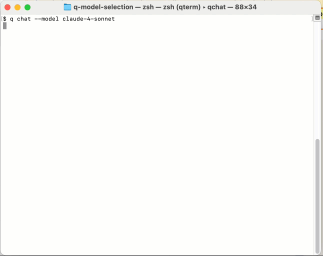

# Truy cập Claude Sonnet 4 trong Amazon Q Developer CLI

> **📖 Bài viết gốc**: [Access Claude Sonnet 4 in Amazon Q Developer CLI](https://aws.amazon.com/blogs/devops/access-claude-sonnet-4-in-amazon-q-developer-cli/)  
> **✍️ Tác giả**: Kirankumar Chandrashekar  
> **📅 Ngày xuất bản**: 5 tháng 6, 2025  
> **🌐 Nguồn**: *AWS DevOps & Developer Productivity Blog*  
> **👨‍💻 Người dịch**: Trần Nguyễn Daenel — *Thực tập sinh FCJ*  
> **🗓️ Ngày dịch**: 10 tháng 6, 2025  

---

## 📋 Tóm tắt

Bài viết này trình bày giải pháp sử dụng GitHub, GitHub Actions workflows, và AWS CodeBuild để xây dựng native container image cho cả x86 và AWS Graviton-based compute trên AWS. Giải pháp tận dụng CodeBuild managed GitHub Actions runners để tự động hóa việc build và push multi-arch image lên Amazon Elastic Container Registry (Amazon ECR). Điều này giúp hỗ trợ đa dạng kiến trúc tính toán và tối ưu hóa hiệu suất trên các nền tảng phần cứng khác nhau.

**🎯 Đối tượng đọc**: DevOps Engineers, Container Developers, Solutions Architects  
**📊 Độ khó**: Intermediate  
**🏷️ Tags**: Developer Tools, Development

---

*Blog này được tác giả bởi Zakiya Randall, Technical Account Manager và đồng tác giả với Muru Bhaskaran, Sr. Specialist Solutions Architect.*

##Giới thiệu

[Amazon Q Developer](https://aws.amazon.com/vi/q/developer//) hiện hỗ trợ Claude Sonnet 4 trong [CLI](https://docs.aws.amazon.com/amazonq/latest/qdeveloper-ug/command-line.html), mang đến khả năng lập trình và suy luận tiên tiến cho quy trình phát triển của bạn mà không mất thêm chi phí. Phiên bản mới nhất này vượt trội về khả năng lập trình với tỷ lệ mã hóa agentic đạt 72,7% trên SWE-bench (xem [thông báo về Claude 4 để biết thêm thông tin](https://www.anthropic.com/news/claude-4)). Với khả năng lập trình và suy luận nâng cao, nó giúp bạn phân tích mã phức tạp, tối ưu hóa các tác vụ phát triển hàng ngày, triển khai sửa lỗi, chạy lệnh bash và phát triển các tính năng mới với vòng phản hồi tức thì và phản hồi chính xác hơn.

Để giúp bạn tận dụng Claude Sonnet 4, Amazon Q Developer cho phép bạn dễ dàng chọn các mô hình Claude Sonnet cụ thể, mang lại cho bạn sự linh hoạt hơn trong CLI.

- **Claude Sonnet 4**: Mô hình hiệu suất cao với trí thông minh cân bằng.
- **Claude Sonnet 3.7**: Mô hình hiệu suất cao với khả năng tư duy mở rộng.
- **Claude Sonnet 3.5**: Mô hình thông minh hiệu suất cao.
Để biết thông tin chi tiết về khả năng và so sánh của mô hình Claude, hãy tham khảo [phần tổng quan về mô hình Anthropic](https://docs.anthropic.com/en/docs/about-claude/models/overview).

Trong bài đăng trên blog này, tôi sẽ chỉ cho bạn cách chọn Claude Sonnet 4 làm mô hình của bạn trong Q Developer CLI và sau đó hướng dẫn bạn qua bản demo nhanh.

## Cách chọn Claude Sonnet 4

Hãy đảm bảo cập nhật lên phiên bản mới nhất ( từ v1.11.0 trở lên) của Amazon Q Developer CLI. Tham khảo hướng dẫn [cài đặt Amazon Q trên dòng lệnh](https://docs.aws.amazon.com/amazonq/latest/qdeveloper-ug/command-line-installing.html). Bạn có thể truy cập Claude Sonnet 4 thông qua các tùy chọn sau:

- Trong khi trò chuyện đang diễn ra, hãy sử dụng lệnh `/model` và chọn `claude-4-sonnet`.
- Bắt đầu một cuộc trò chuyện mới với: `q chat --model claude-4-sonnet`
- Đặt nó làm mô hình mặc định của bạn bằng cách sử dụng: `q settings chat.defaultModel claude-4-sonnet`.

Tên mô hình được hỗ trợ cho `--model` tham số và cài đặt là:

- **`claude-3.5-sonnet`**
- **`claude-3.7-sonnet (default)`**
- **`claude-4-sonnet`**

## Thứ tự ưu tiên lựa chọn mô hình
Q Developer CLI chọn các mô hình theo thứ tự sau:

1. Lựa chọn mô hình phiên hiện tại (thông qua `/model` hoặc `--model`)
2. Tùy chọn do người dùng cấu hình trong cài đặt
3. Mặc định của hệ thống ( `Claude 3.7 Sonnet`)

## Hành vi chính

Trình quản lý CLI của Q Developer sẽ mặc định là Claude Sonnet 3.7 khi không có mô hình cụ thể nào được chọn. Trong các phiên trò chuyện đang diễn ra, bạn có thể dễ dàng chuyển đổi giữa các mô hình bằng `/model` lệnh. Tính liên tục của trò chuyện được duy trì xuyên suốt các phiên, với hệ thống giữ nguyên mô hình đã chọn trước đó khi các cuộc trò chuyện được tiếp tục. Nếu bạn thích Claude Sonnet 4, việc đặt mô hình này làm mô hình mặc định trong cài đặt người dùng sẽ tự động áp dụng cho tất cả các phiên trò chuyện mới, mặc dù điều này có thể được ghi đè bằng các lựa chọn mô hình cụ thể nếu cần.


Hình 1: Q Developer CLI hiển thị mô hình được tải cho phiên

## Claude Sonnet 4 với Q Developer CLI đang hoạt động

Sau khi chuyển sang Claude Sonnet 4 trong Q Developer CLI, hãy cùng khám phá các tính năng của nó bằng một ví dụ mã hóa thực tế. Đây là lời nhắc tôi sẽ sử dụng cho phần trình bày này:
```
- Create a Python command-line to-do list app with these features:
- Add tasks with descriptions and priorities (low/medium/high)
- Mark tasks as complete by index
- Display tasks sorted by priority, then insertion order
- Show completion status ([x] done, [ ] pending)
- Handle errors for empty tasks and invalid indices
- Store tasks in memory only
- Please provide the code to implement this application.
```


Hình 2: Giao diện CLI của Q Developer hiển thị Claude Sonnet 4 đang hoạt động

Trong phần trình diễn trên, Q Developer CLI với Claude Sonnet 4 đã vượt xa những gì được yêu cầu trong lời nhắc bằng cách triển khai phân tích cú pháp lệnh tinh vi với các mô tả được trích dẫn, xử lý lỗi toàn diện và thiết kế hướng đối tượng rõ ràng, được tăng cường bởi các gợi ý kiểu. Giao diện có hệ thống hướng dẫn hữu ích với thông báo lỗi rõ ràng, quản lý ưu tiên dựa trên enum tinh tế và đầu ra được định dạng để biểu diễn tác vụ rõ ràng.

Ngoài ra, Q Developer CLI với Claude Sonnet 4 cũng tạo tài liệu trong README cho ứng dụng việc cần làm, bao gồm các ví dụ xử lý lỗi thực tế và hướng dẫn sử dụng rõ ràng – chuyển đổi các yêu cầu nhanh chóng thành một ứng dụng có cấu trúc tốt, thân thiện với người dùng.

### Phần kết luận

Sự ra mắt của Claude Sonnet 4 đánh dấu một bước tiến đáng kể trong khả năng của Amazon Q Developer. Từ việc tái cấu trúc mã phức tạp đến việc tạo tài liệu một cách hợp lý, Claude Sonnet 4 giúp bạn hoàn thành hiệu quả cả các tác vụ phát triển phức tạp lẫn thông thường.

Cho dù chọn Claude Sonnet 4 cho các tác vụ phức tạp hay sử dụng các mô hình khác cho nhu cầu cụ thể, Amazon Q Developer đều có thể điều chỉnh theo sở thích của bạn, tối ưu hóa hỗ trợ AI đồng thời duy trì hiệu quả trong quy trình làm việc của bạn.

Phiên bản mới nhất ( v1.11.0 ) của Amazon Q Developer đang chờ trong CLI, sẵn sàng hỗ trợ hành trình phát triển của bạn với các tính năng mô hình và tùy chọn nâng cao. Tham khảo bài viết [Cài đặt Amazon Q cho dòng lệnh](https://docs.aws.amazon.com/amazonq/latest/qdeveloper-ug/command-line-installing.html) để biết hướng dẫn cài đặt.

Để tìm hiểu thêm về các tính năng và chi tiết giá của Amazon Q Developer, hãy truy cập [trang sản phẩm Amazon Q Developer](https://aws.amazon.com/vi/q/developer/).
